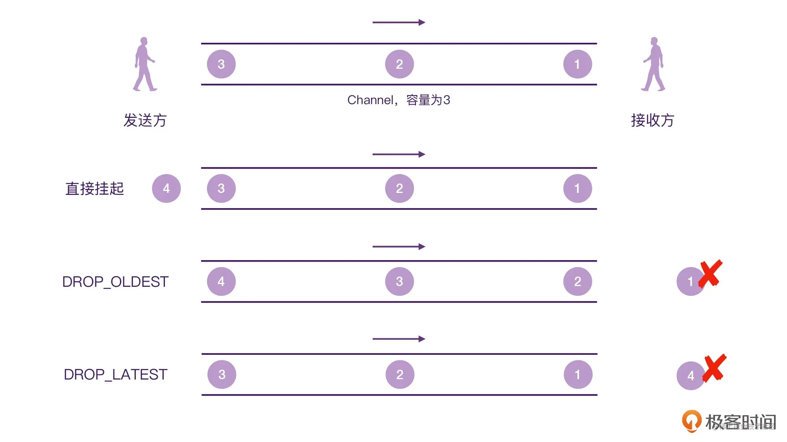
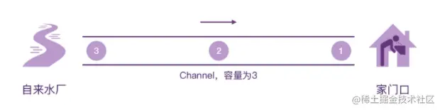

- ## [原文](https://juejin.cn/post/7091853068009996318)
- # 一、简介
	- 在前面介绍中，我们介绍了几种启动协程的方法，以及挂起函数，在使用`async`启动的协程中，我们可以通过`await`方法来获取协程的返回值。
	- 但是这些返回值都是只有一个，即当挂起的函数或者协程，在挂起后重新恢复时，只返回了一个结果。在普通业务中，这种模式是可行的，但是有些特殊业务，比如：前台应用不断更新手机`GPS`返回的经纬度，如果使用回调的话，我们可以非常容易实现，但是想用协程以同步方式优雅地实现，就需要引入新地东西，即本章的`Channel`可以解决。。
	- `Channel`直接翻译就是管道，我们可以利用这个概念来简单构建一个思维模型：
	- 
	- 通过这个思维模型，我们可以把`Channel`看成是一个**封闭**的管道，它只有发送方和接收方，数据从发送方发出可以被接收方收到，中间不会被修改。
- # 构造函数
  collapsed:: true
	- ```kotlin
	  public fun <E> Channel(
	      capacity: Int = RENDEZVOUS,
	      onBufferOverflow: BufferOverflow = BufferOverflow.SUSPEND,
	      onUndeliveredElement: ((E) -> Unit)? = null
	  ): Channel<E>
	  ```
	- ## 参数1：capacity
		- 这个代表**管道的容量**，这个非常好理解，就比如我们生活中见到的管道也是有容量的，当接收方不把数据取走时，管道本身也可以保存一些数据。
		- 默认情况下是`RENDEZVOUS`，表示`Channel`的容量是0。`capacity`还有其他几种情况，分别如下：
			- `UNLIMITED`:代表无限容量；
			- `CONFLATED`:代表容量为1，**新的数据会替代旧的数据**；
			- `BUFFRED`:代表一定缓存容量，默认是64；
		- 这里的默认值`RENDEZOUS`，很有意思，它的翻译是约会、会面的意思。
	- ## 参数2：onBufferOverflow（背压相关）
	  collapsed:: true
		- 这个是当指定了`capacity`的容量，等`Channel`的容量满了之后，`Channel`所应对的策略，这里主要有3种做法：
		- `SUSPEND`:当管道的容量满了以后，如果发送方继续发送数据，我们会挂起当前的`send()`方法。由于它是一个挂起函数，所以我们可以非阻塞的方式将发送方的流程挂起，等管道容量有空闲位置以后再恢复。这个逻辑非常好理解，就和Java实现的阻塞队列一样。
		- `DROP_OLDEST`:顾名思义，就是丢弃掉最旧的那个数据；
		- `DROP_LATEST`丢掉最新的数据，这里指还没有进入管道的数据；
		- 这里有一张图，可以更好地表达上面几种做法:
		- 
	- ## 参数3：onUndeliveredElement
		- 这个相当于一个异常处理回调，**当管道种某些数据没有被成功接收的时候**，这个回调就会被调用。这里其实也需要注意，是数据已经发送了，但是没有被接收，才会触发回调；而不是管道满了，把数据丢了，这种情况不会触发回调。
		- 这种只有非常在意数据是否传输正常的业务，才会用到这个回调
- # 简单使用
  collapsed:: true
	- ```kotlin
	  fun main() = runBlocking {
	      val channel = Channel<Int>()
	      launch {
	          (1 .. 3).forEach{
	              channel.send(it)
	              logX("Send $it")
	          }
	          //这里加一句代码，发送完数据，及时关闭channel
	          channel.close()
	      }
	      launch {
	          for (i in channel){
	              logX("Receive: $i")
	          }
	      }
	      logX("end")
	  }
	  ```
- # 相关方法
  collapsed:: true
	- ## 1、produce{}
	  collapsed:: true
		- 就是使用`channel`，假如忘记调用`close()`，会导致程序一直无法终止。
		- produce内部代码执行完毕，立即终止
			- ```kotlin
			  fun main() = runBlocking {
			      //创建管道
			      val channel = produce {
			          (1 .. 3).forEach {
			              send(it)
			              logX("Send $it")
			          }
			      }
			  
			      launch {
			          //在另一个协程中接收管道消息
			          for (i in channel){
			              logX("Receive $i")
			          }
			      }
			      logX("end")
			  }
			  ```
	- ## 2、`receive() 取发送的数据**[[#red]]==建议别用==**
	  collapsed:: true
		- 前面我们从`Channel`中取出数据用的是`for`循环遍历的方式，其实还有一个方法：`receive()`，它是和`send()`方法对应的，比如上面代码我们把`for`循环遍历取出数据的方式改成`receive()`，并且一次性调用4次：
		- ```kotlin
		  launch {
		      //在另一个协程中接收管道消息
		      channel.receive()
		      channel.receive()
		      channel.receive()
		      channel.receive()
		  }
		  ```
		- 抛出了这个异常，也就说明`Channel`确实被关闭了。
		- 同时我们发现`receive()`是一个挂起函数，它的定义是当`Channel`不为空时取出一个数据，而当`Channel`为空时，会挂起，所以直接使用`receive()`函数时容易会导致程序永久挂起。
	- ## 3、isClosedForReceive， isClosedForSend
	  collapsed:: true
		- 那我就想使用`receive()`函数呢 这里有2个函数`isClosedForReceive`和`isClosedForSend`可以判断在发送时和接收时`Channel`是否关闭。比如下面代码：
		- ```kotlin
		  fun main() = runBlocking {
		      //创建管道
		      val channel = produce {
		          (1 .. 3).forEach {
		              send(it)
		              logX("Send $it")
		          }
		      }
		  
		      launch {
		          //在另一个协程中接收管道消息
		          while (!channel.isClosedForReceive){
		              println("Receive ${channel.receive()}")
		          }
		      }
		      logX("end")
		  }
		  ```
		- 上面代码看起来天衣无缝，在接收协程中，循环判断`Channel`是否关闭，但是结果运行如下：
		- 
		- 会发现还是会崩溃，所以**最好不要使用`channel.receive()`**，即使配合`isClosedForReceive()`也不要使用
	- ## 4、`consumeEach{}` 消费数据
	  collapsed:: true
		- 那有没有除了for循环其他的方式呢，这里Kotlin为我们提供了一个高阶函数：`channel.consumeEach{}`，我们来看下面的例子：
			- ```kotlin
			  fun main() = runBlocking {
			      //创建管道，使用produce生产数据
			      val channel = produce {
			          (1 .. 3).forEach {
			              send(it)
			              logX("Send $it")
			          }
			      }
			  
			      launch {
			          //使用consumeEach消费数据
			          channel.consumeEach {
			              print("Receive $it")
			          }
			      }
			      logX("end")
			  }
			  ```
		- 上面代码就不会出现异常。
		- 综上所述，当使用`Channel`时，我们建议**发送方使用`produce{}`高阶函数，接收方使用`for`循环或者`consumeEach{}`高阶函数**。
- # Channel是"热的"**[[#red]]==不管有没有接收方，发送方都会工作"的模式==**
  collapsed:: true
	- 前面介绍我们知道`Channel`就是一个管道，而管道中是数据流，是多个数据组合形成流。如果把挂起函数、`async`返回的数据比喻成水滴，那`channel`则像是自来水管。
	- 在Kotlin中我们经常拿`Channel`和`Flow`做比较，而说`Channel`是"热"的，那这个"热"该如何理解呢？
	- ### 热情、主动
	- 其实我觉得可以直接翻译为热情、主动的意思，比如我们可以下面代码：
		- ```kotlin
		  fun main() = runBlocking {
		      //创建管道
		      val channel = produce(capacity = 10) {
		          (1 .. 3).forEach {
		              send(it)
		              logX("Send $it")
		          }
		      }
		  
		      logX("end")
		  }
		  ```
	- 我们定义了一个容量为10的管道，然后发送数据，但是我们没有接收数据，这里的运行结果如下：
		- 
	- 依旧会让管道中发送消息，而这种**[[#red]]==不管有没有接收方，发送方都会工作"的模式==**，我们就认为是"热"的原因。
	- 这里就可以类比为**热情的饭店服务员**，不管你有没有提出要求，服务员都会给你端茶递水，把茶水摆在饭桌上，想喝水的时候，直接从桌上拿即可。
	- 也可以类比为前面说的**水龙头**，`Channel`的发送方就好比是自来水厂，不管用不用水，自来水厂都会把水送到管道中来，当想喝水的时候，打开水龙头就能喝到水。
		- 
- # 总结
	- [[协程间通信-channel-面试题]]