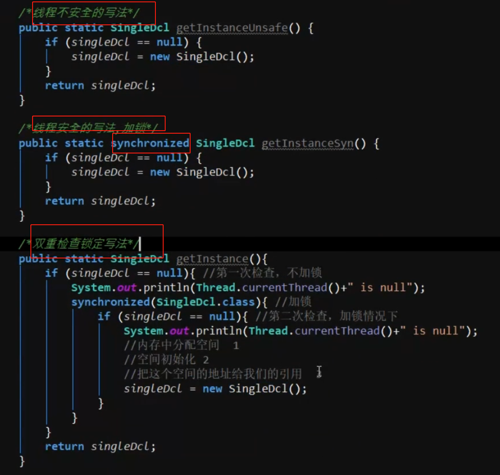
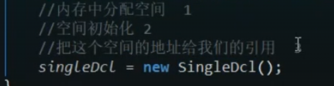
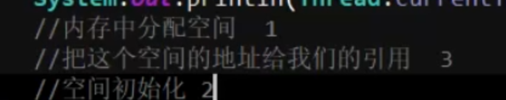

- ## 示例
	- 
		-
- ## 1、为啥sync不加在方法上？
	- 浪费性能，我调用这个方法就是为了拿对象，每次都判断锁，
	- 如果有对象，直接拿就好了
- ## 2、第二版 同步代码块 使用双重检查的原因
	- 有对象直接返回了，
	- 但是此时2个线程进入了第一层判断，此时一个线程拿到锁进去了创建了个对象，第二个线程拿到锁如果不判断还会创建对象的
- ## 3、上述第二版中图里有写明，new 对象 分了三步
	- 
	- 虚拟机有指令重排序的操作的，比如：把3排到2的前边，比如这样
	- 
	- 那么来一个线程判断不为null，拿着引用去用了，而对象空间还没初始化，就会报空指针
	- 加volatile关键字，抑制指令重排序