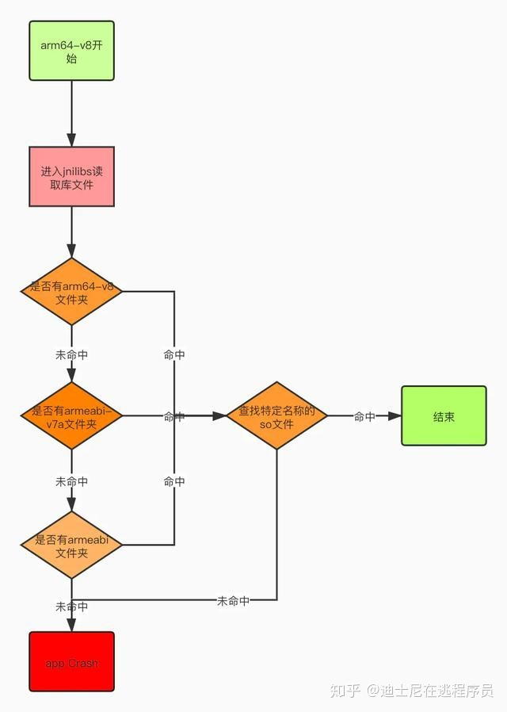

- 市面上大部分都是armeabi-v7a/arm64-v8a
- lib文件夹主要存放了我们引用到的一些第三方so库。根据不同的架构类型，abi分多很多种。
- ## 什么是ABI?
	- ABI是英文Application Binary Interface的缩写，即应用二进制接口。
	- 不同Android设备，使用的CPU架构可能不同，因此支持不同的指令集。 CPU 与指令集的每种组合都有其自己的应用二进制界面（或 ABI）,ABI非常精确地定义了应用程序的机器代码应如何在运行时与系统交互。Android目前支持以下7种ABIs:
	- mips, mips64, X86, X86–64, arm64-v8a, armeabi, armeabi-v7a
- ## ABI 如何工作
	- 
	- 对于一个cpu是arm64-v8a架构的手机，它运行app时，进入jnilibs去读取库文件时，先看有没有arm64-v8a文件夹，如果没有该文件夹，去找armeabi-v7a文件夹，如果没有，再去找armeabi文件夹，如果连这个文件夹也没有，就抛出异常；
	- 如果有arm64-v8a文件夹，那么就去找特定名称的.so文件，注意：如果没有找到想要的.so文件，不会再往下（armeabi-v7a文件夹）找了，而是直接抛出异常。
	- 目前市面上绝大部分的CPU架构都是armeabi-v7a/arm64-v8a，可以在gradle中加入配置只保留这两种so库的其中一种，具体配置如下：
		- ```
		  android {
		      ...
		      defaultConfig {
		          ...
		          ndk {
		              abiFilters "armeabi-v7a"//"arm64-v8a"
		          }
		      }
		  }
		  ```
- 目前同城APP采用的是armeabi-v7a架构，随着国产厂商对于64位架构推进目前已经迁移到arm64-v8a架构了。