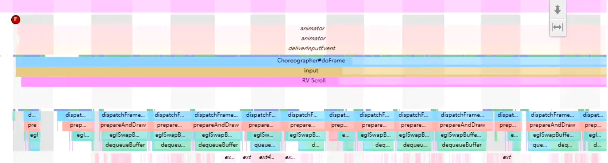
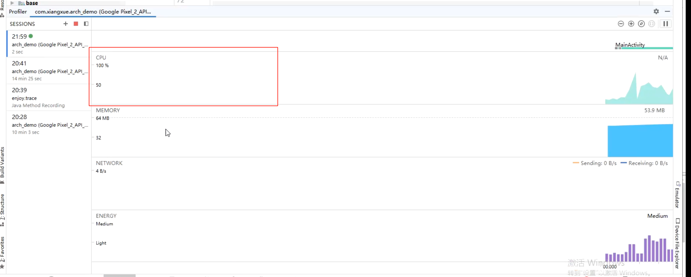
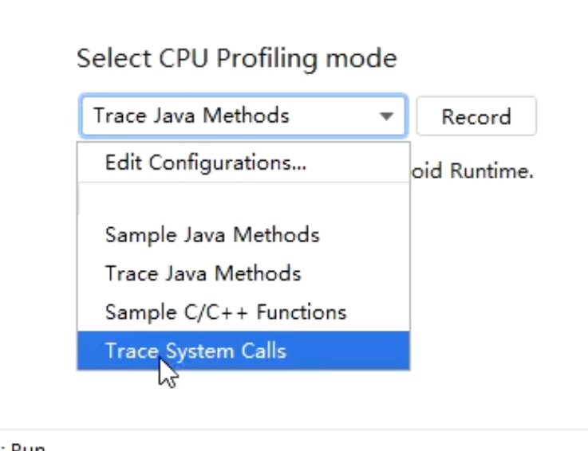
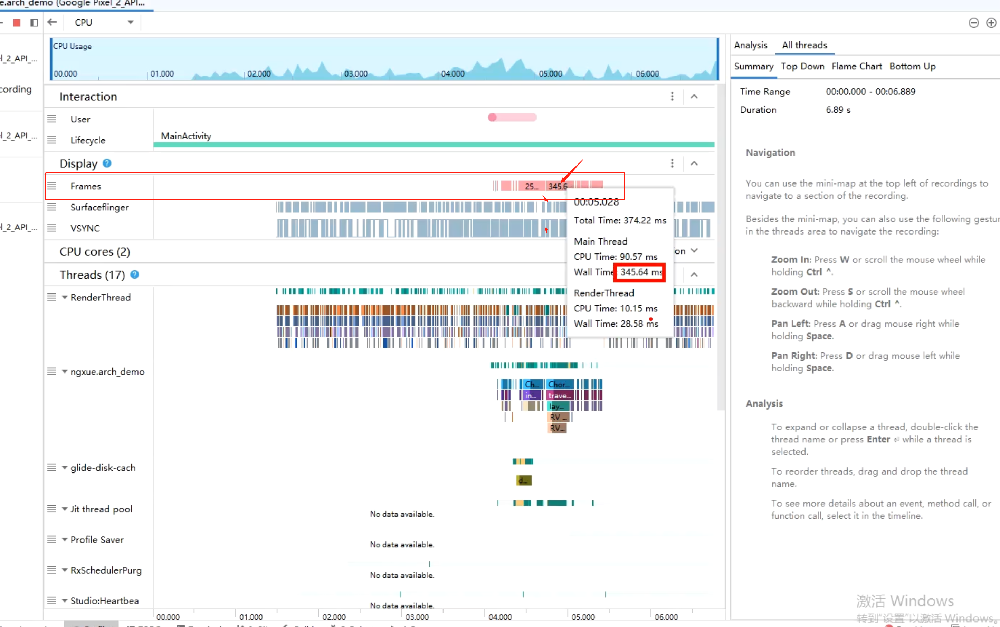
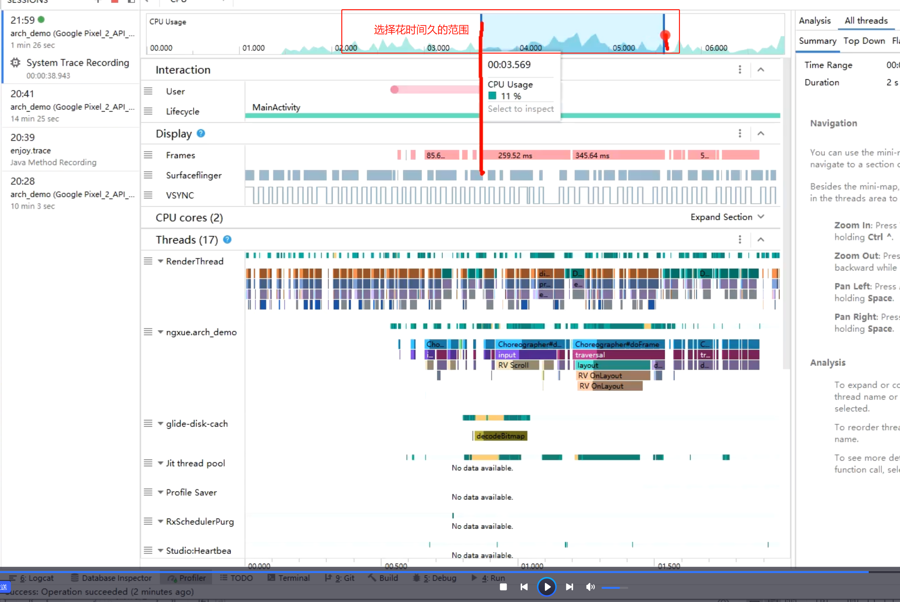
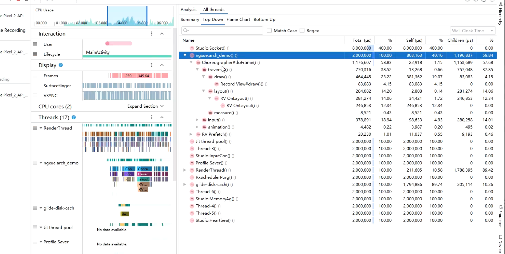

# 1、[[层级优化优化点]]
- # 2、[[解决过度绘制问题]]
- # 3、布局加载优化->可以尝试使用异步加载方式AsyncLayoutInflater
- # 4、卡顿分析
  collapsed:: true
	- ## 借助SysTrace工具
	  collapsed:: true
		- 生成报告后看，连续绿色没问题
			- 
		- 多个红色之间就有问题
			- 
		- 可以手动打点，
	- ## 借助AS Profile,检测卡顿就进入CPU那列
	  collapsed:: true
		- 
		- 
		- 分析报告可以看调用栈
			- 
			- 
			- 右侧看调用栈
				- 
	- ## app层面卡顿监控
	  collapsed:: true
		- 方式一、Looper日志检测卡顿 [[#red]]==**适合测试精准定位问题**==
			- 代码都是通过handler执行起来的
			- looper中Dispatch消息到Handler 前会执行一个log输出 执行完后也有一个日志输出。可以监控前后执行时间
		- 方式二、Choreographer.FrameCallback [[#red]]==**适合线上监控掉帧情况**==
			- ```java
			  public class ChoreographerHelper {
			      public static void start() {
			          if (Build.VERSION.SDK_INT >= Build.VERSION_CODES.JELLY_BEAN) {
			              Choreographer.getInstance().postFrameCallback(new Choreographer.FrameCallback() {
			                  long lastFrameTimeNanos = 0;
			                  @Override
			                  public void doFrame(long frameTimeNanos) {
			  //上次回调时间
			                      if (lastFrameTimeNanos == 0) {
			                          lastFrameTimeNanos = frameTimeNanos;
			                          Choreographer.getInstance().postFrameCallback(this);
			                          return;
			                      }
			                      long diff = (frameTimeNanos - lastFrameTimeNanos) / 1_000_000;
			                      if (diff > 16.6f) {
			  //掉帧数
			                          int droppedCount = (int) (diff / 16.6);
			                      }
			                      lastFrameTimeNanos = frameTimeNanos;
			                      Choreographer.getInstance().postFrameCallback(this);
			                  }
			              });
			          }
			      }
			  }
			  ```