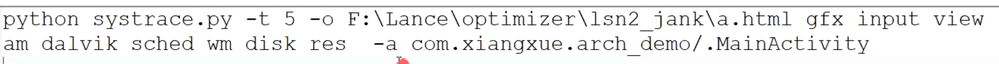
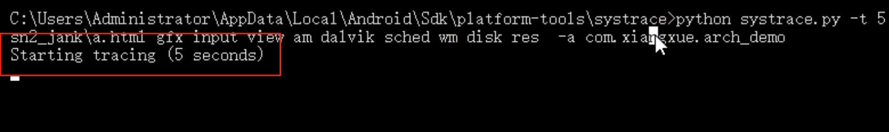

- 大多数用户[[#red]]==**感知到的卡顿等性能问题的最主要根源都是因为渲染性能**==。[[#red]]==**Android系统每隔大概16.6ms发出VSYNC信**==
  号，触发对UI进行渲染，如果每次渲染都成功，[[#red]]==**这样就能够达到流畅的画面所需要的60fps**==，为了能够实现60fps，
  这意味着程序的大多数操作都必须在16ms内完成。
- # 检测工具
	- Systrace
		- Systrace 是Android平台提供的一款工具，用于记录短期内的设备活动。该工具会生成一份报告，其中汇总了Android 内核中的数据，例如 CPU 调度程序、磁盘活动和应用线程。Systrace主要用来分析绘制性能方面的问题。在发生卡顿时，通过这份报告可以知道当前整个系统所处的状态，从而帮助开发者更直观的分析系统瓶颈，改进性能。
	- >TraceView可以看出代码在运行时的一些具体信息，方法调用时长，次数，时间比率，了解代码运行过程的效率问题，从而针对性改善代码。所以对于可能导致卡顿的耗时方法也可以通过TraceView检测。已经过时
	- 要使用Systrace，需要先安装 Python2.7。安装完成后配置环境变量path ，随后在命令行输入： python -- version 进行验证。
- # 使用
	- 在SDK指定目录下执行代码：
		- 
		- -t 5 执行5秒钟，自动断开
		- -o + html地址，就是输出这个报告到哪里
		- 剩下就是开启检测的部分 比如检测view触摸什么的
	- 然后回出现
		- 
	- 操作手机看你要测试的比如滑动卡顿，就滑动一下
	- 打开生成的报告分析就行了
- # 参考
	- [systrace具体使用](https://www.jianshu.com/p/e73768e66b8d)可以查看Zero老师博客：
	- https://blog.csdn.net/u011578734/article/details/109497064