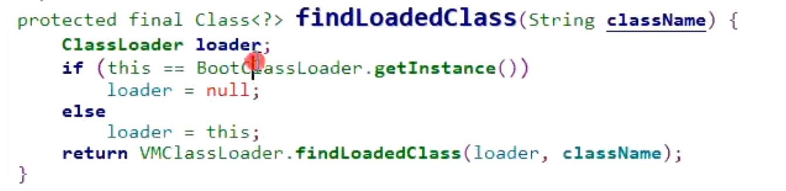
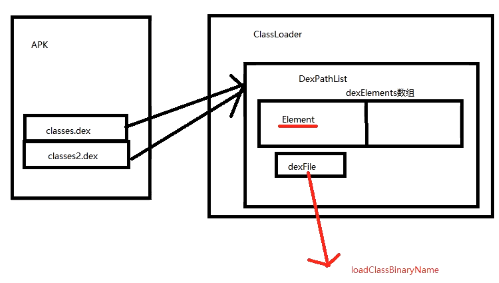
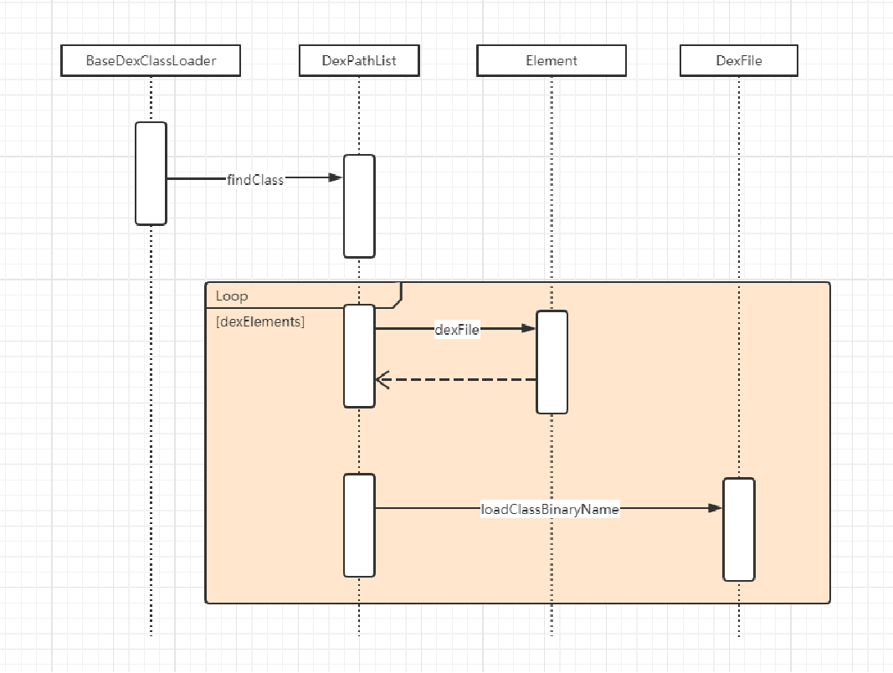

# 一、简述
	- 可以看到创建 ClassLoader 需要接收一个 ClassLoader parent 参数。这个 parent 的目的就在于实现类加载的双亲委托。即：
	- 1、某个类加载器在接到加载类的请求时，首先将加载任务委托给父类加载器，依次递归，如果父类加载器可以完成类加载任务，就成功返回；
	- 2、只有父类加载器无法完成此加载任务时，才自己去加载。
- # 二、loadClass
	- 代码
	  collapsed:: true
		- ```java
		  // name : 将要加载类的全包名
		  protected Class<?> loadClass(String name, boolean resolve) throws ClassNotFoundException{
		      // 1、检查class是否有被加载
		      Class c = findLoadedClass(name);
		      if (c == null) {
		          long t0 = System.nanoTime();
		          try {
		              if (parent != null) {
		                  //如果parent不为null，则调用parent的loadClass进行加载
		                  c = parent.loadClass(name, false);
		              } else {
		                  //parent为null，则调用BootClassLoader进行加载
		                  c = findBootstrapClassOrNull(name);
		              }
		          } catch (ClassNotFoundException e) {
		          }
		          if (c == null) {
		              // 如果都找不到就自己查找
		              long t1 = System.nanoTime();
		              c = findClass(name);
		          }
		      }
		      return c;
		  }
		  ```
		- > 因此我们自己创建的ClassLoader: new PathClassLoader("/sdcard/xx.dex", getClassLoader()); 并不仅仅只能加载 xx.dex中的class。
		- > 值得注意的是： c = findBootstrapClassOrNull(name);
		- > 按照方法名理解，应该是当parent为null时候，也能够加载 BootClassLoader 加载的类。new PathClassLoader("/sdcard/xx.dex", null) ，能否加载Activity.class？
		- 但是实际上，Android当中的实现为：（Java不同）
			- ```java
			  private Class findBootstrapClassOrNull(String name)
			  {
			  return null;
			  }
			  ```
	- ## 1、找缓存，找到就返回，没找到就找parent父加载器
	  collapsed:: true
		- ClassLoader.findLoadedClass
		- 
		- ```java
		  ```
		- VMClassLoader.findLoadedClass
			- 
	- ## 2、parent.loadClass(name, false);递归调用父加载器进行加载
		- > PathClassLoader父加载器是BootClassLoader（构造传入的这个）,父加载器，不是说父类,而是 每个classLoader有个成员是父加载器
	- ## 3、父加载器为null或者完成不了，就自己找findClass
- # 三、看自己的PathClassLoader.findClass
	- 可以看到在所有父ClassLoader无法加载Class时，则会调用自己的 findClass 方法
	- 顶层ClassLoader的findClass
		- ```java
		  protected Class<?> findClass(String name) throws ClassNotFoundException {
		  	throw new ClassNotFoundException(name);
		  }
		  ```
	- PathClassLoader 没有实现 findClass方法看父类 BaseDexClassLoader
		- ```java
		  public BaseDexClassLoader(String dexPath, File optimizedDirectory,String
		  											librarySearchPath, ClassLoader parent) {
		      super(parent);
		      this.pathList = new DexPathList(this, dexPath, librarySearchPath,optimizedDirectory);
		  }
		  
		  @Override
		  protected Class<?> findClass(String name) throws ClassNotFoundException {
		      List<Throwable> suppressedExceptions = new ArrayList<Throwable>();
		      //查找指定的class
		      Class c = pathList.findClass(name, suppressedExceptions);
		      if (c == null) {
		          ClassNotFoundException cnfe = new ClassNotFoundException("Didn't find class \"" +
		                                              name + "\" on path: " + pathList);
		          for (Throwable t : suppressedExceptions) {
		              cnfe.addSuppressed(t);
		          }
		          throw cnfe;
		      }
		      return c;
		  }
		  ```
	- pathList.构造（从 pathList 中查找class。继续查看 DexPathList）
		- 构造
			- ```java
			  // dexPath： dex文件路径 可多个
			  public DexPathList(ClassLoader definingContext, String dexPath,
			  								String librarySearchPath, File optimizedDirectory) {
			  //.........
			  // splitDexPath 实现为返回 List<File>.add(dexPath)
			  // makeDexElements 会去 List<File>.add(dexPath) 中使用DexFile加载dex文件返回 Element数组
			  // 一个dex 生成一个Element 
			    this.dexElements = makeDexElements(splitDexPath(dexPath), optimizedDirectory,
			  											suppressedExceptions, definingContext);
			  
			    //.........
			  }
			  ```
	- pathList.findClass：遍历dexElements 从前往后找，找到就返回了，热修复可以将新生成dex插入最前边
		- ```java
		  public Class findClass(String name, List<Throwable> suppressed) {
		      //1、从element中获得代表Dex的 DexFile
		      for (Element element : dexElements) {
		          // 拿到dex
		          DexFile dex = element.dexFile;
		          if (dex != null) {
		            //2、查找class
		            Class clazz = dex.loadClassBinaryName(name, definingContext, suppressed);
		            if (clazz != null) {
		                return clazz;
		            }
		          }
		      }
		      if (dexElementsSuppressedExceptions != null) {
		          suppressed.addAll(Arrays.asList(dexElementsSuppressedExceptions));
		      }
		      return null;
		  }
		  ```
	- ## 总结自己加载类的流程
		- 
		- 
- # 四、[[双亲委托机制好处]]
- # [[双亲委托+类加载流程-面试]]
-