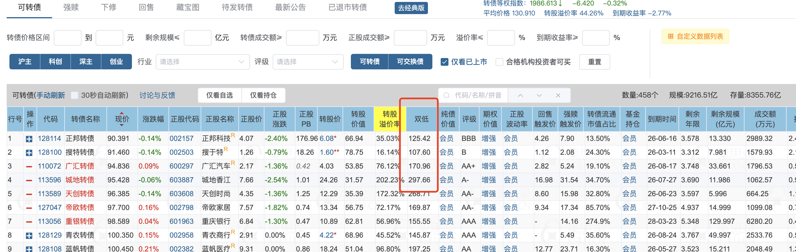
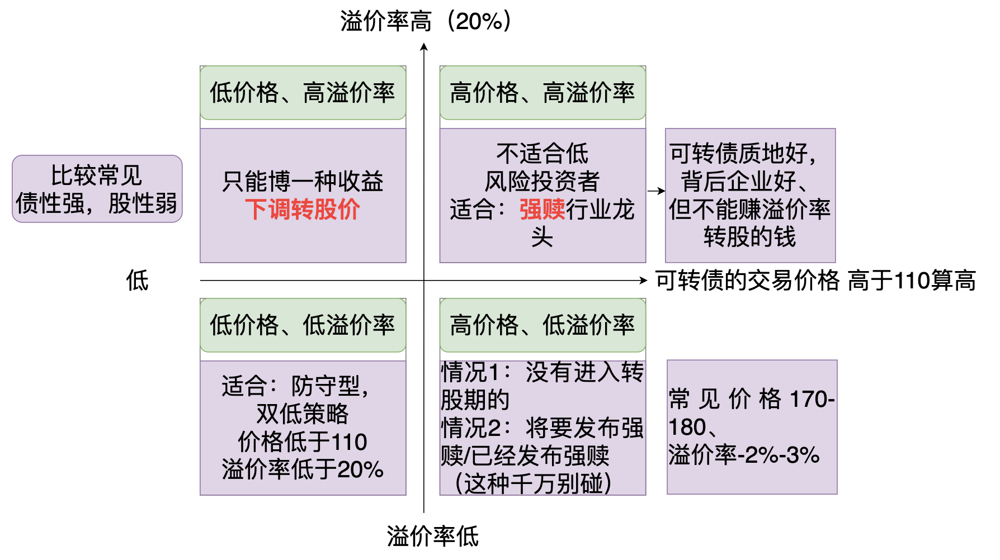

- # 一、集思录查双低值
  collapsed:: true
	- 概念：转债价格 和 转股溢价率的综合    ，即选择转债价格便宜 + 转股溢价率也低的
	- 双低 = 转债价格 + 转股溢价率*100%
	- 
- 从高到低排序，取前10个优质可转债，分摊投资
- # 二、双低策略
  collapsed:: true
	- 
- # 三、筛选--->看集思录的双低值
  collapsed:: true
	- 双低数值 =  转债价格(最高110) + 转股溢价率(最高20%)*100%
	- 按照防守型   双低数组 最高130.去集思录排序
	- ## 第一步：集思录，按双低值排序 取130以下的
	- ## 第二步：二次筛选，去掉价格高于110的，溢价率高于20%的
	- {:height 368, :width 430}
- # 四、盈利方式
	- ## 1、每半个月轮动1次
	- ## 2、可转债盈利10%-15%
	-