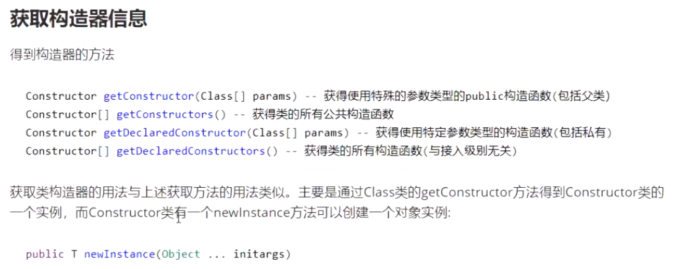

# 一、概念-基于Class的
collapsed:: true
	- 一般情况下，我们使用某个类时必定知道它是什么类，是用来做什么的，并且能够获得此类的引用。于是我们直接对这个类进行实例化，之后使用这个类对象进行操作。
	  
	  反射则是一开始并不知道我要初始化的类对象是什么，自然也无法使用 new 关键字来创建对象了。这时候，我们使用 JDK 提供的反射 API 进行反射调用。[[#red]]==**反射就是在运行状态中,对于任意一个类,都能够知道这个类的所有属性和方法;对于任意一个对象,都能够调用它的任意方法和属性;并且能改变它的属性。是Java被视为动态语言的关键**==
- # 二、属性操作
  collapsed:: true
	- 
	-
	- ## getFiled 和 DecleredFile区别？
	  collapsed:: true
		- getFiled：获取自己+父类的成员（不包括private，只能是public）
		- DecleredFile：只能获取自己的成员（不包括父类，能获取所有作用域）
	- ## 判断为某个类的实例
	  collapsed:: true
		- 
	- ## 创建实例
	  collapsed:: true
		- 
	- ## 获取构造器信息
	  collapsed:: true
		- 
	- ## 获取类的成员
	  collapsed:: true
		- 
	- ## 调用方法
	  collapsed:: true
		- 
	- ## 利用反射创建数组
	  collapsed:: true
		- 
- # 三、反射获取泛型真实类型
  collapsed:: true
	- 
	- 
	- ## Type体系
		- 
	- ## 反射获取真实类型
		- 
		- new 对象的时候，有{}代表匿名内部类对象，没有{}代表new 对象
		- 
- 