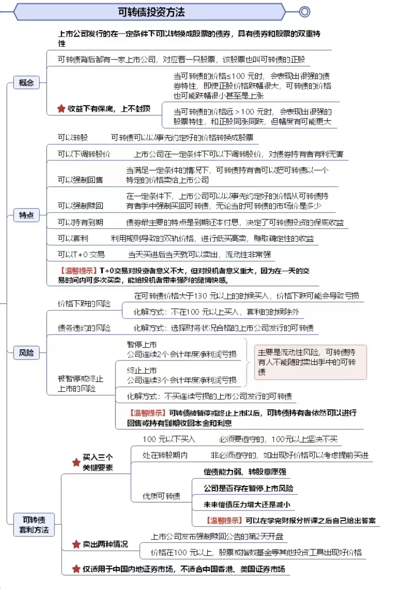

- # 一、[[可转债的性质]]
- # 二、[[套利原理]]
- # 三、[[可转债筛选]]
- # 四、[[卖出止盈]]
- # 五、[[下修转股价]]
- # 六、[[双低策略]]
- # 七、[[可转债付息和公告的查询]]
- # 八、[[仓位管理]]
- # 九、[[可转债基金]]
- # 十、[[摊大饼原则]]
- # 十一、[[常用公式]]
- # 十二、在工程里有-案例分析文档-可转债分析
  collapsed:: true
	- {:height 1153, :width 776}
- # 十三、