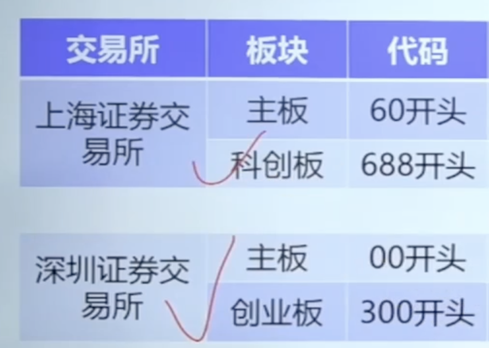
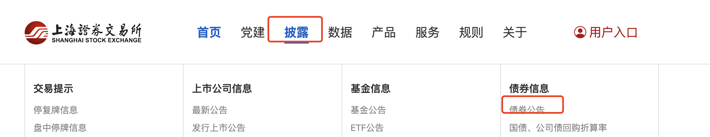
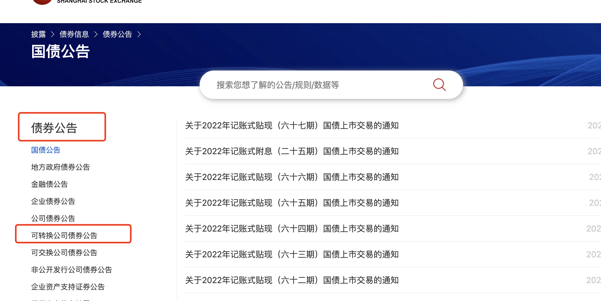

- # 一、查看正股上市的交易所
  collapsed:: true
	- {:height 540, :width 746}
- # 二、在集思录看可转债对应的正股代码，找对应的交易所
	- 比如60开头去上海证券交易所
- # 三、找债券公告
	- ## 上交所查找公共
	  collapsed:: true
		- 
		- 
		- 然后搜索，指定的债券
	- ## 深交所查找公共