- # 一、优点
  collapsed:: true
	- ## 1、风险更低
	  collapsed:: true
		- 可转债基金是以可转债为主要投资对象，同时还包括债券、股票、权证等资产结合的工具，风险更分散
	- ## 2、操作更专业
	  collapsed:: true
		- 可转债的下修条款，强赎条款，回售条款，转股价，转股价值，溢价率等知识有一定的专业性和难度，可交给专业的基金公司来研究
	- ## 3、操作更简单
		- 投资可转债的基金只需要选择一个合适的基金就可以，不用考虑转股操作，查看强赎公告
	- ## 4、收益率高
		- 可转债基金的收益率一般远超过债券型基金，甚至可超过沪深300指数基金
- # 二、可转债和可转债基金的对比
  collapsed:: true
	- 
- # 三、可转债基金的风险类型
  collapsed:: true
	- ## 1、根据可转债的仓位来判断
		- 可转债基金属于债券型基金，投资对象包括国债、金融债、企业债和可转债
		- 前三者 配置比例高的话-----> 风险低
		- 可转债配置比例高的话-----> 风险高
	- ## 2、根据杠杆水平高低判断
		- 在可转债基金中，仓位的上限并不是100%，因为基金经理可以将已经购买的可转债进行抵押融资，继续购买可转债。这就等于增加了杠杆
	- ## 3、格努资产配置比例和行业分布判断
		- 看股票买多少，国债买多少，可转债买多少
			- 国债  风险低
			- 股票 和 可转债 风险高
		- 看行业分布
			- 制造业  比较稳的行业
- # 四、可转债基金的筛选
  collapsed:: true
	-
	- [天天基金网](http://fund.eastmoney.com/340001.html)
	- ## 4-1、入口
	  collapsed:: true
		- {:height 193, :width 746}
		- {:height 333, :width 746}
		- {:height 385, :width 746}
			- 长期纯债 和 短期纯债 收益率 不高基本上  7% - 8% 左右 [更多的国债 金融债等]
			-
	- ## 4-2、点混合债基 进行挑选
	  collapsed:: true
		- 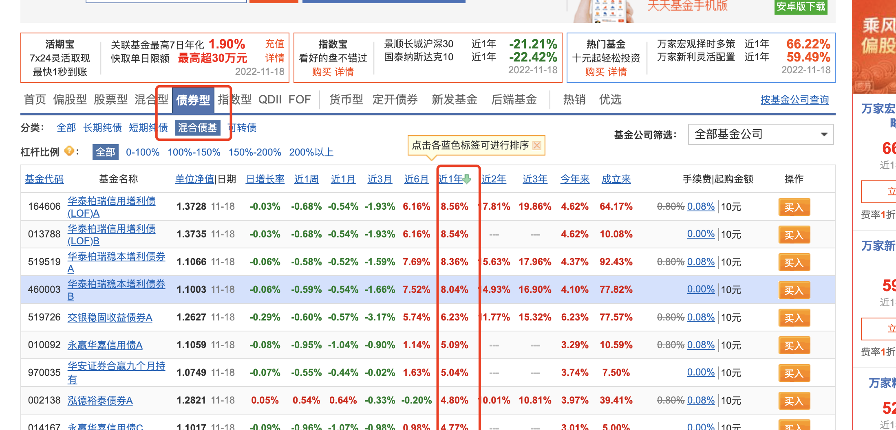
		- 挑选近1年收益率排序后，选出前10个，再按近3年排序
		- ## 挑选近1年排名高的，和近3年也排名高的
	- ## 4-3、选出近1年和3年排名高的债，点击进一步筛选
	  collapsed:: true
		- ## 挑选标准：
			- 1、成立3年以上，基金规模5-100亿之间的
			  collapsed:: true
				- 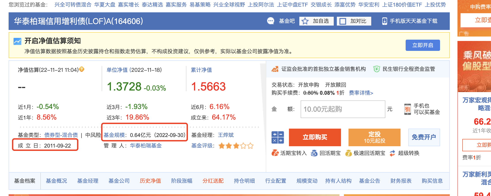
			- 2、查看目标基金的单位净值走势和累计净值走势
			  collapsed:: true
				- 基金有分红的话： 看累计净值走势，基金无分红的话，单位净值走势和累计净值走势应该一样
				- 选择 ，上涨的。不要心电图形的
				- 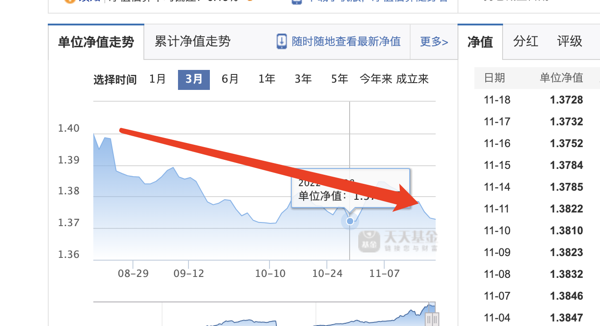
			- 3、看累计收益率走势
				- 要能超过，同类平均和沪深300
				  collapsed:: true
					- 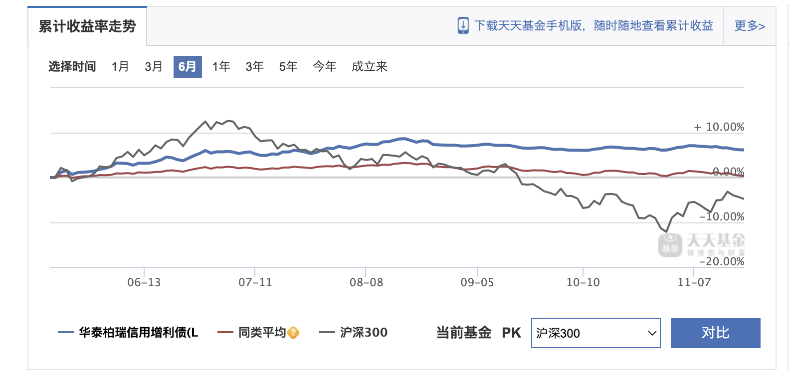{:height 316, :width 656}
				- 达不到 沪深300 直接淘汰
			- 4、查看目标基金的购买费用  ---->选费用低的
				- 在支付宝看某只基金的交易费用
				- 基本上0.08% - 0.1% 之间
			- 5、查看基金经理及任职变化 ----->不能选频繁变更基金经理的
			  collapsed:: true
				- 天天基金 继续下滑有 基金经理的变化
				- 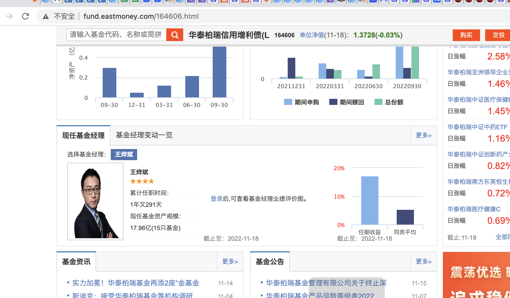
			- 6、看目标基金的持仓，了解其重仓的股票和债券
			  collapsed:: true
				- 天天基金 ->点击某一个 ->选持仓明细
					- 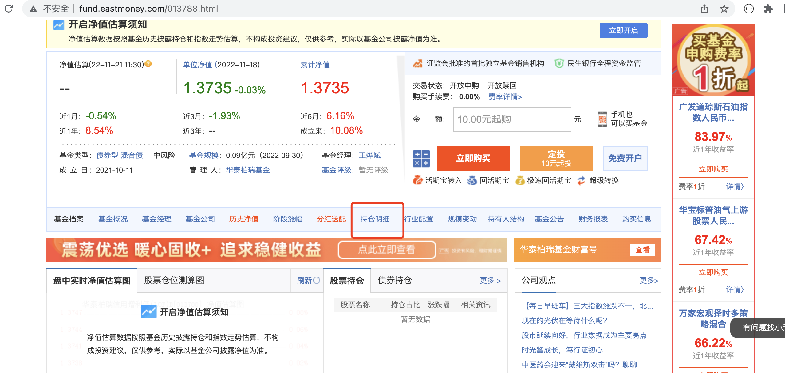
					- 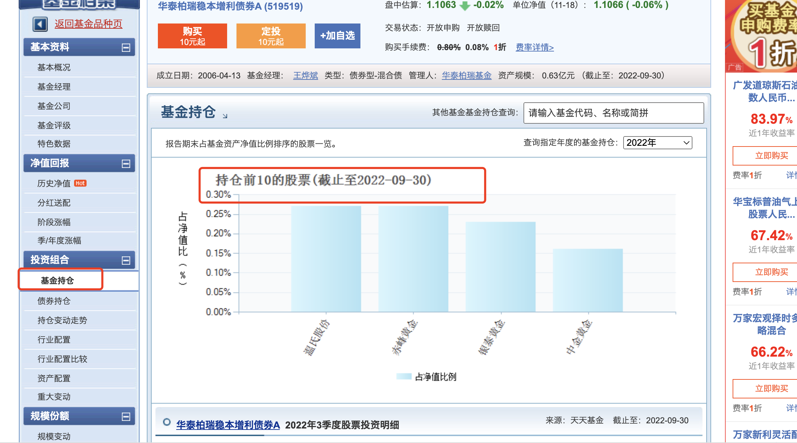
			- 7、看行业配置 和 资产配置，了解其风险
			  collapsed:: true
				- 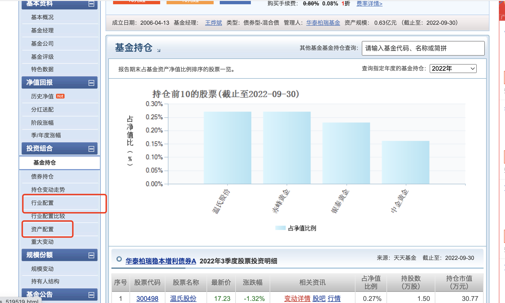
				- 资产配置看杠杆率： 将鼠标放置会显示，3者相加  如果120%多，说明杠杆20%
				  collapsed:: true
					- 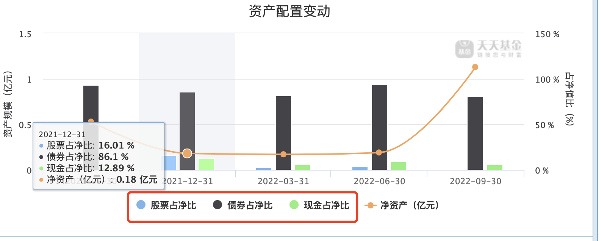{:height 257, :width 626}
			- 8、查看目标基金，标准差 和 夏普比率，与其他基金对比
			  collapsed:: true
				- 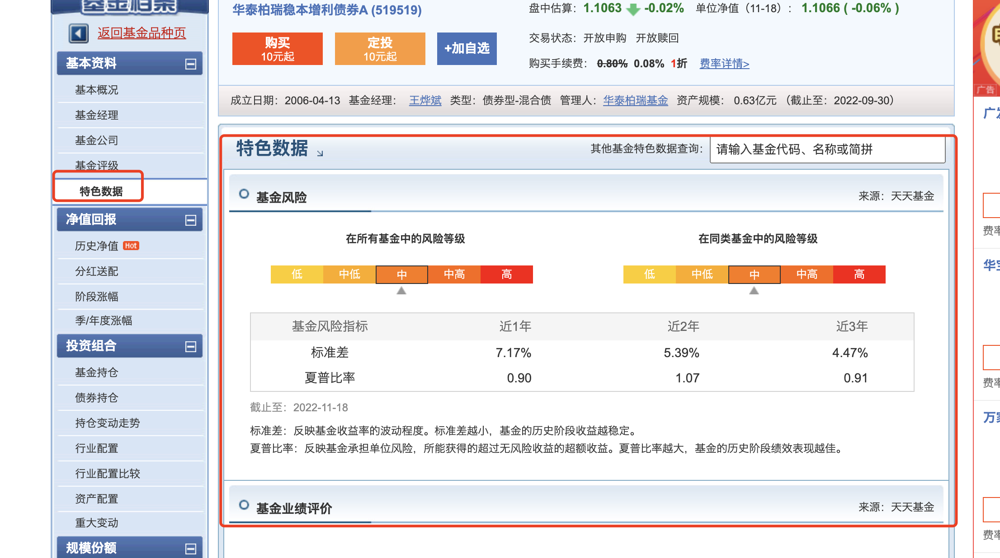
				- 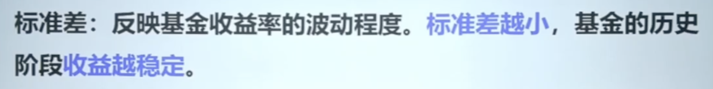{:height 90, :width 656}
				- 夏普比率：承担单位风险，所获得收益率，夏普比率越大，获得收益越好