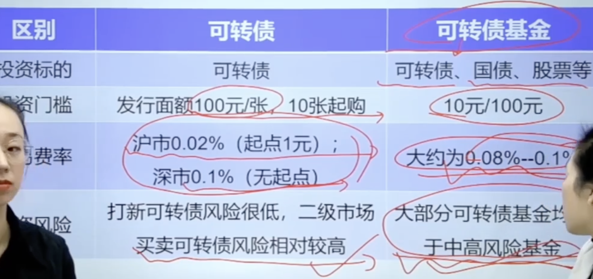
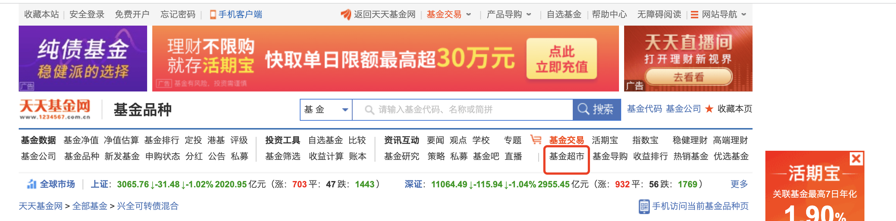
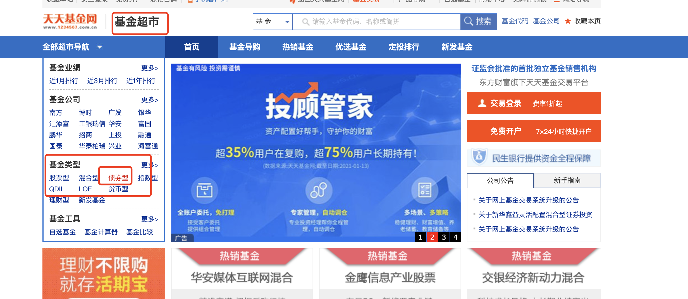
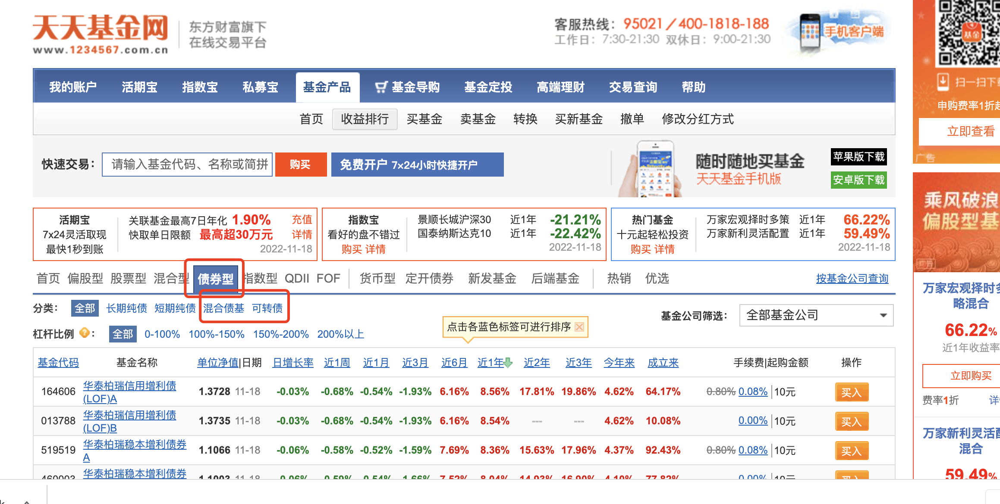

- # 一、优点
  collapsed:: true
	- ## 1、风险更低
	  collapsed:: true
		- 可转债基金是以可转债为主要投资对象，同时还包括债券、股票、权证等资产结合的工具，风险更分散
	- ## 2、操作更专业
	  collapsed:: true
		- 可转债的下修条款，强赎条款，回售条款，转股价，转股价值，溢价率等知识有一定的专业性和难度，可交给专业的基金公司来研究
	- ## 3、操作更简单
		- 投资可转债的基金只需要选择一个合适的基金就可以，不用考虑转股操作，查看强赎公告
	- ## 4、收益率高
		- 可转债基金的收益率一般远超过债券型基金，甚至可超过沪深300指数基金
- # 二、可转债和可转债基金的对比
  collapsed:: true
	- 
- # 三、可转债基金的风险类型
  collapsed:: true
	- ## 1、根据可转债的仓位来判断
		- 可转债基金属于债券型基金，投资对象包括国债、金融债、企业债和可转债
		- 前三者 配置比例高的话-----> 风险低
		- 可转债配置比例高的话-----> 风险高
	- ## 2、根据杠杆水平高低判断
		- 在可转债基金中，仓位的上限并不是100%，因为基金经理可以将已经购买的可转债进行抵押融资，继续购买可转债。这就等于增加了杠杆
	- ## 3、格努资产配置比例和行业分布判断
		- 看股票买多少，国债买多少，可转债买多少
			- 国债  风险低
			- 股票 和 可转债 风险高
		- 看行业分布
			- 制造业  比较稳的行业
- # 四、可转债基金的筛选
	- [天天基金网](http://fund.eastmoney.com/340001.html)
	- {:height 193, :width 746}
	- {:height 333, :width 746}
	- {:height 385, :width 746}
		- 长期纯债 和 短期纯债 收益率 不高基本上  7% - 8% 左右 [更多的国债 金融债等]
		-