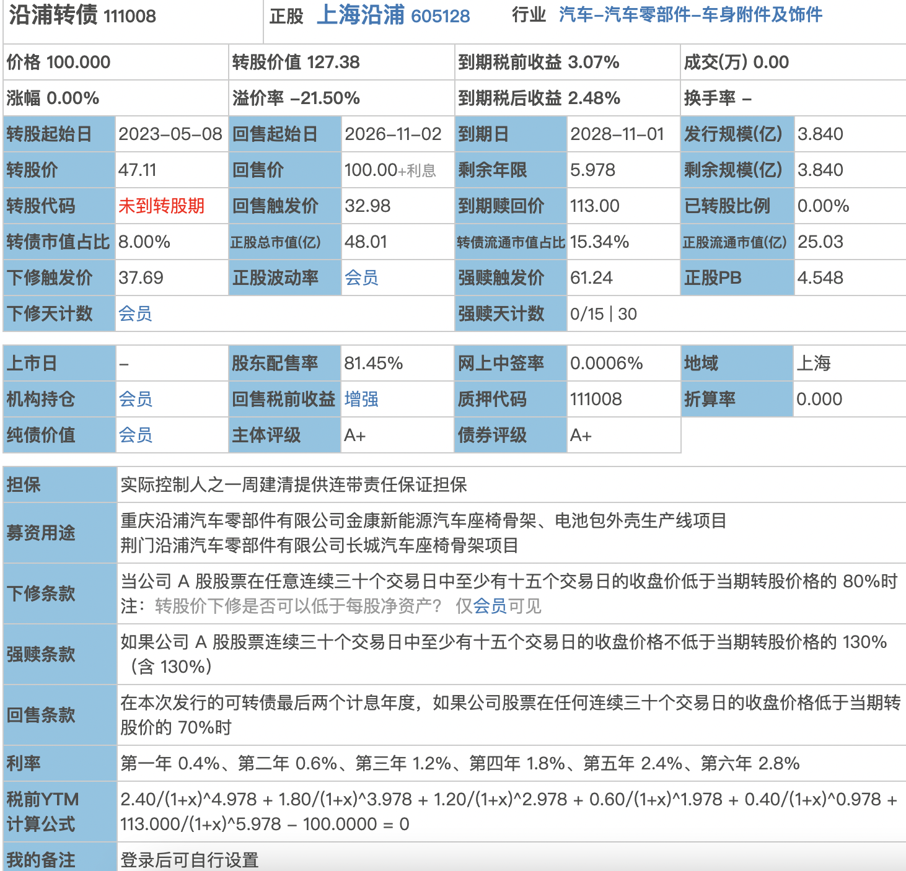

- # 一、概念
  collapsed:: true
	- 可转债：可以变成股票的债券，既有债券的性质 也有股票的性质
		- 债性：换本付息、有存续期、通常为5-6年
		- 股性：可换为股票、享受股票收益
	- 特性：和股票“同涨同跌”
- # 二、债相关概念
	- 
	- 价格100.000：是当前这张债券的交易价格
	- 转股价值127.38：是一张债券 换 股票的价值  值 127.38
		- 转股价值：一张面值100元的可转债，换成正股股票的价值
			- 转股价值 = (100/转股价值)*正股价值
			- 即
	- 转股价：47.11，转股的时候的单价。比如100块面值的债券能换多少股，100/47.11
	- ## 固定的、可变的
		- 
转股价值 = (100/转股价)*正股价值

			- 转股价值 和 正股价的关系：正股价上涨，转股价值就会上涨
			-
			- 100和转股价值是固定的   只有 正股价值是变动的。正股价上涨，转股价值就会上涨
-