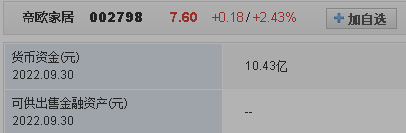

- [集思录](https://www.jisilu.cn/web/data/cb/list)
- # 一、价格较低
  collapsed:: true
	- 100元以下   ---> 极其安全(最差还本付息)
	- 100-104      ---> 极低估(还本付息 基本会5-6年110换本付息)
	- 104-108      ---> 低估
	- 108-112       ---> 合理
	- 112-118       ---> 高估 (风险较大了)
	- 118-130      ---> 极高估(只能等强赎了。触发强赎130连续15天)
	- 130以上      --->  死亡区
- # 二、转股期内
  collapsed:: true
	- 因为强赎套利逻辑，需要在转股期内
- # 三、优秀可转债
  collapsed:: true
	- 触发强赎可能性大
	- 1、当前偿债能力弱(转股能力更强)
		- 最近一个周期内   货币资金和有息负债的关系    存款不够还债
	- 2、不存在退市的风险
	- 3、未来偿债压力大
		- 看公司经营现金流(相当于工资，和债务差距很大就是未来偿债压力大)
	- 
- # 四、可转债实操
  collapsed:: true
	- 1、带感叹号的过滤掉
	  collapsed:: true
		- {:height 708, :width 454}
	- 2、关注相关指标
	  collapsed:: true
		- 2-1、主要关注以下几个时时变动的指标：
		  collapsed:: true
			- 价格：就是当前买卖债券的价格、
			- 转股价值
			- 溢价率。
			- 正股价，在涨乐财富通或者任何股票交易软件上都可查询。
		- 2-2、还要关注以下几个不变的指标：
		  collapsed:: true
			- 转股起始日，转股价、和债券评级。
			- 注意：不论债券此时的交易价格是多少，债券面值都是以100元计算，这也是一个确定的不变的指标。
		- {:height 393, :width 638}
	-
	- # 三要素->价格低
	  collapsed:: true
		- ## 第一步：勾选上市公司
			- 
		- ## 第二步：然后点击现价，把价格从低到高排序一下。这时打开一个空的表格，把价格108以下的可转债选择复制到新的空表里。
			- 风险承受能力弱的同学可以把标准降低到104或者100以下，也是没有问题的啊
			  风险能力承受强的同学把标准提到112以下，也是可以的，根据自己的判断来
	- # 三要素 ->转股期
		- ## 第三步：那就是你选中的可转债，点开看转股起始日，看是不是在转股期内就好了。
		- ## 第四步：过滤
			- 1）把评级B的去掉，评级B说明信用不好，我们不把风险留给自己啊。
				- 直接看评级栏
			- 2）把ST或*ST的去掉。
				- 看正股
			- 3）把年限低于2年的去掉。因为这样的可转债大多转股价值都比较低，也就说明正股太差了，长年持续走低。强赎的可能性不大。
				- 看剩余年限
		- ## 第五步：排序
			- 在入选的20几只可转债里，我们再进一步优化
			- 1）从等待时间来说，选转股价值高的，因为拉伸正股更容易。
			- 2）挑选更好行业的可转债，可以缩短等待时间啊。从而筛选的数量可以精简到3-5只；
			- 3）银行等金融类可转债，因发行规模巨大，普遍无回售条款【保护投资者的条款】，且较多以还本付息告终，可慎重选择。为什么呢？
			  因为AAA的，大多不差钱啊，这类正股股票大多也是比较平稳的，所以强赎的意愿不大，也就是套利的价值不高。
			- 4）下调转股价对于正股的拉伸也有加分项。
			-
		-
	- # 三要素 ->优秀可转债
	  collapsed:: true
		- ①当前能力弱
			- ## 第六步：查财报优秀可转债
			  collapsed:: true
				- I问财：输入条件：
				  XXXX（可转债对应的正股名称），最近1个季度的货币现金，可供出售金融资产，短期借款，长期借款，最近5 年净利润和经营现金流量净额
				- 
				- 10.43亿
				- 
				- 30.34亿
				- 这里是用货币资金和有息付债做对比啊，还债能力弱
		- ②未来偿债压力大
			- 
			- 平均值：0.618亿，这里是用平均值，用0.618亿和有息负债30多个亿比，发现未来偿还压力大。
			  通过以上指标，判断出目标可转债是否优质，优质加入关注。
		- ③不存在退市风险
			- 如果发现目标可转债连续2年净利润为负，就直接淘汰了。
			- 
	- # 总结：
		- 1）选择价格在108元以下的可转债；
		  2）选择进入转股期的可转债
		  3）选择有偿债压力，但上市 公司净利润为正的可转债；
		  4）选3-5支以内的可转债，资金分散投资建仓；（适合资金量不大的同学操作）
		  5）转股价值达到130即可减仓，不要过于贪心。
		-
		-
	- # 可转债双低策略优化筛选：
		- 1.转债剩余规模小于3000万淘汰，
		- 2.已公告强强赎的淘汰，
		- 3.可转债剩余年限小于一年的淘汰，
		- 4.正股是ST或*ST淘汰，
		- 5.债券评级A+以下的淘汰。
- # 五、优选可转债
	- 1、集思录 过滤110以下的债券
	  collapsed:: true
		- {:height 277, :width 716}
	- 2、过滤掉不在转股期内的
		- 可以看溢价率为灰色，就是不在转股期内
	- 3、