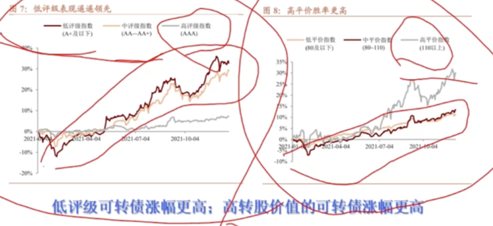

- [集思录](https://www.jisilu.cn/web/data/cb/list)
- # 一、价格较低
  collapsed:: true
	- 100元以下   ---> 极其安全(最差还本付息)
	- 100-104      ---> 极低估(还本付息 基本会5-6年110换本付息)
	- 104-108      ---> 低估
	- 108-112       ---> 合理
	- 112-118       ---> 高估 (风险较大了)
	- 118-130      ---> 极高估(只能等强赎了。触发强赎130连续15天)
	- 130以上      --->  死亡区
- # 二、转股期内
  collapsed:: true
	- 因为强赎套利逻辑，需要在转股期内
- # 三、优秀可转债
  collapsed:: true
	- 触发强赎可能性大
	- 1、当前偿债能力弱(转股能力更强)
		- 最近一个周期内   货币资金和有息负债的关系    存款不够还债
	- 2、不存在退市的风险
	- 3、未来偿债压力大
		- 看公司经营现金流(相当于工资，和债务差距很大就是未来偿债压力大)
	- 
- # 筛选时记得关注相关指标
  collapsed:: true
	- 2-1、主要关注以下几个时时变动的指标：
	  collapsed:: true
		- 价格：就是当前买卖债券的价格、
		- 转股价值
		- 溢价率。
		- 正股价，在涨乐财富通或者任何股票交易软件上都可查询。
	- 2-2、还要关注以下几个不变的指标：
	  collapsed:: true
		- 转股起始日，转股价、和债券评级。
		- 注意：不论债券此时的交易价格是多少，债券面值都是以100元计算，这也是一个确定的不变的指标。
	-
	- {:height 393, :width 638}
- # 四、可转债挑选实操
	- 1、带感叹号的过滤掉--已发布强赎公告了
	  collapsed:: true
		- {:height 708, :width 454}
	- 2、勾选已上市，即选出已上市的可转债
	  collapsed:: true
		- 
	- 3、集思录输入价格条件 90 -110的筛选。
	- 4、看溢价率为灰色的剔除掉，即为不在转股期
	- 5、剩余的复制到表格中
	- 6、初步过滤
	  collapsed:: true
		- 1）把评级B的去掉，评级B说明信用不好，我们不把风险留给自己啊。
		  collapsed:: true
			- 直接看评级栏
		- 2）把ST或*ST的去掉。
		  collapsed:: true
			- 看正股
		- 3）把年限低于2年的去掉。因为这样的可转债大多转股价值都比较低，也就说明正股太差了，长年持续走低。强赎的可能性不大。
		  collapsed:: true
			- 看剩余年限
		- 4）去掉银行等金融股
		  collapsed:: true
			- 银行等金融类可转债，因发行规模巨大，普遍无回售条款【保护投资者的条款】，且较多以还本付息告终，
			-
	- 7、财报指标筛选优质可转债
	  collapsed:: true
		- I问财：输入条件：
		  XXXX（可转债对应的正股名称），最近1个季度的货币现金，可供出售金融资产，短期借款，长期借款，最近5 年净利润和经营现金流量净额
		- ①当前能力弱
		  collapsed:: true
			- ##
				- I问财：输入条件：
				  XXXX（可转债对应的正股名称），最近1个季度的货币现金，可供出售金融资产，短期借款，长期借款，最近5 年净利润和经营现金流量净额
				- 
				- 10.43亿
				- 
				- 30.34亿
				- 这里是用货币资金和有息付债做对比啊，还债能力弱
		- ②未来偿债压力大
		  collapsed:: true
			- 
			- 平均值：0.618亿，这里是用平均值，用0.618亿和有息负债30多个亿比，发现未来偿还压力大。
			  通过以上指标，判断出目标可转债是否优质，优质加入关注。
		- ③不存在退市风险
		  collapsed:: true
			- 如果发现目标可转债连续2年净利润为负，就直接淘汰了。
			- 
	- 8、挑选完后还剩很多就排序，降低套利等待时间
		- 1）按转股价值排序，转股价值高的，因为拉伸正股更容易。
		- 2）优先选择下调过转股价的
		- 3）挑选更好行业的可转债，可以缩短等待时间啊。从而筛选的数量可以精简到3-5只；
	- 9、选3-5支以内的可转债，资金分散投资建仓；（适合资金量不大的同学操作）
		- 转股价值达到130即可减仓，不要过于贪心。
- # 五、强赎套利筛选法---优选可转债
	- 1、集思录 过滤110以下的债券
	  collapsed:: true
		- {:height 277, :width 716}
	- 2、过滤掉不在转股期内的
	  collapsed:: true
		- 可以看溢价率为灰色，就是不在转股期内 [强赎套利可以先不关注 溢价率]
	- 3、财务指标筛选优质
	  collapsed:: true
		- I问财：输入条件：
		  XXXX（可转债对应的正股名称），最近1个季度的货币现金，可供出售金融资产，短期借款，长期借款，最近5 年净利润和经营现金流量净额
		- {:height 374, :width 716}
	- 注：使用人群
	  collapsed:: true
		- 
	- 总结：
	  collapsed:: true
		- 
	- 4、如果筛选出来的还很多，按行业选优质赛道的
		- 按照可转债上涨统计，AAA及以上的不会太涨(银行股)
		  collapsed:: true
			- 
		- 
		- 踢掉银行股，最终挑选转股价值高的
	- 5、 优先选带星号的，曾经下修过转股价
	- 6、选择优质行业，
	  collapsed:: true
		- 大周期
		  collapsed:: true
			- 钢铁，有色金属
		- 制造业
		  collapsed:: true
			- 高端制造
		- 大消费
		  collapsed:: true
			- 食品，啤酒饮料，家用电器
			-
		- 技巧：看正股涨跌排序，看到涨停的是哪些行业。说明当前热点的是哪些，然后，集思录按行业筛选可转债。去关注
	- 辅助条件总结：
	  collapsed:: true
		- 
	- 7、加减仓时，可以关注强赎天计数，查看当前满足强赎的天数
		- 
		- 14天是减仓的信号
- # 可转债双低策略筛选条件：
  collapsed:: true
	- 1.转债剩余规模小于3000万淘汰，
	- 2.已公告强强赎的淘汰，
	- 3.可转债剩余年限小于一年的淘汰，
	- 4.正股是ST或*ST淘汰，
	- 5.债券评级A+以下的淘汰。