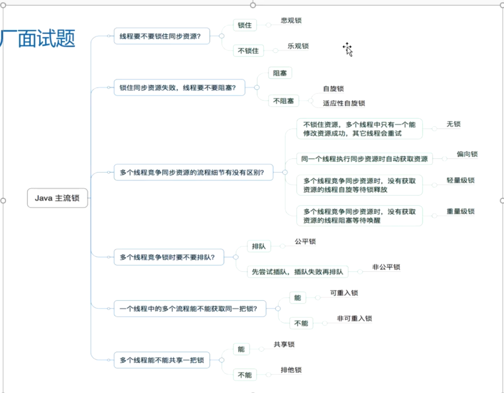

- 
- # 公平锁非公平锁
  collapsed:: true
	- 根据AQS原理的CLH队列锁思想。
	- [[#red]]==**公平锁：**==任何一个线程想拿锁都得先队尾排队，都去排队就是公平锁，
	  ReentrantLock可重入锁的内部就提供了FairSync（继承 了AQS）
	- [[#red]]==**非公平锁：**==可以不用排队，直接拿锁就是非公平锁
	  ReentrantLock内部 NonfairSync(继承了AQS)
- # [[可重入锁]]：ReentrantLock，synchnized
- # [[悲观锁，乐观锁]]
- # 独占锁
	- 只有一个线程能持有
- # 读写锁
- # [[自旋锁]]
-
-
- # [[锁的状态]]