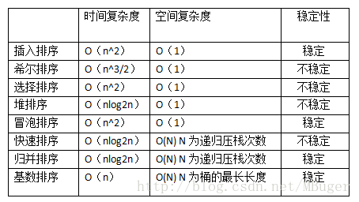

- # 1、插入排序
	- 简介：插入排序是一种较为简单的排序算法
	- 基本思想：它的基本思想是通过构建有序序列，对于未排序数据，在已排序序列中从后向前扫描，找到相应位置并插入。
	- 举例：形象的可以理解为打扑克抓拍的过程，通常我们右手抓牌，没抓一张牌，就放到左手，抓下一张牌后，会把这张牌依次与左手上的牌比较，并把它插入到一个合适的位置（按牌面大小）。
- # 2、希尔排序
	- 简介：希尔排序是对直接插入排序的一种优化，实质就是把直接插入排序改为了分组插入排序。
	- 思想：其基本思想就是将整个待排序元素序列按gap（步长）分割为N个组，对每个组进行直接插入排序，然后在减小gap（步长）再进行直接插入排序，直到gap达到最小时，即数组基本达到有序时，再对数组进行直接插入排序，此时直接插入排序就可以达到最高效率。
- # 3、选择排序
	- 思想：选择排序的排序思想就和它的名字一样，每次通过从无序的数组中选择出一个最小的（要求升序排列）数把他放到数组的最前面。再依次找次小的数字放到数组无序区的最前。直到数组为有序。
	-
- # 4、堆排序
	- 思想：堆排序（使用大堆，升序）从基本实现原理来说也是一种选择排序，它同样是确定了位置选择符合位置的元素，但是堆排序是更加优化的选择排序的版本，它利用了堆的特性。父结点的值大于子结点，且满足完全二叉树，大大提高了选择排序的效率。
- # 5、冒泡排序
	- 思想：冒泡排序（这里指升序）是一种非常简单直观的排序方式，它是一种交换式的排序方法，基本思想就是相近的两个数字作比较，小的放到前面，大的放后面，按照这个规则从头向后比较，最大的数就被换到了数组尾。
- # 6、快速排序
	- 简介：快速排序是一种在实际应用中经常用到的排序算法
	- 应用场景：是大规模的数据排序，并且实际性能要好于归并排序。
	- 原理：它的基本原理是从数组中选取一个元素，把所有大于这个元素的数都放到它的后面，所有小于这个元素的数都放到它的前面，然后这个元素就把原数组切分成了两个部分，再分别对这个两个部分进行同样的操作，直到数组不能再切分的时候，此时数组为有序。
- # 7、归并排序
	- 简介：“归并”的含义是将两个或两个以上的有序表组合成一个新的有序表，归并排序和快排一样也采用的是分治的思想，
	- 原理：它的基本原理是通过对若干个有序结点序列的合并为一个有序序列来实现排序的。
- # 8、基数排序
	- 基数排序（升序）是一种非比较式的排序方式，和之前博文中提到的快排，冒泡排序，插入排序这些排序算法不一样，它没有使用任何交换的方式
	- 原理：它的基本思想是通过分配的方法把元素从小到大分配，以到达排序的作用。
- # 时间空间对比
	- {:height 264, :width 454}
	- 稳定性是指如果存在多个具有相同排序码的记录，经过排序后，这些记录的相对次序仍然保持不变，则这种排序算法称为稳定的。
- # 应用场景
	- ## 1、
	- 若n较小(如n≤50)，可采用直接插入或直接选择排序。
	  　当记录规模较小时，直接插入排序较好；否则因为直接选择移动的记录数少于直接插人，应选直接选择排序为宜。
	  (2)若文件初始状态基本有序(指正序)，则应选用直接插人、冒泡或随机的快速排序为宜；
	  (3)若n较大，则应采用时间复杂度为O(nlgn)的排序方法：快速排序、堆排序或归并排序。
	  　快速排序是目前基于比较的内部排序中被认为是最好的方法，当待排序的关键字是随机分布时，快速排序的平均时间最短；
	  　堆排序所需的辅助空间少于快速排序，并且不会出现快速排序可能出现的最坏情况。这两种排序都是不稳定的。
	  　若要求排序稳定，则可选用归并排序。但前面介绍的从单个记录起进行两两归并的排序算法并不值得提倡，通常可以将它和直接插入排序结合在一起使用。先利用直接插入排序求得较长的有序子序列，然后再两两归并之。因为直接插入排序是稳定 的，所以改进后的归并排序仍是稳定的。