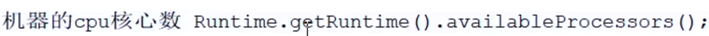

- 前提：先确定任务类型
- CPU密集型：计算的，从内存中取数计算
	- 
	- 最大线程数：不要超过机器的cpu核心数+1
		- 为什么+1？磁盘可能产生虚拟内存，造成页缺失的情况，防止cpu空闲出来
- IO密集型：网络通信读写磁盘的
	- 最大线程数：不要超过机器的cpu核心数*2 （经验来说比较合理）
- 混合型：既有频繁cpu又有io的
	- 2种类型的任务，执行时间相差不大，比如都是10ms，考虑拆分成2个线程池
	- 2个任务相差比较大，比如cpu 10ms io 5s，那么不要拆分，按照io密集型配置就行
-
- 1、高并发型，达到最大吞吐量可以参考Okhttp 分发器的线程池设置[[分发器Dispatcher的线程池]]
-
- 参考时间消费
  collapsed:: true
	- 