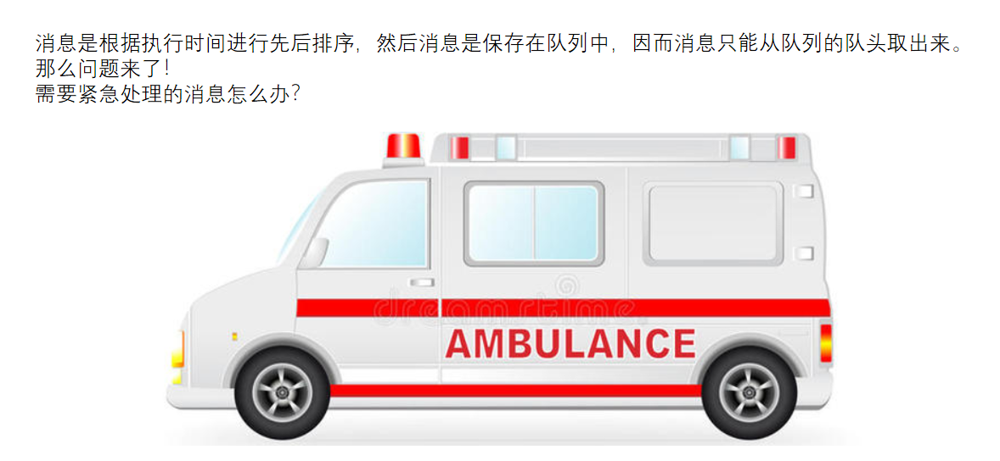

- # 一、概念
	- 大家经过上面的学习应该知道，线程的消息都是放到同一个MessageQueue里面，取消息的时候是互斥取消息，而且只能从头部取消息，**==而添加消息是按照消息的执行的先后顺序进行的排序==**，
	- 那么问题来了，同一个时间范围内的消息，如果它是需要立刻执行的，那我们怎么办，按照常规的办法，我们需要等到队列轮询到我自己的时候才能执行哦，那岂不是黄花菜都凉了。所以，我们需要给紧急需要执行的消息一个绿色通道，这个绿色通道就是同步屏障的概念。
	- 它是一个架构思路，救护车（异步消息）走应急车道先过
		- 
	- 屏障的意思即为阻碍，顾名思义，**同步屏障就是阻碍同步消息，只让异步消息通过**。
- # 二、如何开启同步屏障呢？
	- MessageQueue.postSyncBarrier()
	  collapsed:: true
		- ```java
		   public int postSyncBarrier() {
		          return postSyncBarrier(SystemClock.uptimeMillis());
		      }
		  
		      private int postSyncBarrier(long when) {
		          // Enqueue a new sync barrier token.
		          // We don't need to wake the queue because the purpose of a barrier is to stall it.
		          synchronized (this) {
		              final int token = mNextBarrierToken++;
		            	////从消息池中获取Message
		              final Message msg = Message.obtain();
		              msg.markInUse();
		              //就是这里！！！初始化Message对象的时候，并没有给target赋值，因此 target==null
		              msg.when = when;
		              msg.arg1 = token;
		  
		              Message prev = null;
		              Message p = mMessages;
		              if (when != 0) {
		                  while (p != null && p.when <= when) {
		                    //如果开启同步屏障的时间（假设记为T）T不为0，且当前的同步消息里有时间小于T，
		                    //则prev也不为null
		                      prev = p;
		                      p = p.next;
		                  }
		              }
		              //根据prev是不是为null，将 msg 按照时间顺序插入到 消息队列（链表）的合适位置
		              if (prev != null) { // invariant: p == prev.next
		                  msg.next = p;
		                  prev.next = msg;
		              } else {
		                  msg.next = p;
		                  mMessages = msg;
		              }
		              return token;
		          }
		      }
		  ```
	- 相当于在消息队列里添加了个Target = null的msg[这个msg就起到了消息屏障的作用]，消息队列.next（）取消息时，判断有这个消息屏障会，优先取异步消息
- # 三、如何移除消息屏障？
  collapsed:: true
	- MessageQueue.removeSyncBarrier
		- ```java
		      /**
		       * Removes a synchronization barrier.
		       *
		       * @param token The synchronization barrier token that was returned by
		       * {@link #postSyncBarrier}.
		       *
		       * @throws IllegalStateException if the barrier was not found.
		       *
		       * @hide
		       */
		      @TestApi
		      public void removeSyncBarrier(int token) {
		          // Remove a sync barrier token from the queue.
		          // If the queue is no longer stalled by a barrier then wake it.
		          synchronized (this) {
		              Message prev = null;
		              Message p = mMessages;
		              while (p != null && (p.target != null || p.arg1 != token)) {
		                  prev = p;
		                  p = p.next;
		              }
		              if (p == null) {
		                  throw new IllegalStateException("The specified message queue synchronization "
		                          + " barrier token has not been posted or has already been removed.");
		              }
		              final boolean needWake;
		              if (prev != null) {
		                  prev.next = p.next;
		                  needWake = false;
		              } else {
		                  mMessages = p.next;
		                  needWake = mMessages == null || mMessages.target != null;
		              }
		              p.recycleUnchecked();
		  
		              // If the loop is quitting then it is already awake.
		              // We can assume mPtr != 0 when mQuitting is false.
		              if (needWake && !mQuitting) {
		                  nativeWake(mPtr);
		              }
		          }
		      }
		  
		  ```
	- 从消息队列移除target = null的这个消息。
- # 三、[[开启同步消息屏障，处理异步消息的流程？]]
- # 四、应用场景
  collapsed:: true
	- ## 同步屏障在系统源码中有哪些使用场景呢？
		- Android 系统中的 [[#red]]==UI 更新相关的消息即为异步消息==，需要优先处理
		- 比如，在 View 更新时，draw、requestLayout、invalidate 等很多地方都调用了
		- ViewRootImpl.scheduleTraversals() ，如下
		  collapsed:: true
			- ```java
			  void scheduleTraversals() {
			  	if (!mTraversalScheduled) {
			  		mTraversalScheduled = true;
			  		//开启同步屏障
			  		mTraversalBarrier = mHandler.getLooper().getQueue().postSyncBarrier();
			  		//发送异步消息
			  		mChoreographer.postCallback(Choreographer.CALLBACK_TRAVERSAL, mTraversalRunnable, null);
			  		if (!mUnbufferedInputDispatch) {
			  				scheduleConsumeBatchedInput();
			  		}
			  		notifyRendererOfFramePending();
			  		pokeDrawLockIfNeeded();
			  	}
			  }
			  ```
		- postCallback() 最终走到了 ChoreographerpostCallbackDelayedInternal() ：
		  collapsed:: true
			- ```java
			  private void postCallbackDelayedInternal(int callbackType,
			  Object action, Object token, long delayMillis) {
			  	if (DEBUG_FRAMES) {
			  		Log.d(TAG, "PostCallback: type=" + callbackType- ", action=" + action + ",
			  		token=" + token =" + delayMillis);
			  	}
			  	synchronized (mLock) {
			  		final long now = SystemClock.uptimeMillis();
			  		final long dueTime = now + delayMillis;
			  		mCallbackQueues[callbackType].addCallbackLocked(dueTime, action, token);
			  		if (dueTime <= now) {
			  			scheduleFrameLocked(now);
			  		} else {
			  			Message msg = mHandler.obtainMessage(MSG_DO_SCHEDULE_CALLBACK, action);
			  			msg.arg1 = callbackType;
			  			msg.setAsynchronous(true); //异步消息
			  			mHandler.sendMessageAtTime(msg, dueTime);
			  		}
			  	}
			  }
			  ```
		- 这里就开启了同步屏障，并发送异步消息，由于 UI 更新相关的消息是优先级最高的，这样系统就会优先处理这些异步消息。
		- 最后，当要移除同步屏障的时候需要调用 ViewRootImpl.unscheduleTraversals() 。
			- ```java
			  void unscheduleTraversals() {
			  	if (mTraversalScheduled) {
			  		mTraversalScheduled = false;
			  		//移除同步屏障
			  		mHandler.getLooper().getQueue().removeSyncBarrier(mTraversalBarrier);
			  		mChoreographer.removeCallbacks(
			  		Choreographer.CALLBACK_TRAVERSAL, mTraversalRunnable, null);
			  	}
			  }
			  ```
- # 五、总结
	- 同步屏障的设置可以方便地处理那些优先级较高的异步消息。当我们调用
	- Handler.getLooper().getQueue().postSyncBarrier() 并设置消息的 setAsynchronous(true) 时，target 即为 null ，也就开启了同步屏障。当在消息轮询器 Looper 在 loop() 中循环处理消息时，如若开启了同步屏障，会优先处理其中的异步消息，而阻碍同步消息。