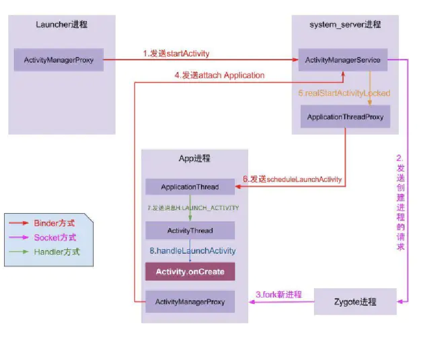

- 
- # 一、启动状态
  collapsed:: true
	- 应用有三种启动状态，每种状态都会影响应用向用户显示所需的时间：冷启动、温启动与热启动。在冷启动中，应用从头开始启动。在另外两种状态中，系统需要将后台运行的应用带入前台。建议始终在假定冷启动的基础上进行优化。这样做也可以提升温启动和热启动的性能。
	- ## 冷启动
		- 冷启动是指应用从头开始启动：[[#red]]==**系统进程在冷启动后才创建应用进程**==。发生冷启动的情况包括应用
		  自设备启动后或系统终止应用后首次启动。
		- [[#red]]==**进程不存在，需要从应用进程启动开始**==
	- ## 热启动
		- 在热启动中，系统的所有工作就是[[#red]]==**将 Activity 带到前台**==。只要应用的所有 Activity 仍驻留在内存
		  中，应用就不必重复执行对象初始化、布局加载和绘制。
	- ## 温启动
		- 温启动包含了在冷启动期间发生的部分操作；同时，它的开销要比热启动高。有许多潜在状态可视
		  为温启动。例如
			- 用户在退出应用后又重新启动应用。[[#red]]==**进程可能未被销毁，继续运行，但应用需要执行onCreate() 从头开始重新创建 Activity。**==
			- 系统将应用从内存中释放，然后用户又重新启动它。进程和 Activity 需要重启，但传递到onCreate() 的已保存的实例 state bundle 对于完成此任务有一定助益。
- # 二、了解启动流程
  collapsed:: true
	- ①点击桌面App图标，Launcher进程采用Binder IPC向system_server进程发起startActivity请求；
	  
	  ②system_server进程接收到请求后，向zygote进程发送创建进程的请求；
	  
	  ③Zygote进程fork出新的子进程，即App进程；
	  
	  ④App进程，通过Binder IPC向sytem_server进程发起attachApplication请求；
	  
	  ⑤system_server进程在收到请求后，进行一系列准备工作后，再通过binder IPC向App进程发送scheduleLaunchActivity请求；
	  
	  ⑥App进程的binder线程（ApplicationThread）在收到请求后，通过handler向主线程发送LAUNCH_ACTIVITY消息；
	  
	  ⑦主线程在收到Message后，通过反射机制创建目标Activity，并回调Activity.onCreate()等方法。
	  
	  ⑧到此，App便正式启动，开始进入Activity生命周期，执行完onCreate/onStart/onResume方法，UI渲染结束后便可以看到App的主界面
	- 
- # 三、启动耗时统计
	- ## [[启动时间258原则]]
	- ## 系统日志统计
	  collapsed:: true
		- logcat 包含一个输出行，其中包含名为 Displayed 的值。此值代表从启动进程到在屏幕上完成对应 Activity 的绘制所用的时间。
		- ```java
		  ActivityManager: Displayed com.android.myexample/.StartupTiming: +3s534ms
		  ```
		- 如果我们使用异步懒加载的方式来提升程序画面的显示速度，这通常会导致的一个问题是，程序画面已经显示，同时 Displayed 日志已经打印，可是内容却还在加载中。为了衡量这些异步加载资源所耗费的时间，我们可以在异步加载完毕之后调用activity.reportFullyDrawn() 方法来让系统打印到调用此方法为止的启动耗时
	- ## [[adb 命令统计]]
- # 四、启动耗时分析工具
	- ## [[CPU Profile]]TraceView已经弃用
- # 五、[[启动优化手段]]
- # 六、[[StrictMode严苛模式]]
- # 七、[[启动黑白屏怎么解决]]
- # 面试
	- # [[启动优化-面试]]
- # 参考
	- ## [[启动耗时优化]]
	- ## [[启动优化实战]]
-