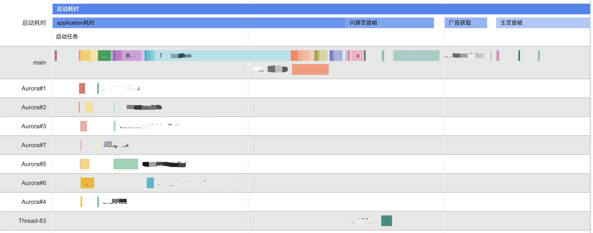
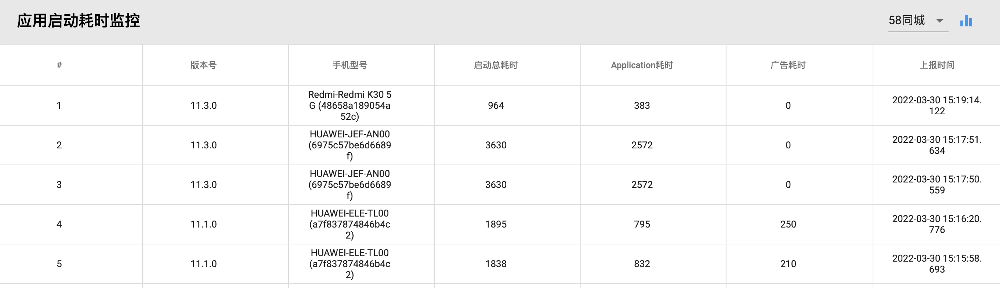

- # 1、前言
  collapsed:: true
	- 
	- App 启动是指用户从 App 之外的场景进入到当前 App 中的过程，按照 App 的进程是否存在以及主 Activity 的生命周期状态，App 启动主要包括冷启动、温启动和热启动三种。启动优化主要是针对冷启动过程，目标是减少用户从桌面点击 icon 启动 App 到展示出 App 主页的首帧画面或者从其他应用调起 App 首次启动到展示出业务的落地页首帧过程的耗时。
	- 关于 App 启动优化的原理和检测工具的介绍，网上已经有很多分享的资料，有的分享技术深入内容全面但理论性太强不便于在项目中实践，有的只讲了某些方面的优化细节而不成体系。每个 App 都有自己特有的业务逻辑和代码实现，有必要针对自身 App 的特点，系统地把细碎的优化方法组织起来，形成一套适合本 App 维护的完整的优化方案体系。本文将主要介绍我们团队在 58同城 App 中进行启动优化的实践。
- # 2、项目背景
  collapsed:: true
	- 随着业务需求不断迭代 App 内的代码逻辑越来越复杂，启动流程的逻辑也越来越复杂，导致 App 的启动性能逐渐劣化。通过启动流程的埋点简单监测了一个线上版本的启动时间，统计发现有大约 20% 的用户启动时间超过了5s，这对外部投放业务帖子的落地页到达率产生了不利影响。业务线团队找到我们无线团队，要求优化58 App 的启动时间。
	- 58同城 App 中集合了招聘、汽车、房产和本地生活服务等业务模块，在启动过程中会初始化各业务模块，同时还会初始化大量的三方和自研的 SDK；除了通过点击桌面 icon 的方式启动， 58 同城 App 中大量的业务帖子落地页可能通过外部应用调起直达，这就要求 58 App 的启动优化既要关注正常流程的优化，还要关注外部调起过程的优化。
- # 3、优化分析
  collapsed:: true
	- 在设计优化方案实施优化动作之前，需要先对 App 的现状进行摸底分析，针对现在的性能瓶颈进行有效的治理，谋定而后动，争取最大化的优化收益和投入产出比。
	- ## 3.1 启动流程分析
	  collapsed:: true
		- 首先从工程代码对 58 App 的启动流程做全路径分析，58同城 App 与大多数同类型 App 的启动路径类似，启动逻辑主要是从 Application 开始到 App 的首页主 Activity onResume 生命周期方法被执行。
		  collapsed:: true
			- 
		- 冷启动的 App 进程由 zygote 进程 fork 出来后会执行 ActivityThread 的 main 方法，在该方法中执行 attach 方法，然后通过跨进程通信触发执行 bindApplication，这是被启动 App 的 Application 开始执行的起点，我们在应用中首先能触达到的方法是其 attachBaseContext 方法，一般应用层的业务初始化从这里开始。
		- 接下来是 installProvider 阶段，一些三方 SDK 可能借助该时机进行初始化，58 App 对这一阶段没有特别处理。然后会执行到 Application 的 onCreate 方法，这是 58 App 中主要的业务初始化阶段，包括三方 SDK、业务线 Lib 库和公司以及部门自研的通用中间件的初始化，虽然已经将所有初始化模块进行了细粒度的任务化和异步执行，但没有做到按需和延迟初始化等。
		- 执行了 Application onCreate 方法后，系统会调起应用的启动 Activity，在 58App 的 LaunchActivity 中处理了启动过程的引导页、开屏广告和 deeplink 的业务分发逻辑，这部分逻辑非常复杂。正常启动流程接下来会进入到 58App 主页面 HomeActivity 中，如果是外部调起的 deeplink 方式启动会进入到业务的落地载体页 Activity。接下来就是主页或者落地页布局的构建和渲染，当完成首帧 View 显示后，就完成了用户可感受到的应用启动过程。
		- 在 58 App 启动过程中还有一个重要的逻辑是隐私权限检查，并在应用首次启动时在 LaunchActivity 之前弹出提示框要求用户选择是否同意隐私协议。这里使用了反射的方法，通过 SharedPreferences 保存了相关状态值，这部分逻辑在 Application attachBaseContext 方法中执行，对启动性能有必然的影响。
	- ## 3.2 耗时归因分析
	  collapsed:: true
		- 所有的耗时都是因为代码运行时不合理地消耗了系统资源而产生的，耗时归因分析就是要找出代码中不合理地消耗了系统资源的地方，消耗系统资源的方式包括占用过多 CPU 时间、频繁的 CPU 调度、I/O 等待和锁抢占等。
		- 程序运行最根本的是需要得到 CPU 时间片，如果一个任务需要较多的 CPU 时间执行，那么它将影响其他任务的执行，从而影响整体任务队列的运行；线程切换涉及到 CPU 调度，而 CPU 调度会有系统资源的开销，所以大量的线程频繁切换也会产生巨大的性能损耗；IO 和 锁的等待会直接阻塞任务的执行，不能充分地利用 CPU 等系统资源。
		- 
		-
	- 我们基于原来的启动流程和启动任务，通过 trace 打点分析所有的启动任务，并将 58 App 的启动过程划分成3个阶段：
	- Trace-T1，从 Application 的 attachBaseContext 方法开始到 LaunchActivity 的 onCreate 方法被调用；
	  Trace-T2，从 LaunchActivity 的 onCreate 方法开始执行到 HomeActivity 的 onCreate 方法被调用；
	  Trace-T3，从 HomeActivity 的 onCreate 方法开始执行到首页 Fragment 的 onResume 方法结束。
	  通过 Profile 分析工具按上述执行阶段详细地分析启动过程中的任务耗时，梳理出启动过程的所有任务的具体耗时点。
- # 4、监控方案
  collapsed:: true
	- 古人云“工欲善其事，必先利其器”，对于启动性能优化来说，如果能获取到各启动阶段以及所有启动任务的执行耗时的可视化数据，将有利于了解启动任务的耗时情况，帮助分析优化方向，同时也可以做优化对比。
	- Android Studio 中的 Profiler 工具以及在线性能分析工具 Perfetto 等都可以做非常详细的性能分析，但需要导出 app 运行的 traces 文件，然后加载到其中才能进行分析，不便于我们开发过程中快速地分析。我们希望可以在 App 运行后直接上报性能数据，然后在工具中可以直观地展示出详细的任务耗时和运行时序图。
	- 于是我们基于 Profiler 的 API 开发了在线可视化性能监控工具，通过在客户端埋点打印执行任务的起止时间，然后在启动完成后（即主页首帧绘制完成）上报搜集的性能数据，在后端分析数据并以时序图展示出任务的执行耗时
	  collapsed:: true
		- 
	- 目前这套可视化的监控工具主要是团队内部用于在开发和测试阶段辅助分析优化点和优化结果，目前还没有实现对线上版本的启动过程监控，也没有对外公开这套工具。不过对于测试阶段的用户启动 58App，可以产出启动时间的统计数据，如下图所示。对于正式发布的线上版本，现阶段我们仍然采用对启动过程的关键点进行埋点统计启动耗时。
	  collapsed:: true
		- 
- # 5、优化方案
	- 根据我们对 58 App 启动流程的具体任务耗时问题的分析和梳理，结合工程代码结构的特点，秉着最小化侵入业务线代码的原则和小步快跑的迭代开发思路，我们进行了以下优化实践：重构组件化的任务启动框架、延迟不必要的初始化任务、合并启动页与首页逻辑、优化首页布局和相关逻辑、外部调起定制化启动。下面将对这些实践内容的具体优化方案分布做详细的阐述。
	- ## 5.1 组件化的启动框架
		- 优化前 58 App 中已经使用了一套将初始化任务 Task 化的启动任务管理框架，但该框架存在几个问题：
		- 1、创建一个新的任务后必须手动添加到启动过程的任务队列中，并需要配置所属进程和优先级；
		- 2、由于启动任务队列是在主 Module 的 Application 类中管理的，代码隔离的业务线如果要新增启动任务将比较麻烦；
		- 3、应用主进程和子进程的任务管理全在 Application 类中管理，存在大量 if-else 控制逻辑。总的来说，该任务管理框架有违开放封闭和单一职责等设计原则，代码的扩展性和维护性都存在问题。
		-