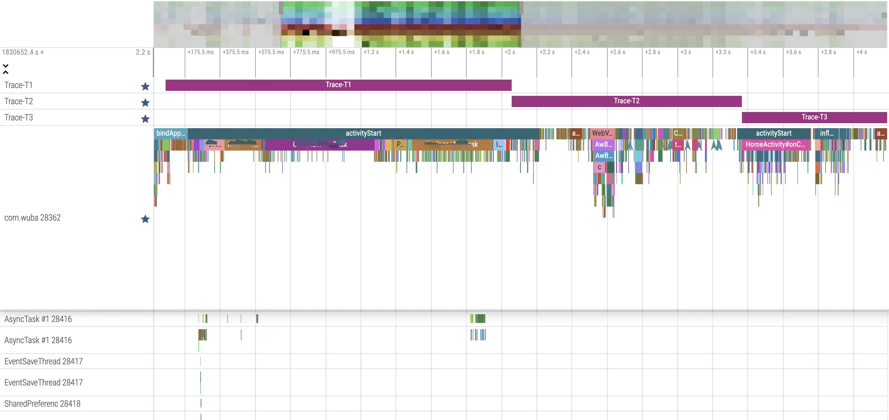

# 1、前言
collapsed:: true
	- 
	- App 启动是指用户从 App 之外的场景进入到当前 App 中的过程，按照 App 的进程是否存在以及主 Activity 的生命周期状态，App 启动主要包括冷启动、温启动和热启动三种。启动优化主要是针对冷启动过程，目标是减少用户从桌面点击 icon 启动 App 到展示出 App 主页的首帧画面或者从其他应用调起 App 首次启动到展示出业务的落地页首帧过程的耗时。
	- 关于 App 启动优化的原理和检测工具的介绍，网上已经有很多分享的资料，有的分享技术深入内容全面但理论性太强不便于在项目中实践，有的只讲了某些方面的优化细节而不成体系。每个 App 都有自己特有的业务逻辑和代码实现，有必要针对自身 App 的特点，系统地把细碎的优化方法组织起来，形成一套适合本 App 维护的完整的优化方案体系。本文将主要介绍我们团队在 58同城 App 中进行启动优化的实践。
- # 2、项目背景
  collapsed:: true
	- 随着业务需求不断迭代 App 内的代码逻辑越来越复杂，启动流程的逻辑也越来越复杂，导致 App 的启动性能逐渐劣化。通过启动流程的埋点简单监测了一个线上版本的启动时间，统计发现有大约 20% 的用户启动时间超过了5s，这对外部投放业务帖子的落地页到达率产生了不利影响。业务线团队找到我们无线团队，要求优化58 App 的启动时间。
	- 58同城 App 中集合了招聘、汽车、房产和本地生活服务等业务模块，在启动过程中会初始化各业务模块，同时还会初始化大量的三方和自研的 SDK；除了通过点击桌面 icon 的方式启动， 58 同城 App 中大量的业务帖子落地页可能通过外部应用调起直达，这就要求 58 App 的启动优化既要关注正常流程的优化，还要关注外部调起过程的优化。
- # 3、优化分析
	- 在设计优化方案实施优化动作之前，需要先对 App 的现状进行摸底分析，针对现在的性能瓶颈进行有效的治理，谋定而后动，争取最大化的优化收益和投入产出比。
	- ## 3.1 启动流程分析
		- 首先从工程代码对 58 App 的启动流程做全路径分析，58同城 App 与大多数同类型 App 的启动路径类似，启动逻辑主要是从 Application 开始到 App 的首页主 Activity onResume 生命周期方法被执行。
			- 
		- 冷启动的 App 进程由 zygote 进程 fork 出来后会执行 ActivityThread 的 main 方法，在该方法中执行 attach 方法，然后通过跨进程通信触发执行 bindApplication，这是被启动 App 的 Application 开始执行的起点，我们在应用中首先能触达到的方法是其 attachBaseContext 方法，一般应用层的业务初始化从这里开始。
		- 接下来是 installProvider 阶段，一些三方 SDK 可能借助该时机进行初始化，58 App 对这一阶段没有特别处理。然后会执行到 Application 的 onCreate 方法，这是 58 App 中主要的业务初始化阶段，包括三方 SDK、业务线 Lib 库和公司以及部门自研的通用中间件的初始化，虽然已经将所有初始化模块进行了细粒度的任务化和异步执行，但没有做到按需和延迟初始化等。
		- 执行了 Application onCreate 方法后，系统会调起应用的启动 Activity，在 58App 的 LaunchActivity 中处理了启动过程的引导页、开屏广告和 deeplink 的业务分发逻辑，这部分逻辑非常复杂。正常启动流程接下来会进入到 58App 主页面 HomeActivity 中，如果是外部调起的 deeplink 方式启动会进入到业务的落地载体页 Activity。接下来就是主页或者落地页布局的构建和渲染，当完成首帧 View 显示后，就完成了用户可感受到的应用启动过程。
		- 在 58 App 启动过程中还有一个重要的逻辑是隐私权限检查，并在应用首次启动时在 LaunchActivity 之前弹出提示框要求用户选择是否同意隐私协议。这里使用了反射的方法，通过 SharedPreferences 保存了相关状态值，这部分逻辑在 Application attachBaseContext 方法中执行，对启动性能有必然的影响。
	- ## 3.2 耗时归因分析
		- 所有的耗时都是因为代码运行时不合理地消耗了系统资源而产生的，耗时归因分析就是要找出代码中不合理地消耗了系统资源的地方，消耗系统资源的方式包括占用过多 CPU 时间、频繁的 CPU 调度、I/O 等待和锁抢占等。
		- 程序运行最根本的是需要得到 CPU 时间片，如果一个任务需要较多的 CPU 时间执行，那么它将影响其他任务的执行，从而影响整体任务队列的运行；线程切换涉及到 CPU 调度，而 CPU 调度会有系统资源的开销，所以大量的线程频繁切换也会产生巨大的性能损耗；IO 和 锁的等待会直接阻塞任务的执行，不能充分地利用 CPU 等系统资源。
		- 
		-
	- 我们基于原来的启动流程和启动任务，通过 trace 打点分析所有的启动任务，并将 58 App 的启动过程划分成3个阶段：
	- Trace-T1，从 Application 的 attachBaseContext 方法开始到 LaunchActivity 的 onCreate 方法被调用；
	  Trace-T2，从 LaunchActivity 的 onCreate 方法开始执行到 HomeActivity 的 onCreate 方法被调用；
	  Trace-T3，从 HomeActivity 的 onCreate 方法开始执行到首页 Fragment 的 onResume 方法结束。
	  通过 Profile 分析工具按上述执行阶段详细地分析启动过程中的任务耗时，梳理出启动过程的所有任务的具体耗时点。
- # 4、监控方案
	- 古人云“工欲善其事，必先利其器”，对于启动性能优化来说，如果能获取到各启动阶段以及所有启动任务的执行耗时的可视化数据，将有利于了解启动任务的耗时情况，帮助分析优化方向，同时也可以做优化对比。
	- Android Studio 中的 Profiler 工具以及在线性能分析工具 Perfetto 等都可以做非常详细的性能分析，但需要导出 app 运行的 traces 文件，然后加载到其中才能进行分析，不便于我们开发过程中快速地分析。我们希望可以在 App 运行后直接上报性能数据，然后在工具中可以直观地展示出详细的任务耗时和运行时序图。
	- 于是我们基于 Profiler 的 API 开发了在线可视化性能监控工具，通过在客户端埋点打印执行任务的起止时间，然后在启动完成后（即主页首帧绘制完成）上报搜集的性能数据，在后端分析数据并以时序图展示出任务的执行耗时
		- {:height 291, :width 719}
	- 目前这套可视化的监控工具主要是团队内部用于在开发和测试阶段辅助分析优化点和优化结果，目前还没有实现对线上版本的启动过程监控，也没有对外公开这套工具。不过对于测试阶段的用户启动 58App，可以产出启动时间的统计数据，如下图所示。对于正式发布的线上版本，现阶段我们仍然采用对启动过程的关键点进行埋点统计启动耗时。
	  collapsed:: true
		- 
- # 5、优化方案
	- 根据我们对 58 App 启动流程的具体任务耗时问题的分析和梳理，结合工程代码结构的特点，秉着最小化侵入业务线代码的原则和小步快跑的迭代开发思路，我们进行了以下优化实践：重构组件化的任务启动框架、延迟不必要的初始化任务、合并启动页与首页逻辑、优化首页布局和相关逻辑、外部调起定制化启动。下面将对这些实践内容的具体优化方案分布做详细的阐述。
	- ## 5.1 组件化的启动框架
	  collapsed:: true
		- 优化前 58 App 中已经使用了一套将初始化任务 Task 化的启动任务管理框架，但该框架存在几个问题：
		- 1、创建一个新的任务后必须手动添加到启动过程的任务队列中，并需要配置所属进程和优先级；
		- 2、由于启动任务队列是在主 Module 的 Application 类中管理的，代码隔离的业务线如果要新增启动任务将比较麻烦；
		- 3、应用主进程和子进程的任务管理全在 Application 类中管理，存在大量 if-else 控制逻辑。总的来说，该任务管理框架有违开放封闭和单一职责等设计原则，代码的扩展性和维护性都存在问题。
		- ## 5.1.1 组件化启动框架原理
			- 针对原有任务管理框架的问题以及对启动任务管理提出了新的需求，我们开发了一套新的组件化的启动框架来重构原有的启动任务。
			- 新框架借鉴了 Jetpack WorkManager 库的设计思想，将启动任务抽象成 Worker 实体，并设计了 WorkGroup 的概念，任务在任务组中根据依赖关系形成任务链顺序执行，所有启动任务被构建成有向无环图。通过启动框架的 API 指定任务的执行线程，并在框架内统一管理 IO 和计算类线程池，一定程度上实现对项目的线程收敛。
			- 任何一个任务都必须在一个特定的任务组中运行，任务组是在定义具体任务时指定的。在横向上任务组可以定义在不同的进程中，实现不同进程的启动任务逻辑隔离，将原先在同一个 Application 类中处理不同进程启动逻辑的代码解藕；在进程执行的时间线上可以按 Application 的生命周期或者自定义的执行时机定义任务组，这样可以根据任务的具体特点灵活地进行延迟执行。
		- ## 5.1.2 组件化启动框架使用
			- 使用新的启动框架定义任务通过继承 Worker 类，并通过 @WorkScheduler 注解指定任务的名称、执行的线程、所属任务组和依赖的其他任务，定义任务的模板代码如下。
				- 
			- 在独立进程中启动该进程内的任务，需要继承 ProcessApplication 类，实现两个 Application 生命周期的方法，并在这些方法中通过 WorkManager 对象找到相关任务组，然后启动任务。
				- 
		- ## 5.1.3 组件化启动框架的收益
		  collapsed:: true
			- 重构组件化的启动框架是我们本次启动优化的基础，开发组件化的启动框架给我们带来了以下收益：
			- 第一、通过将任务组件化地实现，各个业务线可以自行优化拆解本业务模块内的启动任务，方便任务扩展和独立维护；
			- 第二、通过注解方式配置任务的执行环境，可以在编译期完成启动任务序列的创建而不必硬编码实现；
			- 第三、将原框架中通过一个 Application 类管理所有启动任务的方式，改为通过注解指定进程并实现 Application 的生命周期的方式分别管理各进程的启动任务，让进程职责更明确，同时也提高独立进程启动任务的扩展性和可维护性。
	- ## 5.2 延迟初始化部分任务
	  collapsed:: true
		- 按照组件化启动框架设计，我们将原有的启动任务进行拆解重构。按照任务优先级和依赖关系，将任务细化为必需在 Application 的 attachBaseContext、onCreate 阶段执行的和可以延迟到首页加载后执行的。
		- 以主进程为例，我们定义了 MainProcessAttach、MainProcessCreate 和 MainProcessDelay 这几个任务组，并在相关任务的注解参数中配置这些任务组名称。
		- 延迟任务的执行逻辑在 DelayTaskManager 类中管理，在 Application 的 onCreate 方法中初始化该管理类，在这个类的初始化方法中会注册 Application.ActivityLifecycleCallbacks 监听 Activity 的生命周期，然后监控 Activity 首帧 View 渲染完成，在该时机触发延迟任务执行。
		- 从以下监控时序图可以看出，优化后一些任务在首页首帧渲染完成后才开始执行。
		- 
	- ## 5.3 合并启动页与首页
	  collapsed:: true
		- 优化之前，58 App 的启动 Activity 是 LaunchActivity，从前面的优化分析中可知，优化前启动 58 App 到首页可见的流程中会启动两个 Activity。
		- 其中 LaunchActivity 主要承载了开屏相关的逻辑，包括处理开屏的广告和活动策略、用户首次启动加载功能引导图、外部调起的业务逻辑分发等，LaunchActivity 的逻辑非常臃肿。
			- 
		- ## 5.3.1 合并收益
			- 将启动页 Activity 的逻辑和首页 Activity 合并可以得到至少两方面的收益：
			- 减少一次 Activity 的启动过程，避免系统 startActivity 过程的性能损耗；
			  利用处理开屏过程的时间，执行一些与首页 Activity 强关联的并发任务，例如首页数据预加载。
			  启动 Activity 的过程从应用进程执行 Context 的 startActivity 方法，然后通过 Instrumentation 的 execStartActivity 调起 AMS 执行真正的 startActivity 相关方法，在完成了目标进程和 Activity 栈检测之后回调到应用进程，通过 ActivityThread 执行目标 Activity 的创建和启动，整个过程涉及到两次跨进程调用以及在应用进程的主线程通过消息机制执行 Activity 的生命周期方法。
			- 在应用启动过程中如果连续启动多个 Activity，一方面会触发多次跨进程通信，另一方面会导致应用进程的主线程消息队列堆积大量消息，容易造成主线程性能损耗。
				- 将启动页和首页合并后，开屏页成为展示在首页之上的一层 View，原先需要在开屏页退出后才能执行的首页异步任务或者与首页 Activity 关联的任务，比如首页金刚位和 Feed 流数据加载等，可以提前到开屏页展示过程中执行，减少总体启动耗时。
		- ## 5.3.2 问题及解决方案
		  合并了启动页和首页的逻辑后，对应用的启动逻辑产生了一些新问题，主要有：
			- 如何解决外部通过 LaunchActivity 名称调起 58同城 App 的问题？
			- 如何解决 HomeActivity 的启动模式和任务栈管理的问题？
			- 消息调起和外部调起的逻辑分发问题
			- 第一个问题比较好解决，有两种方案可以使用：首先可以在 Manifest 文件中通过 activity-alias 标签配置 targetActivity 将 LaunchActivity 指向 HomeActivity 来解决，如下图所示；其次可以将原来的 LaunchActivity 改为空实现并继承自 HomeActivity。
			  collapsed:: true
				- 
			- 第二个问题实际上关联了一些在不同场景的启动过程页面跳转的任务栈管理问题。
			- 在合并启动页和首页逻辑之前，LaunchActivity 和 HomeActivity 的启动模式分别是 standard 和 singleTask，这种情况下能够确保 HomeActivity 只有一个 实例，并且当我们通过 Home 键将应用退到后台然后点击桌面图标再进入应用时，能够重新回到之前的页面。
			- 但在合并之后，HomeActivity 变成了应用的启动 Activity，如果继续使用 singleTask 这个启动模式，当我们从二级页面点击 Home 键退出后点击 icon 再次进入时，我们将无法回到二级页面，而会回到 HomeActivity 的首页 tab，因此合并后的 HomeActivity 其 launchMode 将不能使用 singleTask。
			- 经过调研，我们最终选择在 Manifest 文件中配置 HomeActivity 的 launchMode 为 standard。对于应用内启动 HomeActivity 的场景，我们通过在startActivity 的 Intent 中增加 FLAG_ACTIVITY_SINGLE_TOP 和 FLAG_ACTIVITY_CLEAR_TOP 的 flag，以实现类似于 singleTop 启动模式的特性，并实现 onNewIntent 方法执行一些页面设置的逻辑。
			- 对于从外部调起 App 进入业务落地页的场景，我们设计了一个空实现的 Activity，并在 Manifest 中指定其 parentActivityName 属性为 HomeActivity，然后通过 TaskStackBuilder 将该空 Activity 添加到待启动的落地页 Activity 的任务栈中，这样可以从目标 Activity 回退时进入到 HomeActivity。
			- 通过推送消息调起 App 主要是修改启动 Activity 的名称，对于外部 deeplink 方式调起 58 App 的逻辑分发问题，主要考虑将原来依赖 LaunchActivity 分发的逻辑迁移到落地页载体 Activity 中。
	- ## 5.4 优化首页布局与逻辑
		- 对首页布局的优化主要是减少首页布局树的渲染时间，首页的布局主要是在 setContentView 方法中通过 LayoutInflate 去加载布局 xml 文件，布局加载的过程主要包括 3 个步骤：
		- 通过 XmlResourceParser 的 IO 过程将 xml 文件解析到内存中；
		  根据 XmlResourceParser 的 Tag name 获取 Class 对象的 Java 反射过程；
		  创建 View 实例，最终生成 View 树。
		  加载布局的整个过程比较耗时，58 同城 App 经过多年的业务迭代，布局结构已经变得非常复杂。在布局方面我们主要进行了以下优化动作：
		- 首先，在布局设计层面，通过使用 merge 标签或者约束布局等方式优化 xml 布局层级，使用 ViewStub 标签进行按需加载布局。
		- 其次，在业务层面，前期我们已经实现了将首页布局按模块进行封装以便独立加载，比如拆分出了搜索框、活动位、金刚位和 Feed 流布局等模块。
		- 最后，我们在启动优化实践中实现了异步线程预加载布局的方案，通过自定义 AsyncLayoutInflater 将 MainLooper 设置到异步线程上，解决解析 xml 生成 View 之后还需要 post 到主线程的问题。
		- 另外，我们还进行了一些基础逻辑的优化：
		- 治理子进程启动逻辑，针对 WebView 的沙箱进程和其他子进程，将其启动时机延迟到主进程主页或目标落地页渲染完成之后；
		  根据网络请求耗时的监控，提高网络并发能力；
		  优化网络请求 Header 的获取，降低构造 Header 的耗时，提早网络请求的发起时机。
		  通过首页布局和逻辑的优化实现了进入首页后更快地体验到加载完成的界面内容，整体提升了 58 同城 App 的用户体验效果。
	- ## 5.5 外部调起优化
	  collapsed:: true
		- 58 同城有很多业务活动是通过投放三方平台进行推广的，用户在其他三方平台通过引导链接进入活动帖子详情页面，通过前面的分析知道，这个过程也会经历 58 App 的启动流程。如果从外部调起进入业务帖子落地页的耗时较长，将会影响业务活动的用户到达率，所以业务线非常看重这个启动过程的性能问题。
		- 通过外部调起时的跳转协议可以明确是什么业务线的帖子，58 同城 App 内的业务模块实现是相互独立的，这样可以根据调起的帖子类型确定启动过程需求执行的初始化任务。根据外部调起的特点，我们设计了一个沙箱进程用于执行业务线定制化的启动任务，可以在外部调起时只初始化与当前业务有关的任务，从而快速打开业务落地页，在沙箱进程中完成帖子页面展示后会立即通知主进程启动。
		- 
- # 6、优化结果
	- 经过前面分析设计的优化方案落地实践，58 同城 App 的冷启动时间总体平均提升50%左右。由于首次启动过程会执行隐私权限检查和弹框的逻辑，并且隐私权限弹框依赖用户交互，我们在测试启动优化效果时分别就首次启动和非首次的冷启动场景进行优化前后的对比测试。
	- 首次安装启动的性能优化对比图（以下柱状图中纵坐标单位均为毫秒 ms）：
	  collapsed:: true
		- 
	- 非首次启动的冷启动性能对比图：
	  collapsed:: true
		- 
- # 7、总结展望
	- 以上我们的启动优化实践主要是基于业务层面的常规的系统性优化，优化结果基本达到了本阶段的优化目标，但相对于业内具有更优秀的启动体验的 App 还有些许差距。性能优化本身就需要持续改进、日益精进，参考业内同行分享的优秀经验，我们还有很多工作可以做。
	- 7.1 持续迭代
	  目前我们已经实践了的优化动作粒度相对较粗，带来了不错的收益可能得利于本阶段进行了大量的对历史代码结构的重构优化，但还有很多细粒度的性能问题没有深入优化，比如 IO 优化、ContentProvider 优化、GC 优化、线程调度和锁优化等。这些优化点也许不能带来很大的优化效果，但是做好了这些方面将会给 App 整体性能带来质的提升，当然做好这些优化不能一蹴而就，唯有通过持续迭代，一个点一个点地优化解决。
	- 7.2 防劣化
	  攻城容易守城难，我们本次优化达到了不错的效果，但随着业务迭代，新增的代码逻辑有可能会抵消一些现在的优化收益，这就需要我们做好性能防劣化的工作。线下分析工具可以帮助我们定位问题点，分析产生性能问题的原因，并且可以快速对比优化结果；而线上性能监控有助于我们掌握性能变化的趋势。更好地设计监控方案，可以帮助分析出性能优化或者劣化的原因，针对性地解决劣化的问题，从而保持启动性能优化的状态。
	- 7.3 新方案探索
	  以上实践的优化方案都是常规的优化思路，在将常规方案做到极致后，我们是否可以开拓思路探索新的优化方案呢？比如结合端智能针对用户画像按用户的常用功能进行启动路径优化。这关键点在于 App 的具体用户画像，比如用户设备性能，常用哪些功能以及不用哪些功能等。后端收到相关上报统计后，就可以给符合某些画像的用户下发最佳的启动路径，比如启动的时候不初始化某些模块，或者 delay 初始化某些模块，或者增加对热点模块的预热等。
- # 8、参考文献
	- [1] 应用启动时间：https://developer.android.com/topic/performance/vitals/launch-time?hl=zh-cn
	  [2] 抖音 Android 启动优化理论：https://juejin.cn/post/7058080006022856735