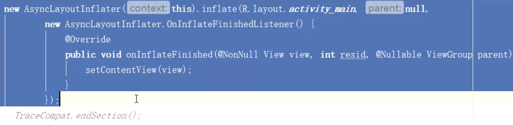
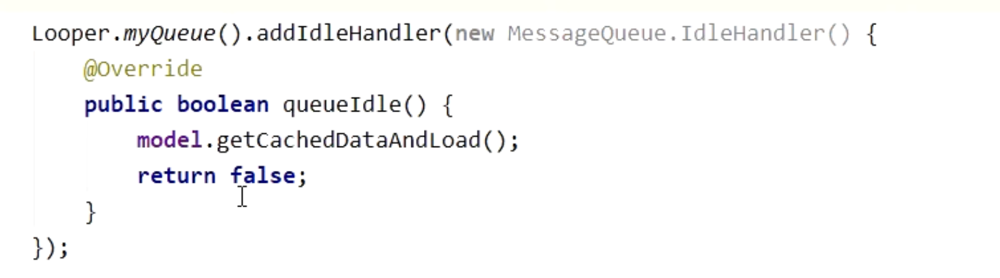

## 1).三方SDK以及其他业务线初始化
	- 延迟初始化
		- 将任务细化为必需在 Application 的 attachBaseContext、onCreate 阶段执行的和可以延迟到首页加载后执行的
	- 合理的使用异步初始化
		- 第三方SDK可以放在子线程初始化的就放子线程，
	- 懒加载机制
- ## 2). 启动过程避免耗时操作，如数据库 I/O操作不要放在主线程执行。
- ## 3). 简化首个Activity的布局-布局优化
	- 1、使用 merge 标签或者约束布局等方式优化 xml 布局层级，使用 ViewStub 标签进行按需加载布局。
	- 2、Androidx里的异步加载AsyncLayoutInflater 能不能用
		- 
- ## 4）合并启动页与首页
	- 减少一次 Activity 的启动过程，避免系统 startActivity 过程的性能损耗，启动过程会进行跨进程通信。
	- 将开屏页作为首页的一层view
- 5). 类加载优化：提前异步执行类加载。
- ## 6). 合理使用IdleHandler进行延迟初始化。
	- Activity初始化通过Handler完成的，空闲时会执行IdleHandler
	- 空闲时，可以执行IdleHandler的内容
	- # 示例
		- model.getCachedDataAndLoad()是在主线程执行的
		- 使用IdleHandler在Activity初始化完成后会执行这个，实现空闲加载
			- 
- # 三方框架初始化优化
	- 1、Arouter 使用gradle插件初始化，优化初始化时间
	- 2、EventBus apt优化