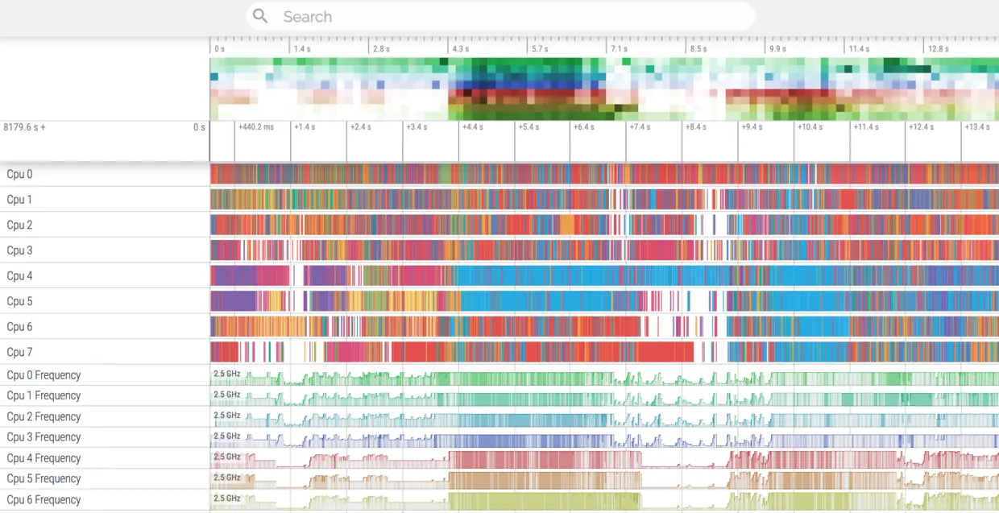
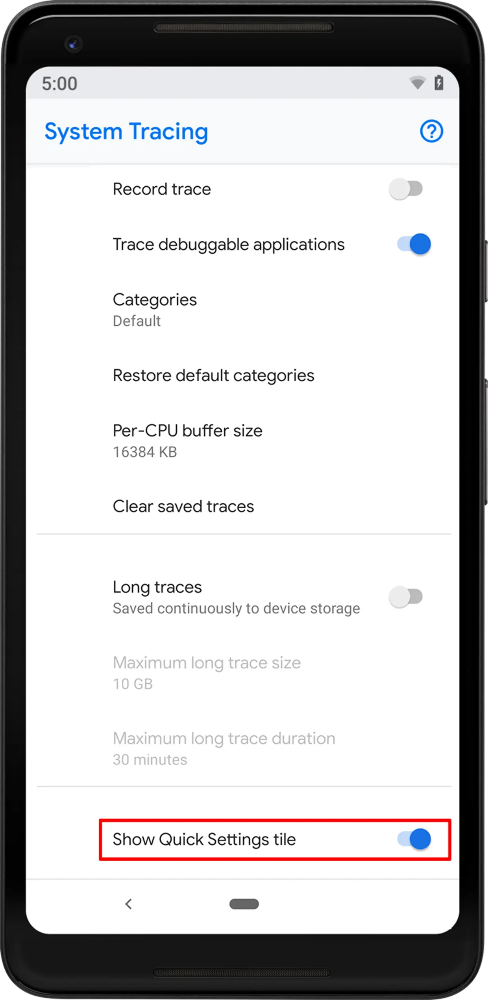
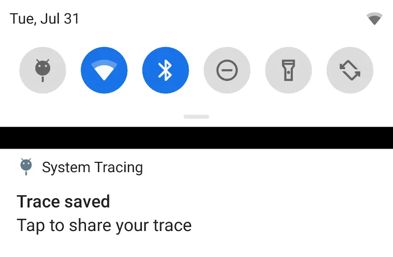
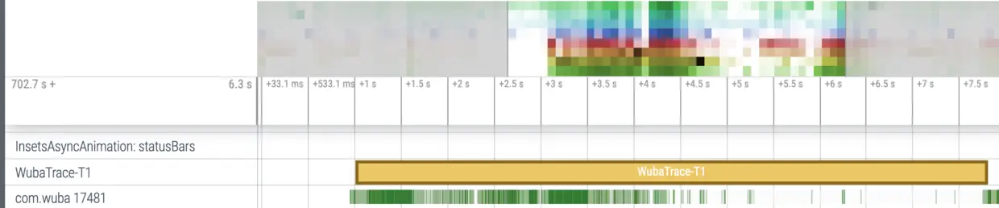
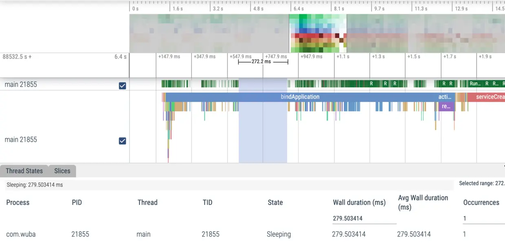
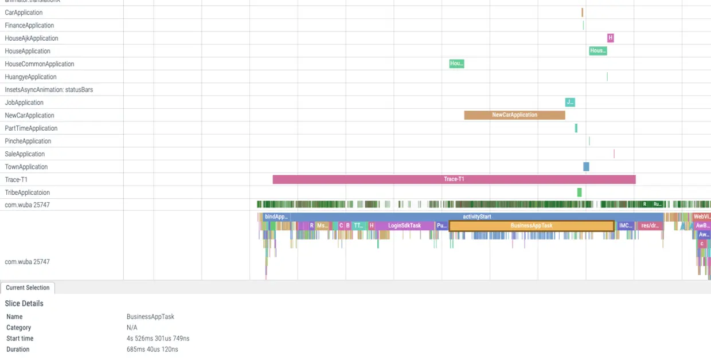
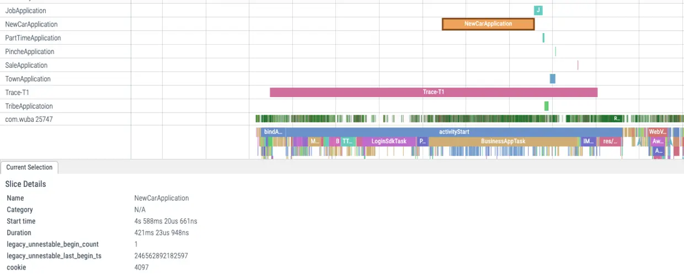
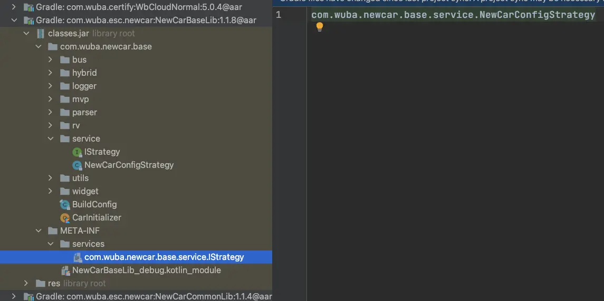
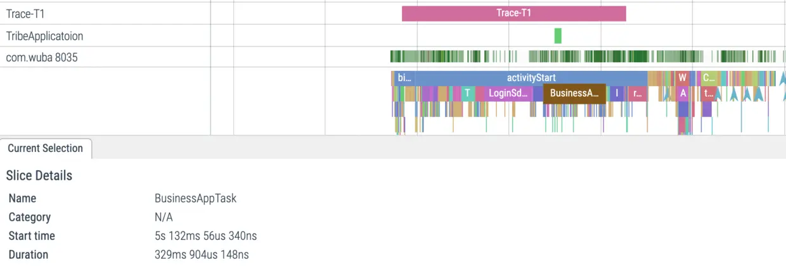

- 图
  collapsed:: true
	- {:height 392, :width 747}
- ## 使用系统追踪获取报告
	- 在Android 9.0或以上手机系统中新增了一个名为系统追踪系统级应用，这个类似于systrace命令行工具，用于代替systrace工具，另外在chrome80版本之后已经无法打开使用systrace工具生成的报告；你可以在开发者选项的调试部分找到，可以通过设置显示在快捷下拉菜单中。 ps：有的手机厂商把这个功能阉割了，可以使用Pixel或小米手机获取结果。
	  collapsed:: true
		- 
	- 可以在类别中选择你感兴趣的类别，点击新增显示的图标即可开始追踪，再次点击结束追踪。
	  collapsed:: true
		- 
- ## Release包如何使用Trace
	- Trace提供的beginSection和endSection可以添加自定义的事件，但只会在debug包开启，由于debug包和release包性能相差很大，所以很有必要在release包开启Trace跟踪，设置开关的方法如下：
	  collapsed:: true
	  Trace.java
		- ```
		      /**
		       * Set whether application tracing is allowed for this process.  This is intended to be set
		       * once at application start-up time based on whether the application is debuggable.
		       *
		       * @hide
		       */
		      @UnsupportedAppUsage
		      public static void setAppTracingAllowed(boolean allowed) {
		          nativeSetAppTracingAllowed(allowed);
		  
		          // Setting whether app tracing is allowed may change the tags, so we update the cached
		          // tags here.
		          cacheEnabledTags();
		      }
		  ```
	- 由于添加了@UnsupportedAppUsage注解所以我们在应用中是无法直接调用，从注释可以看出系统是根据应用是否是debug调用此方法设置开关的，所以我们可以在release包使用反射开启Trace，可以在下面的代码获取。
- ## 异步事件追踪
	- Trace提供的beginSection和endSection必须成对出现在同一个线程中，Android10.0新增了异步事件追踪的能力，只需要在开始和结束时传入相同的methodName和cookie即可。
	  collapsed:: true
		- ```
		  public static void beginAsyncSection (String methodName, int cookie)
		  public static void endAsyncSection (String methodName, int cookie)
		  ```
	- 这会在trace的结果中新增一行：
	  collapsed:: true
		- 
	- 如果你想在低于10.0版本手机也使用这个功能也可以通过反射调用实现：
	  collapsed:: true
		- ```
		  public class TraceUtil {
		  
		      private static boolean ENABLE = false;
		      private static Class cTrace;
		  
		      public static void enable(boolean enable) {
		          if (!enable) {
		              return;
		          }
		          ENABLE = true;
		          try {
		              cTrace = Class.forName("android.os.Trace");
		              cTrace.getDeclaredMethod("setAppTracingAllowed", Boolean.TYPE).invoke(null, Boolean.TRUE);
		          } catch (Throwable th) {
		              th.printStackTrace();
		          }
		      }
		  
		      public static void asyncTraceBegin(String name, int session) {
		          if (!ENABLE) {
		              return;
		          }
		          try {
		              cTrace.getDeclaredMethod("asyncTraceBegin", new Class[]{Long.TYPE, String.class, Integer.TYPE}).invoke(null, new Object[]{Long.valueOf(4096), name, Integer.valueOf(session)});
		          } catch (Throwable th) {
		              th.printStackTrace();
		          }
		      }
		  
		      public static void asyncTraceEnd(String name, int session) {
		          if (!ENABLE) {
		              return;
		          }
		          try {
		              cTrace.getDeclaredMethod("asyncTraceEnd", new Class[]{Long.TYPE, String.class, Integer.TYPE}).invoke(null, new Object[]{Long.valueOf(4096), name, Integer.valueOf(session)});
		          } catch (Throwable th) {
		              th.printStackTrace();
		          }
		      }
		  }
		  ```
- ## 使用Perfetto分析结果
	- 在使用系统追踪获取结果后，可以使用adb命令拉取到电脑上，然后使用Perfetto(https://ui.perfetto.dev/#!/viewer)打开：
		- ```
		  adb pull /data/local/traces/ .
		  ```
	- 配合Trace提供的同步和异步自定义事件能力，可以很快地分析出具体的耗时原因。
		- 
	- 例如上图的主线程休眠，查看代码后发现主线程被加锁导致主线程休眠。
- ## sql查询
	- Perfetto提供了很强大的sql查询功能，你可以使用sql语句查询想要的数据。由于linux系统中的进程id是可以复用的，所以Perfetto提供了一个唯一的upid。
	  collapsed:: true
	  根据进程名查询app的upid：
		- ```
		  SELECT upid,name FROM process
		  WHERE name='com.example.android'
		  ```
	- 根据upid查询所有线程：
	  collapsed:: true
		- ```
		  SELECT * FROM thread
		  WHERE upid=175
		  order by name
		  ```
	- 或者直接使用子查询：
	  collapsed:: true
		- ```
		  SELECT * FROM thread
		  WHERE upid=(SELECT upid FROM process
		  WHERE name='com.example.android')
		  order by name
		  ```
- ## 启动耗时统计
	- 分析优化完代码需要快速产出耗时数据，可以使用下面的shell脚本批量快速产出启动页完全显示的耗时数据：
	  collapsed:: true
		- ```
		  for i in `seq 1 20`
		  do
		    adb shell am force-stop com.example.android
		    sleep 1
		    adb shell am start-activity -W -n com.example.android/.LaunchActivity | grep "TotalTime" | cut -d ' ' -f 2
		  done
		  ```
	- 然后将结果复制到表格中以便统计平均耗时结果。
- ## 优化实践
	- 在10.16版本我们我们对启动任务进行了改造，可以很方便地分析各任务的耗时。
	  collapsed:: true
		- 
	- BusinessAppTask是所有业务App初始化的任务总耗时685ms，其中NewCarApplication耗时421ms，占比所有业务App总耗时的60%。
	  collapsed:: true
		- 
	- ## 新车耗时原因
		- 看了下新车App初始化逻辑很简单，只是初始化赋值了context和hybrid的配置，唯一可疑的点是用到了 SPI (Service Provider Interface)机制动态加载完成一些配置。
		  collapsed:: true
			- ```
			  class NewCarApplication : BusinessRegisterApplication() {
			      override fun onCreate() {
			          super.onCreate()
			  
			          LoginPreferenceUtils.init(applicationContext)
			  
			          LocationPreferenceUtils.init(applicationContext)
			          initConfig()
			          initHybrid()
			      }
			  
			      private fun initHybrid() {
			          Hybrid.add(HybridActions.getNewCarActions())
			      }
			  
			      /**
			       * 启动策略适配器 填充必要的数据
			       */
			      private fun initConfig() {
			          ServiceLoader.load(IStrategy::class.java).iterator().also { iterator ->
			              while (iterator.hasNext()) {
			                  iterator.next().apply {
			                      appSource = "58app"
			                      appVersion = PlatFormServiceRegistry.getAppInfoService().getVersionCode(applicationContext)
			                      cateId = "4,398038"
			                      fullPath = "4,398038"
			                  }
			              }
			          }
			      }
			  
			  }
			  ```
		- Service Provider Interface动态加载的原理
		  collapsed:: true
			- ```java
			  public final class ServiceLoader<S>
			      implements Iterable<S>
			  {
			      private static final String PREFIX = "META-INF/services/";
			  
			  
			      ......
			  
			      public void reload() {
			          providers.clear();
			          lookupIterator = new LazyIterator(service, loader);
			      }
			      
			      private ServiceLoader(Class<S> svc, ClassLoader cl) {
			          service = Objects.requireNonNull(svc, "Service interface cannot be null");
			          loader = (cl == null) ? ClassLoader.getSystemClassLoader() : cl;
			          // Android-changed: Do not use legacy security code.
			          // On Android, System.getSecurityManager() is always null.
			          // acc = (System.getSecurityManager() != null) ? AccessController.getContext() : null;
			          reload();
			      }
			  
			      // Private inner class implementing fully-lazy provider lookup
			      //
			      private class LazyIterator
			          implements Iterator<S>
			      {
			  
			          Class<S> service;
			          ClassLoader loader;
			          Enumeration<URL> configs = null;
			          Iterator<String> pending = null;
			          String nextName = null;
			  
			          private LazyIterator(Class<S> service, ClassLoader loader) {
			              this.service = service;
			              this.loader = loader;
			          }
			  
			          private boolean hasNextService() {
			              if (nextName != null) {
			                  return true;
			              }
			              if (configs == null) {
			                  try {//从META-INF/services/目录加载配置文件
			                      String fullName = PREFIX + service.getName();
			                      if (loader == null)
			                          configs = ClassLoader.getSystemResources(fullName);
			                      else
			                          configs = loader.getResources(fullName);
			                  } catch (IOException x) {
			                      fail(service, "Error locating configuration files", x);
			                  }
			              }
			              while ((pending == null) || !pending.hasNext()) {
			                  if (!configs.hasMoreElements()) {
			                      return false;
			                  }
			                  pending = parse(service, configs.nextElement());
			              }
			              nextName = pending.next();
			              return true;
			          }
			  
			          private S nextService() {
			              if (!hasNextService())
			                  throw new NoSuchElementException();
			              String cn = nextName;
			              nextName = null;
			              Class<?> c = null;
			              try {
			                  c = Class.forName(cn, false, loader);
			              } catch (ClassNotFoundException x) {
			                  fail(service,
			                       "Provider " + cn + " not found");
			              }
			              if (!service.isAssignableFrom(c)) {
			                  fail(service,
			                       "Provider " + cn  + " not a subtype");
			              }
			              try {//创建实例并返回
			                  S p = service.cast(c.newInstance());
			                  providers.put(cn, p);
			                  return p;
			              } catch (Throwable x) {
			                  fail(service,
			                       "Provider " + cn + " could not be instantiated",
			                       x);
			              }
			              throw new Error();          // This cannot happen
			          }
			  
			          public boolean hasNext() {
			              if (acc == null) {
			                  return hasNextService();
			              } else {
			                  PrivilegedAction<Boolean> action = new PrivilegedAction<Boolean>() {
			                      public Boolean run() { return hasNextService(); }
			                  };
			                  return AccessController.doPrivileged(action, acc);
			              }
			          }
			  
			          public S next() {
			              if (acc == null) {
			                  return nextService();
			              } else {
			                  PrivilegedAction<S> action = new PrivilegedAction<S>() {
			                      public S run() { return nextService(); }
			                  };
			                  return AccessController.doPrivileged(action, acc);
			              }
			          }
			  
			          public void remove() {
			              throw new UnsupportedOperationException();
			          }
			  
			      }
			  
			      public static <S> ServiceLoader<S> load(Class<S> service,
			                                              ClassLoader loader)
			      {
			          return new ServiceLoader<>(service, loader);
			      }
			  
			      public static <S> ServiceLoader<S> load(Class<S> service) {
			          ClassLoader cl = Thread.currentThread().getContextClassLoader();
			          return ServiceLoader.load(service, cl);
			      }
			  
			      ......
			  
			  }
			  ```
		- 从上面的代码，我们可以发现，ServiceLoader 实现动态加载的关键在于 ServiceLoaderLazyIterator，它通过 ClassLoader 从 classpath 中查找名称为META-INF/services/{InterfaceName}的 SPI 配置资源，并从中逐行读取接口对应的实现类的类名，然后通过反射来实例化该接口的实现类。
		  collapsed:: true
			- 
	- ## 解决新车动态加载耗时问题
		- 通过查看代码并和新车同学确认该接口的实现类只有一个并且可以获取引用，所以改为了使用变量直接赋值：
			- ```
			  private fun initConfig() {
			          NewCarConfigStrategy.mAppSource= "58app"
			          NewCarConfigStrategy.mAppVersion= PlatFormServiceRegistry.getAppInfoService().getVersionCode(applicationContext)
			          NewCarConfigStrategy.mCateId= "4,398038"
			          NewCarConfigStrategy.mFullPath = "4,398038"
			  }
			  ```
		- 图
		  collapsed:: true
			- 
- 通过上面的改动业务初始化总耗时降到了329ms。
- 总结
  本文介绍了Release包如何开启Trace以及自定义异步事件，使用Perfetto分析trace结果，根据耗时异常分析并优化，使用adb命令统计启动耗时。
- 参考
  https://mp.weixin.qq.com/s/ohKG7i5ttLh5hNH7fuKiUw
  https://developer.android.com/topic/performance/tracing/on-device?hl=zh-cn