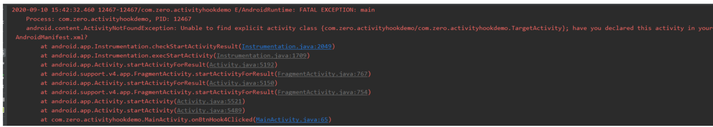

- # 一、首先没有在AndroidManifest.xml注册，报错是什么样子的？
	- 
- # 二、报错位置
	- ## 1、Imstrumentation.java execStartActivity
	  id:: 64abe38d-a1ec-4a89-9c6f-04605bfb24c2
	  collapsed:: true
		- ```java
		  public ActivityResult execStartActivity(
		                                Context who, IBinder contextThread, IBinder token, Activity
		                                target,
		                                Intent intent, int requestCode, Bundle options) {
		            ...
		            try {
		                  intent.migrateExtraStreamToClipData();
		                  intent.prepareToLeaveProcess(who);
		                  //1.通过IActivityManager调用我们执行AMS的startActivity方法，并返回执行结果
		                  int result = ActivityManager.getService()
		                  			.startActivity(whoThread, who.getBasePackageName(), intent,
		                  			intent.resolveTypeIfNeeded(who.getContentResolver()),
		                 				token, target != null ? target.mEmbeddedID : null,
		                  			requestCode, 0, null, options);
		                  //2. 检查结果
		                  checkStartActivityResult(result, intent);
		            } catch (RemoteException e) {
		           		 throw new RuntimeException("Failure from system", e);
		            }
		            return null;
		  }
		  ```
	- ## 2、Imstrumentation.checkStartActivityResult,**[[#red]]==报错点在这==**
	  collapsed:: true
		- ```java
		  public static void checkStartActivityResult(int res, Object intent) {
		      if (!ActivityManager.isStartResultFatalError(res)) {
		      		return;
		      }
		      switch (res) {
		          case ActivityManager.START_INTENT_NOT_RESOLVED:
		          case ActivityManager.START_CLASS_NOT_FOUND:
		              //3. 这里我们找到了报错的地方，原来是res结果为START_INTENT_NOT_RESOLVED，
		              //START_CLASS_NOT_FOUND就会报这个错误
		              if (intent instanceof Intent && ((Intent)intent).getComponent() != null)
		                  throw new ActivityNotFoundException(
		                          "Unable to find explicit activity class "
		                          + ((Intent)intent).getComponent().toShortString()
		                          + "; have you declared this activity in your
		                          AndroidManifest.xml?");
		                  throw new ActivityNotFoundException("No Activity found to handle " + intent);
		          case ActivityManager.START_PERMISSION_DENIED:
		          	throw new SecurityException("Not allowed to start activity "+ intent);
		          case ActivityManager.START_FORWARD_AND_REQUEST_CONFLICT:
		          	throw new AndroidRuntimeException("FORWARD_RESULT_FLAG used while also
		                                            requesting a result");
		          case ActivityManager.START_NOT_ACTIVITY:
		              throw new IllegalArgumentException("PendingIntent is not an activity");
		          case ActivityManager.START_NOT_VOICE_COMPATIBLE:
		              throw new SecurityException( "Starting under voice control not allowed for: "
		                                          +intent);
		          case ActivityManager.START_VOICE_NOT_ACTIVE_SESSION:
		              throw new IllegalStateException(
		              "Session calling startVoiceActivity does not match active session");
		          case ActivityManager.START_VOICE_HIDDEN_SESSION:
		              throw new IllegalStateException( ityManager.START_ASSISTANT_NOT_ACTIVE_SESSION:
		              throw new IllegalStateException("Session calling startAssistantActivity does not match
		              active session");
		          case ActivityManager.START_ASSISTANT_HIDDEN_SESSION:
		              throw new IllegalStateException(
		              "Cannot start assistant activity on a hidden session");
		          case ActivityManager.START_CANCELED:
		          	throw new AndroidRuntimeException("Activity could not be started for "+ intent);
		          default:
		         		 throw new AndroidRuntimeException("Unknown error code "+ res + " when starting " + intent);
		     }
		  }
		  ```
	- ## [[#red]]==这里是根据返回结果检测报错的，返回结果肯定在AMS的==
	- ## 3、接着我们来看下AMS里面是如何判断activity没有注册的，首先我们得明白startActivity执行的主流程
		- ```java
		  AMS.startActivity
		  -> AMS.startActivityAsUser [ActivityManagerService]
		  -> ASC.obtainStarter [ActivityStartController]
		  -> ASR.execute [ActivityStarter]
		  -> ASR.startActivityMayWait
		  -> ASR.startActivity
		  -> ASR.startActivity
		  -> ASR.startActivity
		  -> ASR.startActivityUnchecked
		  -> AS.startActivityLocked <- [ActivityStack]
		  -> ASS.resumeFocusedStackTopActivityLocked [ActivityStackSupervisor]
		  -> AS.resumeTopActivityUncheckedLocked
		  -> AS.resumeTopActivityInnerLocked
		  -> AS.startPausingLocked #PauseActivityItem
		  -> AMS.getLifecycleManager
		  -> CLM.scheduleTransaction [ClientLifecycleManager]
		  -> CTR.getClient [ClientTransaction]
		  -> CTR.schedule
		  -> APT.scheduleTransaction [IApplicationThread]
		  -> APT.scheduleTransaction
		  -> AT.scheduleTransaction [ActivityThread]
		  -> CTH.scheduleTransaction [ClientTransactionHandler]
		  -> AT.sendMessage #EXECUTE_TRANSACTION
		  -> TE.execute [TransactionExecutor] 
		  -> TE.executeCallbacks
		  -> TE.cycleToPath
		  -> TE.performLifecycleSequence
		  -> PauseActivityItem.execute
		  -> AT.handlePauseActivity
		  -> AT.performPauseActivity
		  -> AT.performPauseActivityIfNeeded
		  -> Instrumentation.callActivityOnPause
		  -> Activity.performPause
		  -> Activity.onPause
		  -> PauseActivityItem.postExecute
		  -> AMS.activityPaused
		  -> AS.activityPausedLocked
		  -> AS.completePauseLocked
		  -> ASS.resumeFocusedStackTopActivityLocked
		  -> AS.resumeTopActivityUncheckedLocked
		  -> AS.resumeTopActivityInnerLocked
		  -> ASS.startSpecificActivityLocked #发现app进程还没起来 startActivity中断了
		  -> AMS.startProcessLocked
		  -> AMS.startProcess
		  -> Process.start
		  -> ZygoteProcess.start
		  -> ZygoteProcess.startViaZygote
		  -> ZygoteProcess.openZygoteSocketIfNeeded
		  -> ZygoteState.connect
		  -> ZygoteProcess.zygoteSendArgsAndGetResult
		  -> zygoteState.writer.write #localsocket通信
		  -> app_main.main #zygote从哪儿来的
		  -> AppRuntime.start #com.android.internal.os.ZygoteInit
		  -> ZygoteInit.main #app启动中zygote服务端
		  -> new ZygoteServer
		  -> ZygoteServer.runSelectLoop
		  -> ZygoteServer.acceptCommandPeer
		  -> ServerSocket.accept
		  -> ZygoteConnection.processOneCommand
		  -> Zygote.forkAndSpecialize
		  -> Zygote.nativeForkAndSpecialize
		  -> com_android_internal_os_Zygote.cpp#nativeForkAndSpecialize
		  -> #ForkAndSpecializeCommon
		  -> fork #不再往底层分析 processOneCommand <-
		  -> ZygoteConnection.handleChildProc
		  -> ZygoteInit.zygoteInit
		  -> RuntimeInit.redirectLogStreams
		  -> RuntimeInit.commonInit
		  -> ZygoteInit.nativeZygoteInit #在AndroidRuntime里面注册
		  -> com_android_internal_os_ZygoteInit_nativeZygoteInit
		  -> gCurRuntime->onZygoteInit #具体实现在AppRuntime即app_main里面
		  -> ProcessState::self->startThreadPool #开启binder线程池
		  -> RuntimeInit.applicationInit #回到ZygoteInit
		  -> RuntimeInit.findStaticMain
		  -> MethodAndArgsCaller.run #回到ZygoteInit.main
		  -> Method.invoke #android.app.ActivityThread
		  -> AT.main
		  -> new ActivityThread
		  -> AT.attach
		  -> AMS.attachApplication #binder
		  -> AMS.attachApplicationLocked
		  -> APT.bindApplication #binder
		  -> AT.sendMessage #BIND_APPLICATION
		  -> AT.handleBindApplication
		  -> AT.getPackageInfoNoCheck #获取LoadedApk
		  -> ContextImpl.createAppContext
		  -> 反射创建Instrumentation
		  -> LoadedApk.makeApplication
		  -> Instrumentation.newApplication
		  -> Application.attach
		  -> Instrumentation.callApplicationOnCreate
		  -> ASS.attachApplicationLocked#回到attachApplicationLocked
		  -> ASS.realStartActivityLocked
		  -> 通过ClientTransaction启动Activity
		  ```
	- ## 4、我们找到在ActivityStarter.startActivity[2]中返回了START_INTENT_NOT_RESOLVED，START_CLASS_NOT_FOUND
		- ```java
		  private int startActivity(IApplicationThread caller, Intent intent, Intent
		                                ephemeralIntent,
		                                String resolvedType, ActivityInfo aInfo, ResolveInfo rInfo,
		                                IVoiceInteractionSession voiceSession, IVoiceInteractor
		                                voiceInteractor,
		                                IBinder resultTo, String resultWho, int requestCode, int
		                                callingPid, int callingUid,
		                                String callingPackage, int realCallingPid, int realCallingUid,
		                                int startFlags,
		                                SafeActivityOptions options,
		                                boolean ignoreTargetSecurity, boolean componentSpecified,
		                                ActivityRecord[] outActivity,
		                                TaskRecord inTask, boolean
		                                allowPendingRemoteAnimationRegistryLookup) {
		        int err = ActivityManager.START_SUCCESS;
		        ...
		        //接下来开始做一些校验判断
		        if (err == ActivityManager.START_SUCCESS && intent.getComponent() == null) {
		            // We couldn't find a class that can handle the given Intent.
		            // That's the end of that!
		            //从Intent中无法找到相应的Component
		            err = ActivityManager.START_INTENT_NOT_RESOLVED;
		        }
		        if (err == ActivityManager.START_SUCCESS && aInfo == null) {
		            // We couldn't find the specific class specified in the Intent.
		            // Also the end of the line.
		            //从Intent中无法找到相应的ActivityInfo
		            err = ActivityManager.START_CLASS_NOT_FOUND;
		        }
		        ...
		        if (err != START_SUCCESS) {//不能成功启动了，返回err
		            if (resultRecord != null) {
		                resultStack.sendActivityResultLocked(
		                -1, resultRecord, resultWho, requestCode,
		                RESULT_CANCELED, null);
		            }
		            SafeActivityOptions.abort(options);
		            return err;
		        }
		        ...
		        //创建出我们的目标ActivityRecord对象，存到传入数组0索引上
		        ActivityRecord r = new ActivityRecord(mService, callerApp,
		                            callingPid, callingUid,
		                            callingPackage, intent, resolvedType, aInfo,
		                            mService.getGlobalConfiguration(),
		                            resultRecord, resultWho, requestCode, componentSpecified,
		                            voiceSession != null,
		                            mSupervisor, checkedOptions, sourceRecord);
		        ...
		        return startActivity(r, sourceRecord, voiceSession, voiceInteractor,
		                            startFlags,
		                            true /* doResume */, checkedOptions, inTask, outActivity);
		  }
		  ```
	- ## 5、但是 intent.getComponent()，aInfo又是从哪儿获取的呢，我们回溯到startActivityMayWait
		- ```java
		  private int startActivityMayWait(IApplicationThread caller, int callingUid,
		                            String callingPackage, Intent intent, String resolvedType,
		                            IVoiceInteractionSession voiceSession, IVoiceInteractor
		                            voiceInteractor,
		                            IBinder resultTo, String resultWho, int requestCode, int
		                            startFlags,
		                            ProfilerInfo profilerInfo, WaitResult outResult,
		                            Configuration globalConfig, SafeActivityOptions options, boolean
		                            ignoreTargetSecurity,
		                            int userId, TaskRecord inTask, String reason,
		                            boolean allowPendingRemoteAnimationRegistryLookup) {
		          // Refuse possible leaked file descriptors
		          ...
		          intent = new Intent(intent);
		          if (componentSpecified && !(Intent.ACTION_VIEW.equals(intent.getAction()) &&
		          		intent.getData() == null) &&
		          		!Intent.ACTION_INSTALL_INSTANT_APP_PACKAGE.equals(intent.getAction())
		         			 &&
		                  !Intent.ACTION_RESOLVE_INSTANT_APP_PACKAGE.equals(intent.getAction())
		                  && mService.getPackageManagerInternalLocked()
		                  .isInstantAppInstallerComponent(intent.getComponent())) {
		              // intercept intents targeted directly to the ephemeral
		              installer the
		              // ephemeral installer should never be started with a raw
		              Intent; instead
		              // adjust the intent so it looks like a "normal" instant app
		              launch
		              intent.setComponent(null /*component*/);
		              componentSpecified = false;
		          }
		          ResolveInfo rInfo = mSupervisor.resolveIntent(intent, resolvedType,
		                              userId,
		                              0 /* matchFlags */,
		                              computeResolveFilterUid(
		                                callingUid, realCallingUid,
		                              mRequest.filterCallingUid));
		          if (rInfo == null) {
		          	UserInfo userInfo = mSupervisor.getUserInfo(userId);
		            if (userInfo != null && userInfo.isManagedProfile()) {
		                  // Special case for managed profiles, if attempting to
		                  launch non-cryto aware
		                  // app in a locked managed profile from an unlocked parent
		                  allow it to resolve
		                  // as user will be sent via confirm credentials to unlock
		                  the profile.
		                  UserManager userManager = UserManager.get(mService.mContext);
		                  boolean profileLockedAndParentUnlockingOrUnlocked = false;
		                  long token = Binder.clearCallingIdentity();
		                  try {
		                      UserInfo parent = userManager.getProfileParent(userId);
		                      profileLockedAndParentUnlockingOrUnlocked = (parent != null)
		                                                &&
		                                                userManager.isUserUnlockingOrUnlocked(parent.id)
		                                                &&
		                                                !userManager.isUserUnlockingOrUnlocked(userId);
		                  } finally {
		                          Binder.restoreCallingIdentity(token);
		                  }
		                  if (profileLockedAndParentUnlockingOrUnlocked) {
		                      rInfo = mSupervisor.resolveIntent(intent, resolvedType,
		                      userId,
		                      PackageManager.MATCH_DIRECT_BOOT_AWARE|PackageManager.MATCH_DIRECT_BOOT_UNAWARE,
		                      computeResolveFilterUid(callingUid, realCallingUid,mRequest.filterCallingUid));
		                  }
		              }
		          }
		          // Collect information about the target of the Intent.
		  ////收集Intent所指向的Activity信息, 当存在多个可供选择的 Activity,则直接向用户弹出resolveActivity
		          ActivityInfo aInfo = mSupervisor.resolveActivity(intent, rInfo, startFlags, profilerInfo);
		          ...
		          final ActivityRecord[] outRecord = new ActivityRecord[1];
		          int res = startActivity(caller, intent, ephemeralIntent,
		                                resolvedType, aInfo, rInfo,
		                                voiceSession, voiceInteractor, resultTo, resultWho,
		                                requestCode, callingPid,
		                                callingUid, callingPackage, realCallingPid,
		                                realCallingUid, startFlags, options,
		                                ignoreTargetSecurity, componentSpecified, outRecord,
		                                inTask, reason,
		                                allowPendingRemoteAnimationRegistryLookup);
		          ...
		          return res;
		          }
		  }
		  ```
	- ## 6、我们看下aInfo哪儿来的
		- ```java
		  ActivityInfo resolveActivity(Intent intent, ResolveInfo rInfo, int
		                                startFlags,
		                                ProfilerInfo profilerInfo) {
		        final ActivityInfo aInfo = rInfo != null ? rInfo.activityInfo : null;
		        if (aInfo != null) {
		            // Store the found target back into the intent, because now that
		            // we have it we never want to do this again. For example, if the
		            // user navigates back to this point in the history, we should
		            // always restart the exact same activity.
		            intent.setComponent(new ComponentName(
		            							aInfo.applicationInfo.packageName, aInfo.name));
		            // Don't debug things in the system process
		            ...
		        }
		        return aInfo;
		  }
		  ```
	- ## 7、发现是从rInfo来的
		- ```java
		  ResolveInfo resolveIntent(Intent intent, String resolvedType, int userId,
		                                        int flags,
		                                        int filterCallingUid) {
		        synchronized (mService) {
		            try {
		            		...
		           	 	final long token = Binder.clearCallingIdentity();
		            try {
		                return
		                mService.getPackageManagerInternalLocked().resolveIntent(
		                             intent, resolvedType, modifiedFlags, userId,
		                                true, filterCallingUid);
		            } finally {
		            		Binder.restoreCallingIdentity(token);
		            }
		        ...
		        }
		  }
		  ```
	- ## 8、那么rInfo怎么获取的呢？
		- ```java
		  PackageManagerInternal getPackageManagerInternalLocked() {
		      if (mPackageManagerInt == null) {
		          mPackageManagerInt =
		          LocalServices.getService(PackageManagerInternal.class);
		      }
		      return mPackageManagerInt;
		  }
		  ```
	- ## 9、具体实现类是PackageManagerService
		- ```java
		  @Override
		  public ResolveInfo resolveIntent(Intent intent, String resolvedType,
		  							int flags, int userId) {
		      return resolveIntentInternal(intent, resolvedType, flags, userId,
		                          false,
		                          Binder.getCallingUid());
		  }
		  ```
	- ## 10、再看resolveIntentInternal
		- ```java
		  private ResolveInfo resolveIntentInternal(Intent intent, String
		                                      resolvedType,
		                                      int flags, int userId, boolean resolveForStart, int
		                                      filterCallingUid) {
		        try {
		        		...
		            //获取ResolveInfo列表
		            final List<ResolveInfo> query =
		                                  queryIntentActivitiesInternal(intent, resolvedType,
		                                  flags, filterCallingUid, userId, resolveForStart, true
		                                  /*allowDynamicSplits*/);
		            Trace.traceEnd(TRACE_TAG_PACKAGE_MANAGER);
		            //找出最好的返回
		            final ResolveInfo bestChoice =
		                    chooseBestActivity(intent, resolvedType, flags, query,
		                    userId);
		            return bestChoice;
		        } finally {
		        		Trace.traceEnd(TRACE_TAG_PACKAGE_MANAGER);
		        }
		  }
		  ```
	- ## 11、再看 queryIntentActivitiesInternal
		- ```java
		  private @NonNull List<ResolveInfo> queryIntentActivitiesInternal(Intent
		                                  intent,
		                                  String resolvedType, int flags, int filterCallingUid, int
		                                  userId,
		                                  boolean resolveForStart, boolean allowDynamicSplits) {
		        ...
		        if (comp != null) {
		            final List<ResolveInfo> list = new ArrayList<ResolveInfo>(1);
		            final ActivityInfo ai = getActivityInfo(comp, flags, userId);
		            if (ai != null) {
		                // When specifying an explicit component, we prevent the activity from being
		                // used when either 1) the calling package is normal and the activity is within
		                // an ephemeral application or 2) the calling package is ephemeral and the
		                // activity is not visible to ephemeral applications.
		                final boolean matchInstantApp = (flags & PackageManager.MATCH_INSTANT) != 0;
		                final boolean matchVisibleToInstantAppOnly =
		                                            (flags &
		                                            PackageManager.MATCH_VISIBLE_TO_INSTANT_APP_ONLY) != 0;
		                final boolean matchExplicitlyVisibleOnly =
		                                              (flags &
		                                              PackageManager.MATCH_EXPLICITLY_VISIBLE_ONLY) != 0;
		                final boolean isCallerInstantApp = instantAppPkgName != null;
		                final boolean isTargetSameInstantApp = comp.getPackageName().equals(instantAppPkgName);
		                final boolean isTargetInstantApp =
		                                              (ai.applicationInfo.privateFlags
		                                              & ApplicationInfo.PRIVATE_FLAG_INSTANT) !=
		                                              0;
		                final boolean isTargetVisibleToInstantApp =
		                                            (ai.flags &
		                                            ActivityInfo.FLAG_VISIBLE_TO_INSTANT_APP) != 0;
		                final boolean isTargetExplicitlyVisibleToInstantApp =
		                                          isTargetVisibleToInstantApp
		                                          && (ai.flags &
		                                          ActivityInfo.FLAG_IMPLICITLY_VISIBLE_TO_INSTANT_APP) == 0;
		                final boolean isTargetHiddenFromInstantApp =
		                                          !isTargetVisibleToInstantApp
		                                          || (matchExplicitlyVisibleOnly &&
		                                          !isTargetExplicitlyVisibleToInstantApp);
		                final boolean blockResolution =
		                                          !isTargetSameInstantApp
		                                          && ((!matchInstantApp && !isCallerInstantApp &&
		                                          isTargetInstantApp)
		                                          || (matchVisibleToInstantAppOnly &&
		                                          isCallerInstantApp
		                                          && isTargetHiddenFromInstantApp));
		                if (!blockResolution) {
		                    final ResolveInfo ri = new ResolveInfo();
		                    ri.activityInfo = ai;
		                    list.add(ri);
		                }
		            }
		       	 return applyPostResolutionFilter(
		                      list, instantAppPkgName, allowDynamicSplits,
		                      filterCallingUid, resolveForStart,
		                      userId, intent);
		        }
		  }
		  ```
	- ## 12、原来是从getActivityInfo获取的
	  id:: 64abe859-0b45-4d87-91c6-6a628d938f5f
		- ```java
		  @Override
		  public ActivityInfo getActivityInfo(ComponentName component, int flags,int userId) {
		        return getActivityInfoInternal(component, flags,
		        			Binder.getCallingUid(), userId);
		  }
		  
		  private ActivityInfo getActivityInfoInternal(ComponentName component, int flags,
		                                               int filterCallingUid, int userId) {
		    if (!sUserManager.exists(userId)) return null;
		    flags = updateFlagsForComponent(flags, userId, component);
		    if (!isRecentsAccessingChildProfiles(Binder.getCallingUid(),
		                                         userId)) {
		      mPermissionManager.enforceCrossUserPermission(Binder.getCallingUid(),
		                                                    userId,
		                                                    false /* requireFullPermission */, false /* checkShell
		        */, "get activity info");
		    }
		    synchronized (mPackages) {
		        //关键点
		        PackageParser.Activity a =
		          mActivities.mActivities.get(component);
		        if (DEBUG_PACKAGE_INFO) 
		          Log.v(TAG, "getActivityInfo " +component + ": " + a);
		        if (a != null && mSettings.isEnabledAndMatchLPr(a.info, flags,userId)) {
		            PackageSetting ps = mSettings.mPackages.get(component.getPackageName());
		            if (ps == null) return null;
		            if (filterAppAccessLPr(ps, filterCallingUid, component,
		                                   TYPE_ACTIVITY, userId)) {
		              return null;
		            }
		            //关键点
		            return PackageParser.generateActivityInfo(a, flags, ps.readUserState(userId), userId);
		        }
		        if (mResolveComponentName.equals(component)) {
		            return PackageParser.generateActivityInfo( mResolveActivity, flags, new PackageUserState(),
		              userId);
		        }
		    }
		    return null;
		  }
		  ```
-
- # [[Activity没有在AndroidManifest.xml注册-面试]]