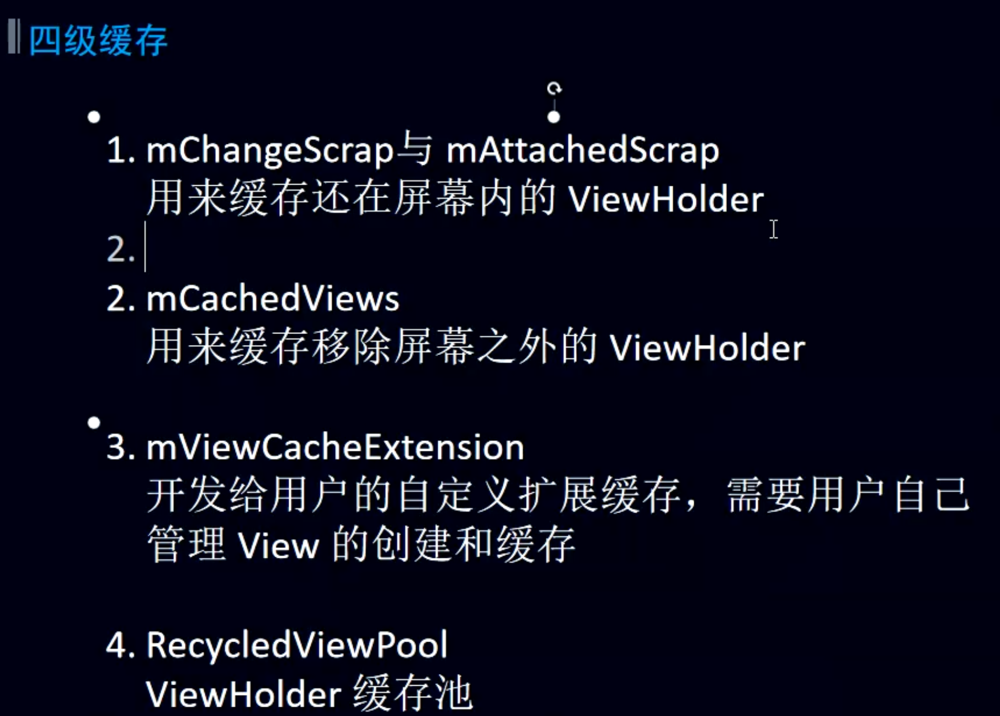

## 图
	- 
- # 1、一级缓存Scrap 缓存
	- ## 介绍：
		- [[#red]]==**用来缓存还在屏幕内的ViewHolder**==,Scrap 是 RecyclerView 中最轻量的缓存，它不参与滑动时的回收复用
		- 目的：
			- 目的是缓存当界面重新布局的前后都出现在屏幕上的ViewHolder，以此省去不必要的重新加载与绑定工作。
	- ## 组成
		- mAttachedScrap：负责保存将会原封不动的ViewHolder。
		- mChangedScrap：负责保存位置会发生移动的ViewHolder，注意只是位置发生移动，内容仍原封不动。（删除item后的上移）或者和动画相关的
	- ## 删除B并且刷新时解释
	  collapsed:: true
		- 代码
			- ```java
			  public final class Recycler {
			  	// 负责保存将会原封不动的ViewHolder。
			      final ArrayList<ViewHolder> mAttachedScrap = new ArrayList<>();
			      // 负责保存位置会发生移动的ViewHolder，注意只是位置发生移动，内容仍原封不动。
			      ArrayList<ViewHolder> mChangedScrap = null;
			  }
			  
			  ```
		- 
- # 2、CachedViews缓存
	- 用来缓存移除屏幕外的viewHolder
	- 默认最大值为2
	- 
- # 3、用户自定义缓存
- # 4、[[RecyclerViewPool的图解]]