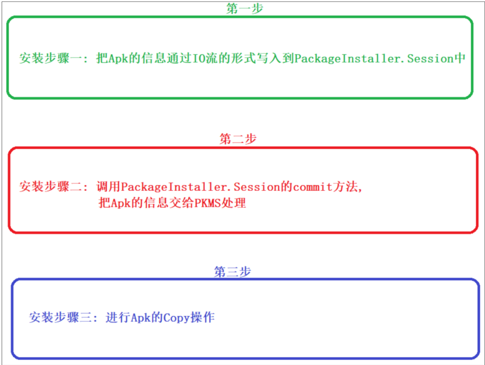
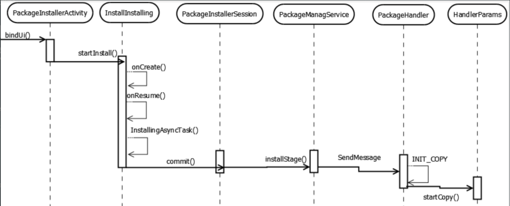
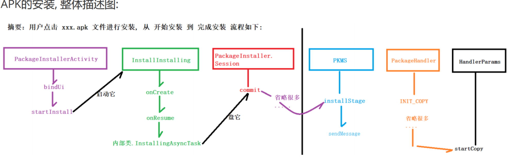
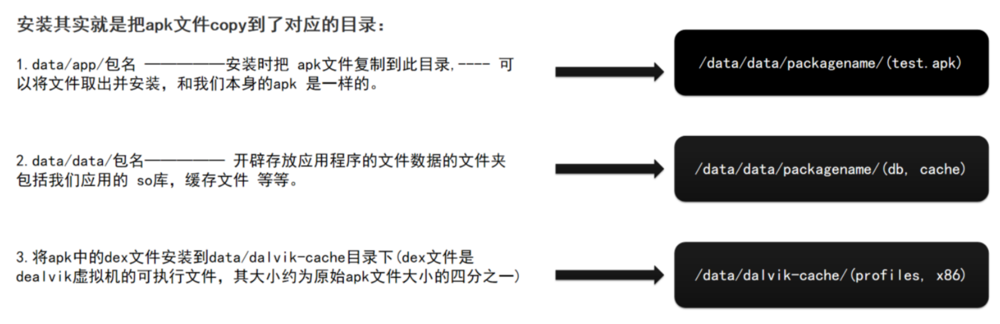

- # 一、步骤
	- 
	- 安装步骤一: 把Apk的信息通过IO流的形式写入到PackageInstaller.Session中
	- 安装步骤二: 调用PackageInstaller.Session的commit方法, 把Apk的信息交给PKMS处理
	- 安装步骤三: 进行Apk的Copy操作, 进行安装
	-
- # 二、用户点击 xxx.apk 文件进行安装, 从 开始安装 到 完成安装 流程如下:
	- 
	- 
- # 三、具体流程
	- ## 1、点击一个apk后，会弹出安装界面，点击确定按钮后，会进入**PackageInstallerActivity **的 **bindUi**()
	  collapsed:: true
		- 的mAlert点击事件, 弹出的安装界面底部显示的是一个diaglog，主要由bindUi构成，上面有 ”**取消**“ 和 ”**安装**“ 两个按钮，点击安装后 调用startInstall()进行安装
		- bindUi（）
			- ```java
			  private void bindUi() {
			      mAlert.setIcon(mAppSnippet.icon);
			      mAlert.setTitle(mAppSnippet.label);
			      mAlert.setView(R.layout.install_content_view);
			      mAlert.setButton(DialogInterface.BUTTON_POSITIVE,
			      getString(R.string.install),
			              (ignored, ignored2) -> {
			                  if (mOk.isEnabled()) {
			                      if (mSessionId != -1) {
			                          mInstaller.setPermissionsResult(mSessionId, true);
			                          finish();
			                      } else {
			                        // 进行APK安装 [同学们注意] 下面开始分析startInstall 做的事情
			                          startInstall(); 
			                      }
			                  }
			              }, null);
			      mAlert.setButton(DialogInterface.BUTTON_NEGATIVE,
			      getString(R.string.cancel),
			            (ignored, ignored2) -> {
			                // Cancel and finish
			                setResult(RESULT_CANCELED);
			                if (mSessionId != -1) {
			                    //如果mSessionId存在，执行setPermissionsResult()完成取消安装
			                    mInstaller.setPermissionsResult(mSessionId, false);
			                }
			                finish();
			            }, null);
			      setupAlert();
			      mOk = mAlert.getButton(DialogInterface.BUTTON_POSITIVE);
			      mOk.setEnabled(false);
			  }
			  ```
	- ## 2、**startInstall**
	  collapsed:: true
		- 方法组装了一个Intent，并跳转到 InstallInstalling 这个Activity（正在安装中的Activity），并关闭掉当前的PackageInstallerActivity。InstallInstalling主要用于向包管理器发送包的信息并处理包管理的回调
		- startInstall()
			- ```java
			  private void startInstall() {
			      // Start subactivity to actually install the application
			      Intent newIntent = new Intent();
			      newIntent.putExtra(PackageUtil.INTENT_ATTR_APPLICATION_INFO,
			                                                  mPkgInfo.applicationInfo);
			      newIntent.setData(mPackageURI);
			      // 设置Intent中的class为 InstallInstalling，用来进行Activity跳转
			      // class InstallInstalling extends AlertActivity [同学们注意] 下面会分析
			      InstallInstalling Activity
			      newIntent.setClass(this, InstallInstalling.class);
			      String installerPackageName = getIntent().getStringExtra(
			                                  Intent.EXTRA_INSTALLER_PACKAGE_NAME);
			      if (mOriginatingURI != null) {
			          newIntent.putExtra(Intent.EXTRA_ORIGINATING_URI, mOriginatingURI);
			      }
			      if (mReferrerURI != null) {
			          newIntent.putExtra(Intent.EXTRA_REFERRER, mReferrerURI);
			      }
			      if (mOriginatingUid != PackageInstaller.SessionParams.UID_UNKNOWN) {
			          newIntent.putExtra(Intent.EXTRA_ORIGINATING_UID, mOriginatingUid);
			      }
			      if (installerPackageName != null) {
			          newIntent.putExtra(Intent.EXTRA_INSTALLER_PACKAGE_NAME, installerPackageName);
			      }
			      if (getIntent().getBooleanExtra(Intent.EXTRA_RETURN_RESULT, false)) {
			          newIntent.putExtra(Intent.EXTRA_RETURN_RESULT, true);
			      }
			      newIntent.addFlags(Intent.FLAG_ACTIVITY_FORWARD_RESULT);
			      if(localLOGV) Log.i(TAG, "downloaded app uri="+mPackageURI);
			      startActivity(newIntent);
			      finish();
			  }
			    
			  ```
	- ## 3、启动 **InstallInstalling**，进入onCreate, 重点是看onCreate函数中的**六步**:
	  collapsed:: true
		- 以上**第六步**是重点 PackageInstaller 的 createSession()内部会通过IPackageInstaller与
		- PackageInstallerService进行进程间通信，最终调用的是PackageInstallerService的createSession方法来创建并返回mSessionId
		- onCreate（）
			- ```java
			  protected void onCreate(@Nullable Bundle savedInstanceState) {
			      super.onCreate(savedInstanceState);
			      ApplicationInfo appInfo = getIntent()
			      .getParcelableExtra(PackageUtil.INTENT_ATTR_APPLICATION_INFO);
			      mPackageURI = getIntent().getData();
			      if ("package".equals(mPackageURI.getScheme())) {
			          try {
			              getPackageManager().installExistingPackage(appInfo.packageName);
			              launchSuccess();
			          } catch (PackageManager.NameNotFoundException e) {
			              launchFailure(PackageManager.INSTALL_FAILED_INTERNAL_ERROR, null);
			          }
			      } else {
			      //根据mPackageURI创建一个对应的File
			      final File sourceFile = new File(mPackageURI.getPath());
			      PackageUtil.AppSnippet as = PackageUtil.getAppSnippet(this, appInfo, sourceFile);
			      mAlert.setIcon(as.icon);
			      mAlert.setTitle(as.label);
			      mAlert.setView(R.layout.install_content_view);
			      mAlert.setButton(DialogInterface.BUTTON_NEGATIVE,
			      getString(R.string.cancel),
			              (ignored, ignored2) -> {
			                  if (mInstallingTask != null) {
			                       mInstallingTask.cancel(true);
			                  }
			                  if (mSessionId > 0) {
			                      getPackageManager().getPackageInstaller().abandonSession(mSessionId);
			                      mSessionId = 0;
			                  }
			                  setResult(RESULT_CANCELED);
			                  finish();
			              }, null);
			      setupAlert();
			      requireViewById(R.id.installing).setVisibility(View.VISIBLE);
			      // 第一步.如果savedInstanceState不为null，获取此前保存的mSessionId和
			      // mInstallId，其中mSessionId是安装包的会话id，mInstallId是等待的安装事件id
			      if (savedInstanceState != null) {
			          mSessionId = savedInstanceState.getInt(SESSION_ID);
			          mInstallId = savedInstanceState.getInt(INSTALL_ID);
			          // Reregister for result; might instantly call back if result was
			          // delivered while
			          // activity was destroyed
			          try {
			              // 第二步.根据mInstallId向InstallEventReceiver注册一个观察者，
			              launchFinishBasedOnResult会接收到安装事件的回调，
			              //无论安装成功或者失败都会关闭当前的Activity(InstallInstalling)。如果
			              savedInstanceState为null，代码的逻辑也是类似的
			              InstallEventReceiver.addObserver(this, mInstallId,
			                                      this::launchFinishBasedOnResult);
			          } catch (EventResultPersister.OutOfIdsException e) {
			              // Does not happen
			          }
			      } else {
			          // 第三步.创建SessionParams，它用来代表安装会话的参数,组装params
			          PackageInstaller.SessionParams params = new
			          PackageInstaller.SessionParams(
			          PackageInstaller.SessionParams.MODE_FULL_INSTALL);
			          params.setInstallAsInstantApp(false);
			          params.setReferrerUri(getIntent().getParcelableExtra(Intent.EXTRA_REFERRER));
			          params.setOriginatingUri(getIntent()
			          .getParcelableExtra(Intent.EXTRA_ORIGINATING_URI));
			          params.setOriginatingUid(getIntent().getIntExtra(Intent.EXTRA_ORIGINATING_UID,
			          UID_UNKNOWN));
			          params.setInstallerPackageName(getIntent().getStringExtra(
			          Intent.EXTRA_INSTALLER_PACKAGE_NAME));
			          params.setInstallReason(PackageManager.INSTALL_REASON_USER);
			          // 第四步.根据mPackageUri对包（APK）进行轻量级的解析，并将解析的参数赋值给SessionParams
			          File file = new File(mPackageURI.getPath());
			          try {
			              PackageParser.PackageLite pkg = PackageParser.parsePackageLite(file, 0);
			              params.setAppPackageName(pkg.packageName);
			              params.setInstallLocation(pkg.installLocation);
			              params.setSize( PackageHelper.calculateInstalledSize(pkg, false,
			                                                  params.abiOverride));
			          } catch (PackageParser.PackageParserException e) {
			              Log.e(LOG_TAG, "Cannot parse package " + file + ". Assuming
			              defaults.");
			              Log.e(LOG_TAG,
			              "Cannot calculate installed size " + file + ". Try only
			              apk size.");
			              params.setSize(file.length());
			          } catch (IOException e) {
			              Log.e(LOG_TAG,
			              "Cannot calculate installed size " + file + ". Try only
			              apk size.");
			              params.setSize(file.length());
			          }
			          try {
			              // 第五步.向InstallEventReceiver注册一个观察者返回一个新的mInstallId，
			              //其中InstallEventReceiver继承自BroadcastReceiver，用于接收安装事件并
			              // 回调给EventResultPersister。
			              mInstallId = InstallEventReceiver
			              .addObserver(this, EventResultPersister.GENERATE_NEW_ID,
			              this::launchFinishBasedOnResult);
			          } catch (EventResultPersister.OutOfIdsException e) {
			              launchFailure(PackageManager.INSTALL_FAILED_INTERNAL_ERROR, null);
			          }
			          try {
			              // 第六步.PackageInstaller的createSession方法内部会通过
			              IPackageInstaller与PackageInstallerService进行进程间通信，
			              //最终调用的是PackageInstallerService的createSession方法来创建并返回 mSessionId
			              mSessionId = getPackageManager().getPackageInstaller().createSession(params);
			          } catch (IOException e) {
			              launchFailure(PackageManager.INSTALL_FAILED_INTERNAL_ERROR, null);
			          }
			      }
			      mCancelButton = mAlert.getButton(DialogInterface.BUTTON_NEGATIVE);
			      mSessionCallback = new InstallSessionCallback();
			      }
			  }
			  ```
	- ## 4、**InstallInstalling.onResume**
	  collapsed:: true
		- **InstallInstalling.onResume**方法中，调用onPostExecute()方法，将APK的信息通过IO流的形式写入到PackageInstaller.Session中
		- onResume()
			- ```JAVA
			  protected void onResume() {
			      super.onResume();
			      // This is the first onResume in a single life of the activity
			      if (mInstallingTask == null) {
			          PackageInstaller installer = getPackageManager().getPackageInstaller();
			          // 获取sessionInfo
			          PackageInstaller.SessionInfo sessionInfo =
			          installer.getSessionInfo(mSessionId);
			          if (sessionInfo != null && !sessionInfo.isActive()) {
			              // 【同学们注意】 最终执行onPostExecute() 下面来分析
			              // 创建内部类InstallingAsyncTask的对象，调用execute()，最终进入 onPostExecute()
			              mInstallingTask = new InstallingAsyncTask();
			              mInstallingTask.execute();
			          } else {
			              // we will receive a broadcast when the install is finished
			              mCancelButton.setEnabled(false);
			              setFinishOnTouchOutside(false);
			          }
			      }
			  }
			  ```
	- ## 5、Installinstalling.**InstallingAsyncTask****： **关注 第一步 和 第二步
	  collapsed:: true
		- InstallingAsyncTask.java
			- ```java
			  private final class InstallingAsyncTask extends AsyncTask<Void, Void,
			  										PackageInstaller.Session> {
			      volatile boolean isDone;
			      // 第一步： doInBackground()会根据包(APK)的Uri，将APK的信息通过IO流的形式写入到
			      // PackageInstaller.Session中
			      @Override
			      protected PackageInstaller.Session doInBackground(Void... params) {
			          PackageInstaller.Session session;
			          try {
			              session =
			              getPackageManager().getPackageInstaller().openSession(mSessionId);
			          } catch (IOException e) {
			              return null;
			          }
			          session.setStagingProgress(0);
			          try {
			              File file = new File(mPackageURI.getPath());
			              try (InputStream in = new FileInputStream(file)) {
			                  long sizeBytes = file.length();
			                  try (OutputStream out = session.openWrite("PackageInstaller", 0, sizeBytes)) {
			                      byte[] buffer = new byte[1024 * 1024];
			                      while (true) {
			                          int numRead = in.read(buffer);
			                          if (numRead == -1) {
			                              session.fsync(out);
			                              break;
			                          }
			                          if (isCancelled()) {
			                              session.close();
			                              break;
			                          }
			                          //将APK的信息通过IO流的形式写入到PackageInstaller.Session中
			                          out.write(buffer, 0, numRead);
			                          if (sizeBytes > 0) {
			                              float fraction = ((float) numRead / (float)sizeBytes);
			                              session.addProgress(fraction);
			                          }
			                      }
			                  }
			              }
			              return session;
			          } catch (IOException | SecurityException e) {
			              Log.e(LOG_TAG, "Could not write package", e);
			              session.close();
			              return null;
			          } finally {
			              synchronized (this) {
			                  isDone = true;
			                  notifyAll();
			              }
			          }
			      }
			  // 第二步：最后在onPostExecute()中 调用PackageInstaller.Session的commit方法，进行
			  // 安装
			      @Override
			      protected void onPostExecute(PackageInstaller.Session session) {
			          if (session != null) {
			              Intent broadcastIntent = new Intent(BROADCAST_ACTION);
			              broadcastIntent.setFlags(Intent.FLAG_RECEIVER_FOREGROUND);
			              broadcastIntent.setPackage(getPackageName());
			              broadcastIntent.putExtra(EventResultPersister.EXTRA_ID, mInstallId);
			              PendingIntent pendingIntent = PendingIntent.getBroadcast(
			              InstallInstalling.this,
			              mInstallId,
			              broadcastIntent,
			              PendingIntent.FLAG_UPDATE_CURRENT);
			              // 【同学们注意】commit 下面会分析
			              // 调用PackageInstaller.Session的commit方法，进行安装
			              session.commit(pendingIntent.getIntentSender());
			              mCancelButton.setEnabled(false);
			              setFinishOnTouchOutside(false);
			          } else {
			              getPackageManager().getPackageInstaller().abandonSession(mSessionId);
			              if (!isCancelled()) {
			                  launchFailure(PackageManager.INSTALL_FAILED_INVALID_APK, null);
			              }
			          }
			      }
			  }
			  ```
	- ## 6、PackageInstaller的**commit**()
		- [PackageInstaller.java] commit
			- ```java
			  public void commit(@NonNull IntentSender statusReceiver) {
			      try {
			          // mSession的类型为IPackageInstallerSession，这说明要通过
			          // IPackageInstallerSession来进行进程间的通信，最终会调用PackageInstallerSession的commit
			          // 方法，这样代码逻辑就到了Java框架层的。
			          // 调用IPackageInstallerSession的commit方法, 跨进程调用到
			          PackageInstallerSession.commit()
			          mSession.commit(statusReceiver, false);
			      } catch (RemoteException e) {
			          throw e.rethrowFromSystemServer();
			      }
			  }
			  ```
	- ## 7、PackageInstallerSession.**commit()**
		- [PackageInstallerSession.java] commit()
			- ```java
			  public void commit(@NonNull IntentSender statusReceiver, boolean forTransfer) {
			      if (mIsPerfLockAcquired && mPerfBoostInstall != null) {
			          mPerfBoostInstall.perfLockRelease();
			          mIsPerfLockAcquired = false;
			      }
			      ...
			      // 调用markAsCommitted()
			      if (!markAsCommitted(statusReceiver, forTransfer)) {
			          return;
			      }
			      ...
			      // 【同学们注意】向Handler发送一个类型为MSG_COMMIT的消息 ，下面会分析
			      mHandler.obtainMessage(MSG_COMMIT).sendToTarget();
			  }
			  ```
	- ## 8、**MSG_COMMIT**在handler中进行处理，进入handleCommit()
		- ```java
		  public boolean handleMessage(Message msg) {
		      switch (msg.what) {
		          case MSG_COMMIT:
		          handleCommit();
		          break;
		      }
		  }
		  private void handleCommit() {
		    	List<PackageInstallerSession> childSessions = getChildSessions();
		      try {
		          synchronized (mLock) {
		              //最终调用installStage()，进入PKMS
		              commitNonStagedLocked(childSessions);
		      	}
		      } catch (PackageManagerException e) {
		          final String completeMsg = ExceptionUtils.getCompleteMessage(e);
		          Slog.e(TAG, "Commit of session " + sessionId + " failed: " + completeMsg);
		          destroyInternal();
		          dispatchSessionFinished(e.error, completeMsg, null);
		      }
		  }
		  ```
	- ## 9、**mPm.installStage()**
		- 最终调用 **mPm.installStage()**，进入PKMS 【经过千辛万苦，终于要进入PKMS了】
		- commitNonStagedLocked
			- ```java
			  private void commitNonStagedLocked(...)throws PackageManagerException {
			      if (isMultiPackage()) {
			          ...
			          mPm.installStage(activeChildSessions); 
			        // 【同学们注意】跨越进程 进入 PKMS.installStage了
			      } else {
			          mPm.installStage(committingSession);
			      }
			  }
			  ```
	- ## 10、**PKMS.installStage**
		- [PackageManagerService.java]installStage：[[#red]]==**通过文件流的操作，把APK拷贝到/data/app等目录**==
		  collapsed:: true
			- ```java
			  void installStage(ActiveInstallSession activeInstallSession) {
			  if (DEBUG_INSTANT) {
			  if ((activeInstallSession.getSessionParams().installFlags
			  & PackageManager.INSTALL_INSTANT_APP) != 0) {
			  Slog.d(TAG, "Ephemeral install of " +
			  activeInstallSession.getPackageName());
			  }
			  }
			  // 第一步.创建了类型为INIT_COPY的消息
			  final Message msg = mHandler.obtainMessage(INIT_COPY);
			  // 第二步.创建InstallParams，它对应于包的安装数据
			  final InstallParams params = new InstallParams(activeInstallSession);
			  params.setTraceMethod("installStage").setTraceCookie(System.identityHashCode(pa
			  rams));
			  msg.obj = params;
			  Trace.asyncTraceBegin(TRACE_TAG_PACKAGE_MANAGER, "installStage",
			  System.identityHashCode(msg.obj));
			  Trace.asyncTraceBegin(TRACE_TAG_PACKAGE_MANAGER, "queueInstall",
			  System.identityHashCode(msg.obj));
			    // 第三步.将InstallParams通过消息发送出去。
			  mHandler.sendMessage(msg);
			  }
			  对INIT_COPY的消息的处理
			  [PackageManagerService.java]
			  void doHandleMessage(Message msg) {
			  switch (msg.what) {
			  case INIT_COPY: {
			  HandlerParams params = (HandlerParams) msg.obj;
			  if (params != null) {
			  if (DEBUG_INSTALL) Slog.i(TAG, "init_copy: " + params);
			  Trace.asyncTraceEnd(TRACE_TAG_PACKAGE_MANAGER, "queueInstall",
			  System.identityHashCode(params));
			  Trace.traceBegin(TRACE_TAG_PACKAGE_MANAGER, "startCopy");
			  // 【同学们注意】执行APK拷贝动作，这里会执行到 final void startCopy()
			  params.startCopy();
			  Trace.traceEnd(TRACE_TAG_PACKAGE_MANAGER);
			  }
			  break;
			  }
			  }
			  }
			  [PKMS.HandlerParams]
			  final void startCopy() {
			  if (DEBUG_INSTALL) Slog.i(TAG, "startCopy " + mUser + ": " + this);
			  handleStartCopy();
			  handleReturnCode(); // 调用到下面 handleReturnCode
			  }
			  [PKMS.MultiPackageInstallParams]
			  void handleReturnCode() {
			  if (mVerificationCompleted && mEnableRollbackCompleted) {
			  .....
			  if (mRet == PackageManager.INSTALL_SUCCEEDED) {
			  mRet = mArgs.copyApk(); // 【同学们注意】 下面会说到 copyApk
			  }
			  .....
			  }
			  }
			  ```
		- APK 拷贝 方法调用步骤如下：
			- ```java
			  PKMS
			  copyApk()
			  doCopyApk()
			  PackageManagerServiceUtils
			  copyPacakge()
			  copyFile()
			  // TODO 通过文件流的操作，把APK拷贝到/data/app等目录
			  private static void copyFile(String sourcePath, File targetDir, String
			  						targetName) throws ErrnoException, IOException {
			      if (!FileUtils.isValidExtFilename(targetName)) {
			      	throw new IllegalArgumentException("Invalid filename: " + targetName);
			      }
			      Slog.d(TAG, "Copying " + sourcePath + " to " + targetName);
			      final File targetFile = new File(targetDir, targetName);
			      final FileDescriptor targetFd = Os.open(targetFile.getAbsolutePath(),
			      O_RDWR | O_CREAT, 0644);
			      Os.chmod(targetFile.getAbsolutePath(), 0644);
			      FileInputStream source = null;
			      try {
			          source = new FileInputStream(sourcePath);
			          FileUtils.copy(source.getFD(), targetFd);
			      } finally {
			      	IoUtils.closeQuietly(source);
			      }
			  }
			  ```
		-
	- ## 11、[[进入 Android 10.0 核心安装环节]]：
		-
- # 四、总结
	- 
- # [[PKMS-APK安装过程-面试]]
-