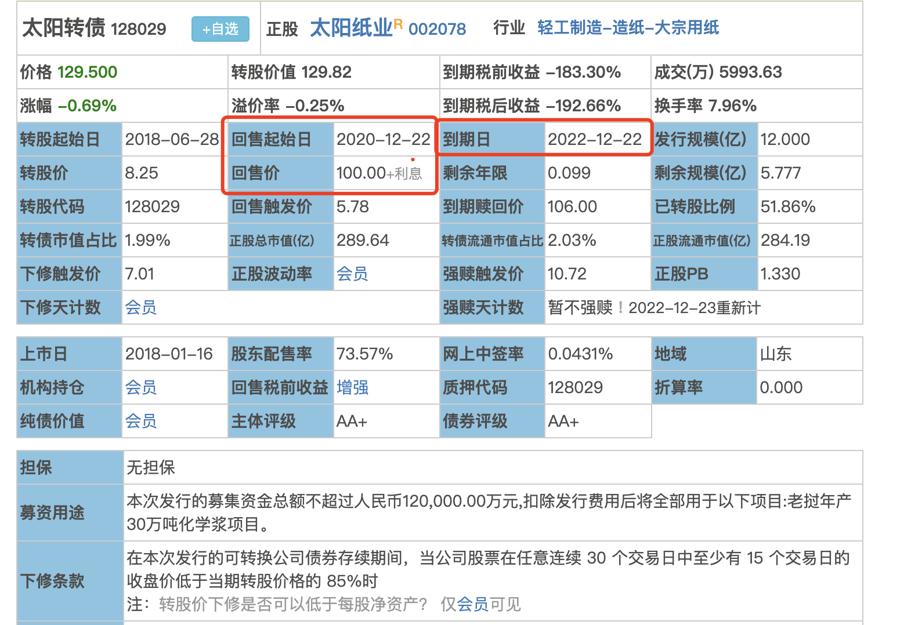
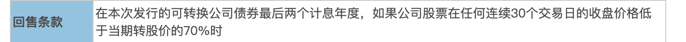

- # 一、原理
  collapsed:: true
	- 触发回售条款是投资人的权利，强赎条款是上市公司的权利
	- 回售条款是保护投资人的
	- {:height 520, :width 746}
	- 
	- 1、到达回售起始日
	- 2、连续30个交易日 股价低于当期转股价的70%{具体看回售条款}时。可以卖回给上市公司
	- 即：正股价<回售触发价   连续30天时
	-
- # 二、套利逻辑
  collapsed:: true
	- 正股价持续低于转股价的70%怎么办
	- 1、拉升正股价
		- 临近快30个交易日，正股股价一般会异动回到转股价上方一次，转股价值因此上升
		- 可买股/债套利
	- 2、下调转股价
		- 转股价值增加，可转债交易价格同步增加，可转股获利，
- # 三、操作
  collapsed:: true
	- 1、进入回售期----->回售起始日
	- 2、价格低----->安全性高
		- 基本60-80之间适合 回售套利
		- 100-130适合强赎套利
		- 150-160-170-180适合溢价率套利
	- 选择可转债交易价格    小于或等于   回售价的
- # 四、问答
	- ## 1、什么时候可以回售
		- 回售条款生效必须在特定的年度内，就是可转债最后2个计息年度内
	- ## 2、什么条件下回售？多少价格回售
		- 查询公司的回售条款和回售价格
	- ## 3、如何数日子？下修影响数日子吗？
		- 回售要求连续30天，哪怕有一天股价没有低于转股价的70%,天数要重新计算
		- 所以从正股价跌到转股价70%开始，就可以计算天数了