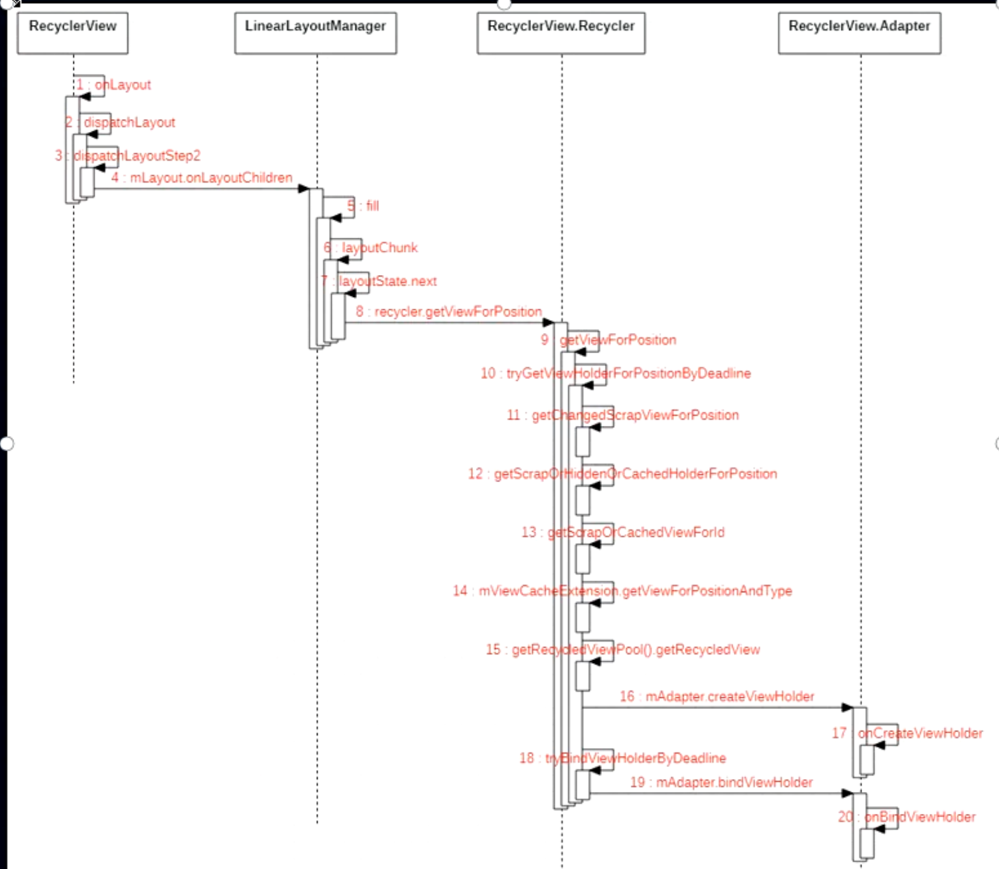

# 情形1、滑动的时候
	- # [[Recyclerview复用机制-怎么从四级缓存取]]
	- # [[#red]]==**到这里走的是找缓存复用的原理**==
	- # [[Recyclerview回收/缓存机制-怎么存到四级缓存]]
- # 情形2、布局的时候onLayout时的回收和复用
  collapsed:: true
	- ## 时序图
	  collapsed:: true
		- 
	- RecyclerView
		- onLayout
		- dispatchLayout
		- dispatchLayoutStep2--处理回收缓存的
			- ```java
			  mLayout.onLayoutChildren(mRecycler, mState);
			  ```
	- LinearLayoutManager。
		- onLayoutChildren
		- fill。
		- ## [[#red]]==**到此和 滑动的复用流程一致**==（看上边就行了）
		- ## [[#red]]==**fill也会处理缓存**==
			- recycleByLayoutState
				- ```java
				      private void recycleByLayoutState(RecyclerView.Recycler recycler, LayoutState layoutState) {
				          if (!layoutState.mRecycle || layoutState.mInfinite) {
				              return;
				          }
				          int scrollingOffset = layoutState.mScrollingOffset;
				          int noRecycleSpace = layoutState.mNoRecycleSpace;
				          if (layoutState.mLayoutDirection == LayoutState.LAYOUT_START) {
				              recycleViewsFromEnd(recycler, scrollingOffset, noRecycleSpace);
				          } else {
				              recycleViewsFromStart(recycler, scrollingOffset, noRecycleSpace);
				          }
				      }
				  ```
			- recycleViewsFromStart：向上滑动，顶部消失的viewHodler 需要缓存就是这里
			- recycleChildren
			- removeAndRecycleViewAt，移除并且回收
			- recycleView
			- [[recycleViewHolderInternal]]。就是这种情形，只会缓存cacheView  和 缓存池的缓存。一级缓存没有处理
		-
	- ```java
	  ```