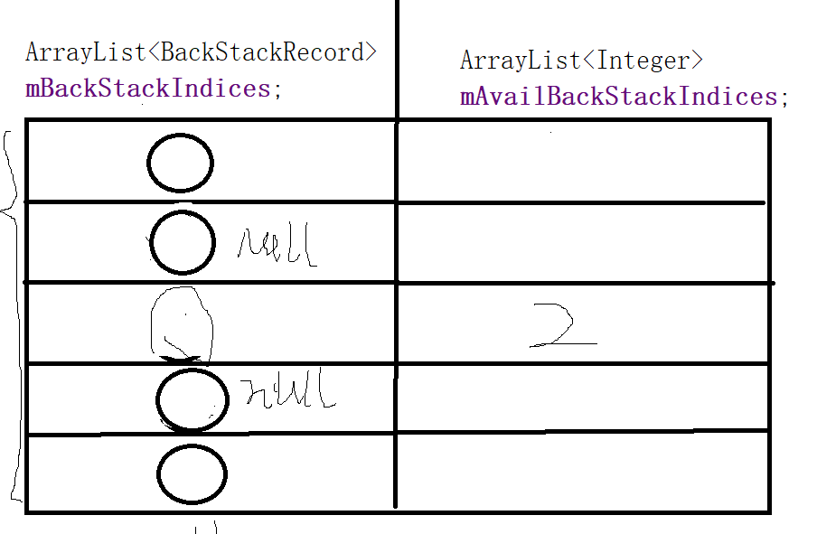

- ```java
  FragmentManager mFragmentManager = getSupportFragmentManager();
  mFragmentManager.beginTransaction()
      .replace(R.id.fl_content, fragment)
      .addToBackStack()
      .commitAllowingStateLoss();
  ```
- # 1、BackStackRecord.java
	- addToBackStack
	- ```java
	      @Override
	      public FragmentTransaction addToBackStack(@Nullable String name) {
	          if (!mAllowAddToBackStack) {
	              throw new IllegalStateException(
	                      "This FragmentTransaction is not allowed to be added to the back stack.");
	          }
	          mAddToBackStack = true;
	          mName = name;
	          return this;
	      }
	  ```
- # 2、再看commit
	- ```java
	      @Override
	      public int commit() {
	          return commitInternal(false);
	      }
	  
	   
	      int commitInternal(boolean allowStateLoss) {
	          if (mCommitted) throw new IllegalStateException("commit already called");
	          if (FragmentManagerImpl.DEBUG) {
	              Log.v(TAG, "Commit: " + this);
	              LogWriter logw = new LogWriter(TAG);
	              PrintWriter pw = new PrintWriter(logw);
	              dump("  ", null, pw, null);
	              pw.close();
	          }
	          mCommitted = true;
	          if (mAddToBackStack) {
	              mIndex = mManager.allocBackStackIndex(this);
	          } else {
	              mIndex = -1;
	          }
	          mManager.enqueueAction(this, allowStateLoss);
	          return mIndex;
	      }
	  ```
- # 3、FragmentImpl.allocBackStackIndex(申请回退栈索引)
	- ```java
	      ArrayList<BackStackRecord> mBackStackIndices; // 回退栈索引 集合
	      ArrayList<Integer> mAvailBackStackIndices; // 可用回退栈索引 集合
	  public int allocBackStackIndex(BackStackRecord bse) {
	         // mAvailBackStackIndices可用回退栈索引 集合
	        // mBackStackIndices 回退栈索引 集合
	          synchronized (this) {
	              if (mAvailBackStackIndices == null || mAvailBackStackIndices.size() <= 0) {
	                  // 新建回退栈索引
	                  if (mBackStackIndices == null) {
	                      mBackStackIndices = new ArrayList<BackStackRecord>();
	                  }
	                  int index = mBackStackIndices.size();
	                  if (DEBUG) Log.v(TAG, "Setting back stack index " + index + " to " + bse);
	                  mBackStackIndices.add(bse);
	                  return index;
	  
	              } else {
	                  int index = mAvailBackStackIndices.remove(mAvailBackStackIndices.size()-1);
	                  if (DEBUG) Log.v(TAG, "Adding back stack index " + index + " with " + bse);
	                  mBackStackIndices.set(index, bse);
	                  return index;
	              }
	          }
	      }
	  ```
	- 
	- 1、根据上边的代码第一次执行，mAvailBackStackIndices肯定为null，走if那么在左侧加入事务
	- 2、当释放内存时调用
		- ```java
		      public void freeBackStackIndex(int index) {
		          synchronized (this) {
		              mBackStackIndices.set(index, null);
		              if (mAvailBackStackIndices == null) {
		                  mAvailBackStackIndices = new ArrayList<Integer>();
		              }
		              if (DEBUG) Log.v(TAG, "Freeing back stack index " + index);
		              mAvailBackStackIndices.add(index);
		          }
		      }
		  ```
		- 会将左侧指定下边的置为null释放内存，同时 在mAvailBackStackIndices保存下 为null的下标
	- 3、当下次添加事务时走allocBackStackIndex 这个方法走else，移除最后一个 可用回退栈索引下标（右侧的最后一个）。在指定下标出，添加事务。达到内存复用