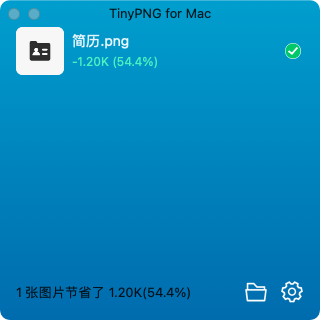
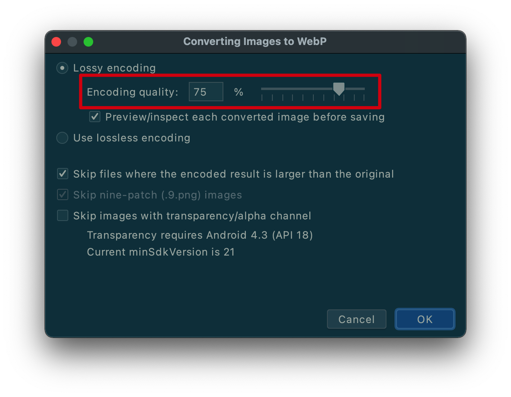

- 图片资源是res文件夹下占比最大的，也是处理方式最简单的。我们拿到UI提供的图片资源后，直接使用压缩工具进行压缩即可。
- 应用中使用最多的图片格式就是PNG。PNG图片主要有三个类型，分别为 PNG-8，PNG-24，PNG-32，数字越大代表可表现的色彩越丰富，但对于移动端来说，色彩越多意味着文件体积和占用的内存越大，对于APP中简单的icon或图片直接选择png-8更合适。
- 对于带透明度的PNG可以选择[TinyPNG](https://tinypng.com/)、[pngquant](https://pngquant.org/)进行有损压缩，通常能有30-60%的压缩收益。
- 
- WebP 是 Google 的一种可以同时提供有损压缩（像 JPEG 一样）和透明度（像 PNG 一样）的图片文件格式，不过与 JPEG 或 PNG 相比，这种格式可以提供更小的文件大小。
- Android Studio中提供了比较便捷的工具将PNG图片转为WebP，同时可以选择图片质量，更高的质量意味着更大的体积，这里需要做一个平衡。
  collapsed:: true
	- 
	- 
- 在Android 4.0（API 级别 14）就已经支持显示 WebP 图片，Android 4.3（API 级别 18）及更高版本支持无损且透明的 WebP 图片，对于我们应用最低版本是5.0的来说，不用考虑兼容情况。目前我们项目中大量的使用了webp格式的图片，在包大小方面也有很大的收益。