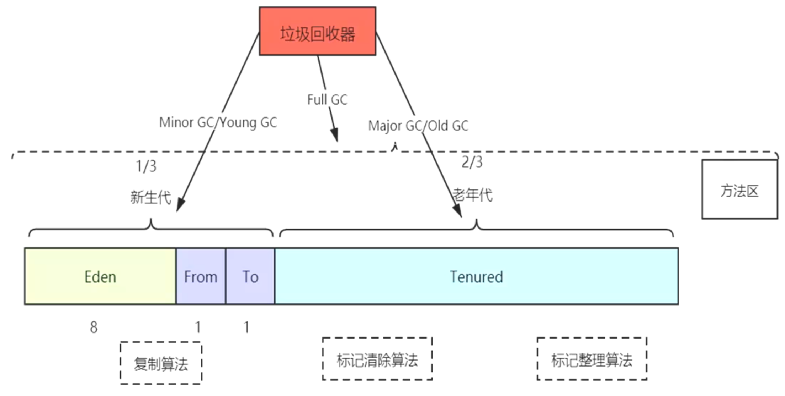

# 一、分代收集理论
	- 1、绝大部分的对象都是朝生夕死的（新生代）
	- 2、对象熬过了多次垃圾回收，就越难回收（老年代）
	- 所以应该把这两类对象分开：分代收集
- # 二、分代设计
	- 
	- 堆内存中分代收集
	- 1、新生代占堆的1/3,老年代占1/2
	- 2、垃圾回收器对新生代回收：叫MinorGC 或者 Young GC
	- 3、垃圾回收器对老年代回收：Major GC 或者 Old GC
	- 4、Full gc 全部回收，新生代+ 老年代+ 方法区
- # 三、垃圾回收算法
	- ## [[ 复制算法（Copying）]][[#red]]==新生代用==
	  collapsed:: true
		- 注意：内存移动是必须实打实的移动（复制），不能使用指针玩。
		- 专门研究表明，新生代中的对象98%是“朝生夕死”的，所以并不需要按照1:1的比例来划分内存空间，而是将内存分为一块较大的Eden空间和两块较小的Survivor空间，每次使用Eden和其中一块Survivor[1]。当回收时，将Eden和Survivor中还存活着的对象一次性地复制到另外一块Survivor空间上，最后清理掉Eden和刚才用过的Survivor空间。
		- HotSpot虚拟机默认Eden和Survivor的大小比例是8:1，也就是每次新生代中可用内存空间为整个新生代容量的90%（80%+10%），只有10%的内存会被“浪费”。当然，98%的对象可回收只是一般场景下的数据，我们没有办法保证每次回收都只有不多于10%的对象存活，当Survivor空间不够用时，需要依赖其他内存（这里指老年代）进行分配担保（Handle Promotion）
	- ## **[[标记-清除算法（Mark-Sweep）]]-==老年代用==**
	- ## **[[标记-整理算法（Mark-Compact）]]-==老年代用==**
		-