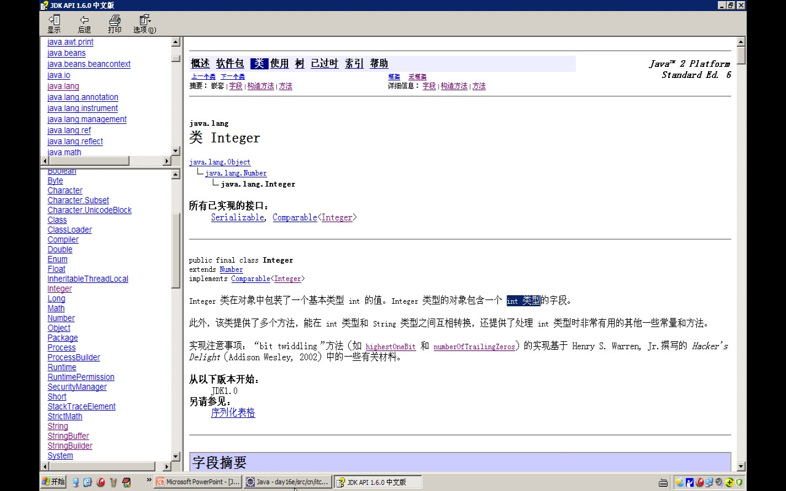
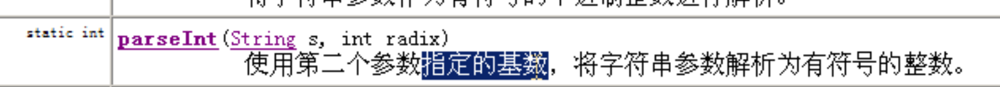

- # 一、概念
  collapsed:: true
	- 为了方便操作==基本数据类型值==，将其封装成了对象，在对象中定义了属性和行为丰富了该数据的操作
	- 用于描述该对象的类就称为基本数据类型对象包装类。
- # 二、基本数据类型包装类
  collapsed:: true
	- byte		Byte
	- short	Short
	- int		Integer
		- 
	- long		Long
	- float	Float
	- double	Double
	- char		Character
	- boolean	Boolean
- # 三、包装类的作用
  collapsed:: true
	- 该包装对象主要用基本类型和字符串之间的转换
	- ## 基本类型--->字符串
		- 1,基本类型数值+""
		- 2,用String类中的静态方法valueOf(基本类型数值);
		- 3,用Integer的静态方法valueOf(基本类型数值);
	- ## 字符串--->基本类型
	  collapsed:: true
		- 1、使用包装类中的静态方法   xxx parseXxx("xxx类型的字符串");
		  int parseInt("intstring");
		  long parseLong("longstring");
		  boolean parseBoolean("booleanstring");
		  只有Character没有parse方法
			- ```java
			  		int x = Integer.parseInt("123");
			  		System.out.println(Integer.parseInt("123")+1);
			  ```
		- 2、如果字符串被Integer进行对象的封装。
			- 可使用另一个非静态的方法，[[#red]]==**intValue()**==;将一个Integer对象转成基本数据类型值。
			- ```java
			  
			  		Integer i = new Integer("123");		
			  		System.out.println(i.intValue());
			  ```
	- ## 进制转换
	  collapsed:: true
		- 十进制-->其他进制。
			- toBinaryString:十进制->二进制
			  collapsed:: true
				- ```java
				  Integer.toBinaryString(60)
				  ```
			- toOctalString: 十进制 -》 八进制
			- toHexString：十进制 -》 十六进制
			- 参数1 数字，参数2 转成的进制
				- Integer.toString(60,16)
		- 其他进制-》十进制
			- 
		- ```java
		  		
		  		/*
		  		 * 整数具备不同的进制体现。
		  		 * 
		  		 * 十进制-->其他进制。
		  		 * 		toBinaryString
		  		 * 		toOctalString
		  		 * 		toHexString
		  		 * 
		  		 * 其他进制-->十进制。
		  		 * 		parseInt("string",radix)
		  		 * 
		  		 */
		  		
		  //		十进制-->其他进制。
		  		System.out.println(Integer.toBinaryString(60));
		  		System.out.println(Integer.toOctalString(60));
		  		System.out.println(Integer.toHexString(60));
		  		
		  		
		  //		System.out.println(Integer.toString(60,16));
		  //		其他进制-->十进制。
		  		System.out.println(Integer.parseInt("3c",16));
		  ```
- # 四、[[包装类面试题]]
- # 五、自动装箱
  collapsed:: true
	- ## 概念
	  collapsed:: true
		- ==基本数据类型==和==对应的包装类之间自动进行转换的过程==。它使得我们可以在需要使用包装类的地方直接使用基本数据类型，而不需要显式地进行类型转
			- ```java
			  int num = 10;
			  Integer integer = 10; // 自动装箱  相当于 Integer integer = new Integer(10)
			  ```
	- ## 场景
	  collapsed:: true
		- ### 1、将基本数据类型赋值给对应的包装类变量：
			- ```java
			  int num = 10;
			  Integer integer = num; // 自动装箱
			  
			  ```
		- ### 2、将基本数据类型作为参数传递给期望接收包装类的方法
			- ```java
			  void processInteger(Integer value) {
			      // ...
			  }
			  
			  int num = 20;
			  processInteger(num); // 自动装箱
			  
			  ```
		- ### 3、将基本数据类型存储在集合类（如List、Set）等需要使用包装类的容器中：
			- ```java
			  List<Integer> numbers = new ArrayList<>();
			  numbers.add(30); // 自动装箱
			  
			  ```
	- ## 弊端
	  collapsed:: true
		- 自动装箱可能会带来一些性能上的开销，因为它涉及到**==对象的创建和内存分配==**。在某些性能要求较高的场景下，可以考虑手动进行装箱和拆箱操作，以避免额外的开销。
	- ## 例子
		- ```java
		  Integer i =  4;//i = new Integer(4);自动装箱  简化书写。
		  i = i + 6;// i = new Integer(i.intValue() + 6); //i.intValue() 自动拆箱 
		  1、先i.intValue() 自动拆箱把对象转成int，
		  2、数字运算
		  3、new Integer 返回
		  ```
- # 六、自动拆箱
  collapsed:: true
	- 它指的是将包装类对象自动转换为对应的基本数据类型的过程。
	- ## 使用场景
	  collapsed:: true
		- ### 1、将包装类对象赋值给对应的基本数据类型变量：
			- ```java
			  Integer integer = 10;
			  int num = integer; // 自动拆箱
			  
			  ```
		- ### 2、将包装类对象作为参数传递给期望接收基本数据类型的方法
			- ```java
			  void processInt(int value) {
			      // ...
			  }
			  
			  Integer integer = 20;
			  processInt(integer); // 自动拆箱
			  
			  ```
		- ### 3、从存储了包装类对象的容器（如List、Set）中取出对应的基本数据类型值：
			- ```java
			  List<Integer> numbers = new ArrayList<>();
			  numbers.add(30);
			  int num = numbers.get(0); // 自动拆箱
			  
			  ```
	- ## 弊端
		- 自动拆箱也可能带来一些性能上的开销，因为它涉及到从对象中提取值的操作。在某些性能要求较高的场景下，可以考虑手动进行装箱和拆箱操作，以避免额外的开销。
		- 此外，需要注意避免自动拆箱时可能出现的空指针异常，因为对于包装类对象为`null`的情况，自动拆箱会引发`NullPointerException`。