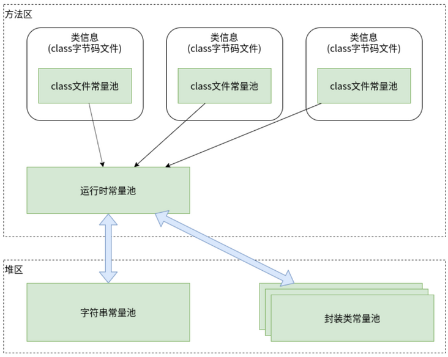

- 
- # 一、简介
	- 包括`Byte,Short,Integer,Long,Character,Boolean`，注意，浮点数据类型`Float,Double`是没有常量池的。
	- Java的基本数据类型中，除了两个浮点数类型，其他的基本数据类型都在各自内部实现了常量池，但都在[-128~127]这个范围内。
	- [[#red]]==封装类的常量池是在各自内部类中实现的==，比如`IntegerCache`(`Integer`的内部类)，自然也位于[[#red]]==堆区。==
	- **这里常量池中缓存的是包装类对象，而不是基本数据类型**
- # 二、基本类型包装类的常量池是有范围的
	- 对于数值范围在 -128 到 127 之间的整数，会使用包装类常量池的缓存对象，而超出该范围的整数则会创建新的对象。
	- Byte,Short,Integer,Long : [-128~127]
	- Character : [0~127]
	- Boolean : [True, False]
	- 例子：
		- ```java
		  Integer i1 = 127;
		  Integer i2 = 127;
		  System.out.println(i1 == i2); //true 在常量池范围内 直接返回
		  
		  Integer i3 = 128; 
		  Integer i4 = 128;
		  System.out.println(i3 == i4); // false
		  // 数值 128 超出了 -128 到 127 的范围，因此会创建两个不同的 Integer 对象。尽管它们的数值相同，但它们引用的是不同的对象
		  
		  Integer i5 = -128;
		  Integer i6 = -128;
		  System.out.println(i5 == i6); // true
		  
		  Integer i7 = -129;
		  Integer i8 = -129;
		  System.out.println(i7 == i8); // false
		  
		  Boolean bool1=true;
		  Boolean bool2=true;
		  System.out.println(bool1==bool2);//输出true
		  
		  //浮点类型的包装类没有实现常量池技术
		  Double d1=1.0;
		  Double d2=1.0;
		  System.out.println(d1==d2); //输出false
		  ```