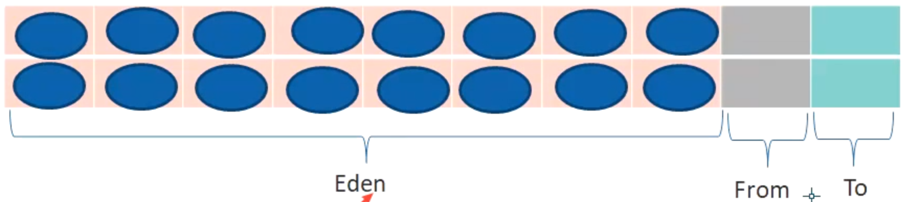
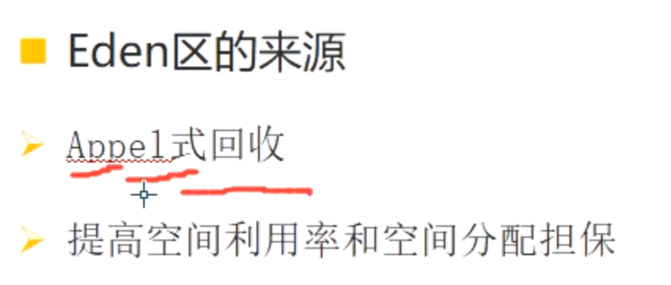

- # 一、做法
	- 空间一分为二，只用一半
	- 1、将可用内存按容量划分为大小相等的两块，**[[#red]]==每次只使用其中的一块==**。
	- 2、当这一块的内存用完了，就[[#red]]==**将还存活着的对象复制到另外一块上面，然后再把已使用过的内存空间一次清理掉**==。
	- 这样使得每次都是对整个半区进行内存回收，内存分配时也就不用考虑内存碎片等复杂情况，只要按顺序分配内存即可，实现简单，运行高效。只是这种算法的代价是将内存缩小为了原来的一半。
	- [[#red]]==**适用于 From to区（每次进入这两个区，年龄都会+1）**==
- # 二、特点
	- ### 优点
		- 实现简单，运行高效
		- 内存复制，没有内存碎片
	- ###  缺点：
		- 空间利用率只有一半，引出Eden区
- # 三、Eden区的来源
	- 
	- 因为大部分对象（90%以上）都是朝生夕死的，只有10%才可能用的上复制算法，没必要1:1划分内存，所以把大部分放入Eden区（80%），其余1:1算为From 和 To 区
	-
	- ## Appel式回收
		- 1、将内存新增Eden区，按照上述8:1:1划分 Eden From to 区
		- 2、新对象放入Eden区，进行垃圾回收时，存活的会放入From to 区，年龄加1
		- 3、From to 之间为复制算法，进行垃圾回收，满足一定条件（1、年龄到15，2 超一半的servier区，年龄都是相同的）
	- ## 好处
		- 提高空间利用率和空间分配担保
	- 