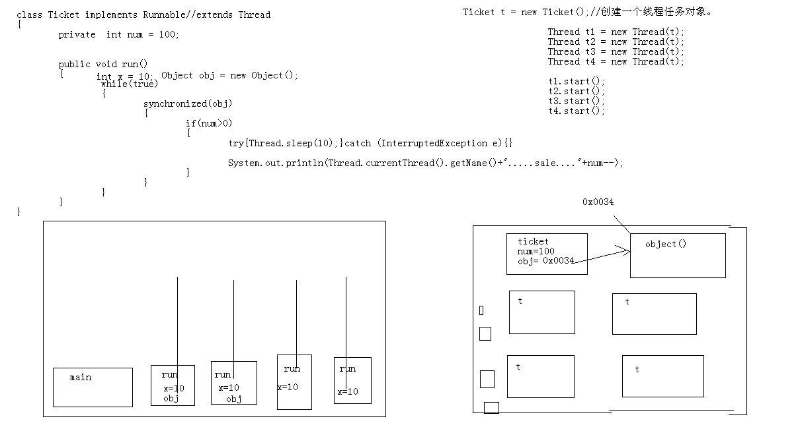

- # 一、概念线程：
	- 就是进程中一个负责程序执行的控制单元(执行路径)
	- 一个进程中可以多执行路径，称之为多线程。
- # 二、概述
  collapsed:: true
	- 一个进程中至少要有一个线程。
	- 每一个线程都有自己运行的内容。这个内容可以称为线程要执行的任务。
	- 其实[[#red]]==**应用程序的执行都是cpu在做着快速的切换完成**==的。这个切换是随机的。
	- JVM启动时就启动了多个线程，至少有两个线程可以分析的出来。
		- 1，执行main函数的线程，
			- 该线程的任务代码都定义在main函数中。
		- 2，负责垃圾回收的线程。
- ## [[CPU核心数和线程数的关系？]]
- ## [[CPU时间轮转机制-过多应用开启导致卡顿]]
- # 三、多线程
  collapsed:: true
	- 一个进程中可以多执行路径，称之为多线程。
	- ## 好处
		- 解决了多部分同时运行的问题
	- ## 弊端
		- 线程太多回到效率的降低
	- ## 运行图
	  collapsed:: true
		- 
- # [[创建线程的几种方式]]
- # 四、[[线程的状态]]
  collapsed:: true
	- 
	- {:height 370, :width 673}
	- 1、被创建
	- 2、运行
	- 3、冻结
	- 4、消亡
	- 5、临时阻塞状态
- # 五、卖票示例
  collapsed:: true
	- ## 需求：4个线程卖100张票
	- ## 示例1：多线程卖票
	  collapsed:: true
		- 票类
		  collapsed:: true
			- ```java
			  class Ticket extends Thread
			  {
			  	private  int num = 100;
			  
			  	public void run()
			  	{
			  		while(true)
			  		{
			  				if(num>0)
			  				{
			  					System.out.println(Thread.currentThread().getName()+".....sale...."+num--);
			  				}
			  		}
			  	}
			  }
			  
			  class  TicketDemo
			  {
			  	public static void main(String[] args) 
			  	{
			  
			  		Ticket t1 = new Ticket();
			  		Ticket t2 = new Ticket();
			  		Ticket t3 = new Ticket();
			  		Ticket t4 = new Ticket();
			  		t1.start();
			  		t2.start();
			  		t3.start();
			  		t4.start();
			  		
			  	}
			  }
			  ```
		- 打印结果：每个线程都把100张票卖一遍显然不行
		- ## 原因
			- -00_11_32-2023_06_20_17_20_05_1687252837876_0.jpg)
			- 一个卖票线程对象一个变量100，都卖各自的变量，肯定1-100都卖一遍
	- ## 示例2：让数据num 四个线程共享-static[==不推荐==]
	  collapsed:: true
		- ```java
		  class Ticket implements Runnable//extends Thread
		  {
		  	private static int num = 100;
		  
		  	public void run()
		  	{
		  		while(true)
		  		{
		  				if(num>0)
		  				{
		  					System.out.println(Thread.currentThread().getName()+".....sale...."+num--);
		  				}
		  		}
		  	}
		  }
		  
		  ```
		- num 变静态的后，放入方法区，线程数据共享的，但是这么做 num就和卖票类Ticket没什么关系了
		- 所以这种不可取
	- ## 改进3：使用runnable多个线程共享一个任务对象[有线程安全问题]
	  collapsed:: true
		- 
		- ```java
		  class Ticket implements Runnable//extends Thread
		  {
		  	private  int num = 100;
		  
		  	public void run()
		  	{
		  		while(true)
		  		{
		  			{
		  				if(num>0)
		  				{
		  					System.out.println(Thread.currentThread().getName()+".....sale...."+num--);
		  				}
		  			}
		  		}
		  	}
		  }
		  ```
		- ```java
		  
		  class  TicketDemo
		  {
		  	public static void main(String[] args) 
		  	{
		  
		  		Ticket t = new Ticket();//创建一个线程任务对象。
		  
		          // 四个线程 共享1个任务
		  		Thread t1 = new Thread(t);
		  		Thread t2 = new Thread(t);
		  		Thread t3 = new Thread(t);
		  		Thread t4 = new Thread(t);
		  
		  		t1.start();
		  		t2.start();
		  		t3.start();
		  		t4.start();
		  		
		  	}
		  }
		  ```
		- ## ==会出现线程安全问题，多线程访问同一变量==
		-
	- ## 对3的改进：synchronized 同步代码块
	  collapsed:: true
		- ```java
		  class Ticket implements Runnable//extends Thread
		  {
		  	private  int num = 100;
		  
		  	Object obj = new Object();
		  	public void run()
		  	{
		  		while(true)
		  		{
		  			synchronized(obj)
		  			{
		  				if(num>0)
		  				{   
		                      // 线程睡一会释放执行资格和执行权，模拟多线程都访问这里
		  					try{Thread.sleep(10);}catch (InterruptedException e){}
		  					
		  					System.out.println(Thread.currentThread().getName()+".....sale...."+num--);
		  				}
		  			}
		  		}
		  	}
		  }
		  ```
	- 锁图解
		- 
- # 六、[[线程安全问题产生的原因]]
  collapsed:: true
- # 七、[[解决线程安全问题]]
  collapsed:: true
	- # [[线程安全问题解决思路]]
- # 八、[[同步的优缺点]]
- # 九、[[同步的前提]]
	-
- # 十、总结
	- /*
	  多线程总结：
	- 1，进程和线程的概念。
	  	|--进程：
	  	|--线程：
	- 2，jvm中的多线程体现。
	  	|--主线程，垃圾回收线程，自定义线程。以及他们运行的代码的位置。
	- 3，什么时候使用多线程，多线程的好处是什么？创建线程的目的？
	  	|--当需要多部分代码同时执行的时候，可以使用。
	- 4，创建线程的两种方式。★★★★★
	  	|--继承Thread
	  |--步骤
	  	|--实现Runnable
	  |--步骤
	  	|--两种方式的区别？
	- 5，线程的5种状态。
	  	对于执行资格和执行权在状态中的具体特点。
	  	|--被创建：
	  	|--运行：
	  	|--冻结：
	  	|--临时阻塞：
	  	|--消亡：
	- 6，线程的安全问题。★★★★★
	  	|--安全问题的原因：
	  	|--解决的思想：
	  	|--解决的体现：synchronized
	  	|--同步的前提：但是加上同步还出现安全问题，就需要用前提来思考。
	  	|--同步的两种表现方法和区别：
	  	|--同步的好处和弊端：
	  	|--单例的懒汉式。
	  	|--死锁。
	- 7，线程间的通信。等待/唤醒机制。
	  	|--概念：多个线程，不同任务，处理同一资源。 
	  	|--等待唤醒机制。使用了锁上的 wait notify notifyAll.  ★★★★★
	  	|--生产者/消费者的问题。并多生产和多消费的问题。  while判断标记。用notifyAll唤醒对方。 ★★★★★
	  	|--JDK1.5以后出现了更好的方案，★★★
	  Lock接口替代了synchronized  
	  Condition接口替代了Object中的监视方法，并将监视器方法封装成了Condition
	  和以前不同的是，以前一个锁上只能有一组监视器方法。现在，一个Lock锁上可以多组监视器方法对象。
	  可以实现一组负责生产者，一组负责消费者。 
	  	|--wait和sleep的区别。★★★★★
	-
	- 8，停止线程的方式。
	  	|--原理：
	  	|--表现：--中断。
	- 9，线程常见的一些方法。
	  	|--setDaemon()
	  	|--join();
	  	|--优先级
	  	|--yield();
	  	|--在开发时，可以使用匿名内部类来完成局部的路径开辟。