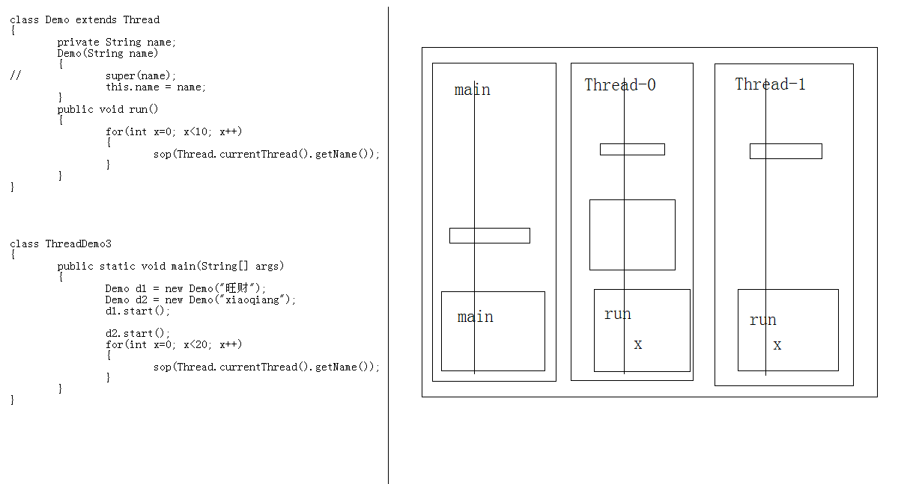
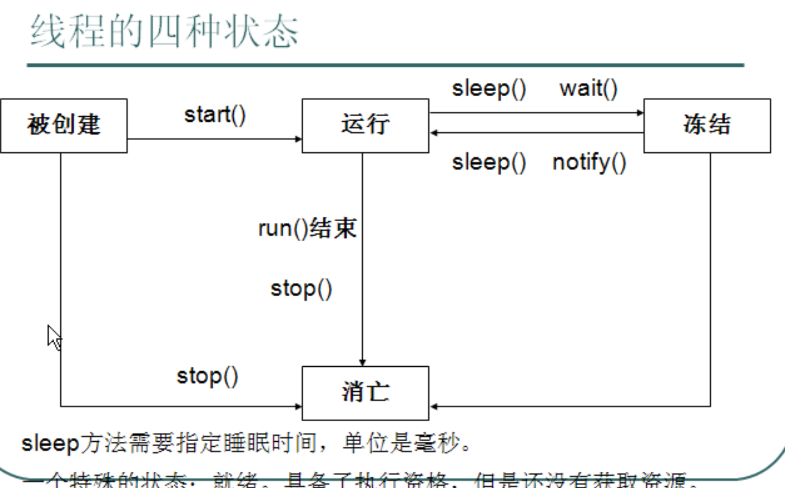
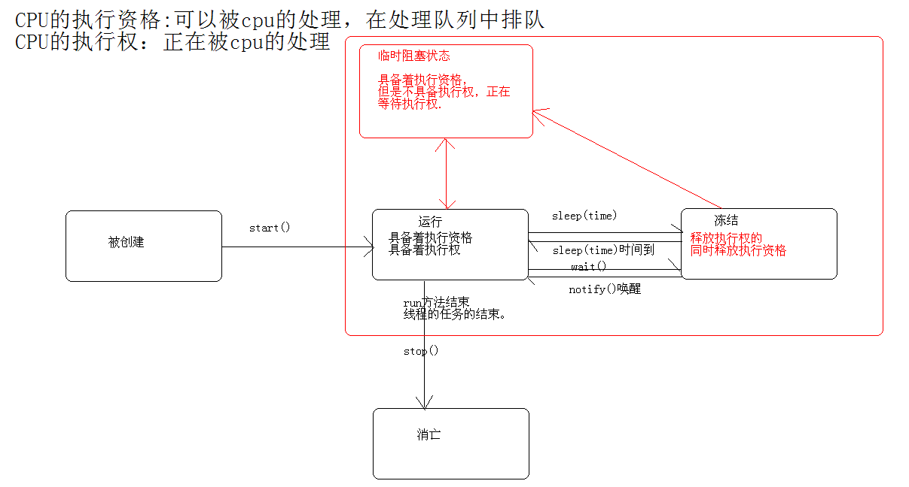
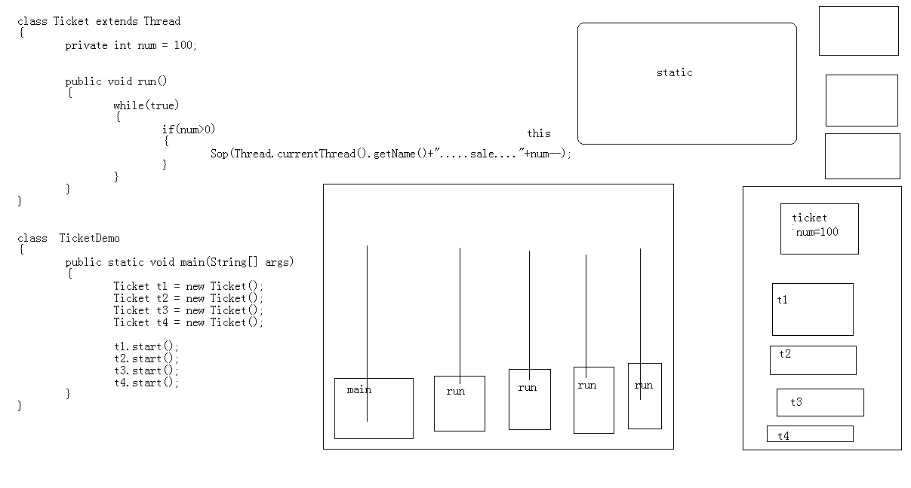

- # 一、概念线程：
	- 就是进程中一个负责程序执行的控制单元(执行路径)
	- 一个进程中可以多执行路径，称之为多线程。
- # 二、概述
	- 一个进程中至少要有一个线程。
	- 每一个线程都有自己运行的内容。这个内容可以称为线程要执行的任务。
	- 其实[[#red]]==**应用程序的执行都是cpu在做着快速的切换完成**==的。这个切换是随机的。
	- JVM启动时就启动了多个线程，至少有两个线程可以分析的出来。
		- 1，执行main函数的线程，
			- 该线程的任务代码都定义在main函数中。
		- 2，负责垃圾回收的线程。
- # 三、多线程
  collapsed:: true
	- 一个进程中可以多执行路径，称之为多线程。
	- ## 好处
		- 解决了多部分同时运行的问题
	- ## 弊端
		- 线程太多回到效率的降低
	- ## 运行图
		- 
- # [[创建线程的几种方式]]
- # 四、线程的状态
  collapsed:: true
	- 
	- 
	- 1、被创建
	- 2、运行
	- 3、冻结
	- 4、消亡
	- 5、临时阻塞状态
- # 五、卖票示例
  collapsed:: true
	- ## 需求：4个线程卖100张票
	- ## 示例1：多线程卖票
	  collapsed:: true
		- 票类
		  collapsed:: true
			- ```java
			  class Ticket extends Thread
			  {
			  	private  int num = 100;
			  
			  	public void run()
			  	{
			  		while(true)
			  		{
			  				if(num>0)
			  				{
			  					System.out.println(Thread.currentThread().getName()+".....sale...."+num--);
			  				}
			  		}
			  	}
			  }
			  
			  class  TicketDemo
			  {
			  	public static void main(String[] args) 
			  	{
			  
			  		Ticket t1 = new Ticket();
			  		Ticket t2 = new Ticket();
			  		Ticket t3 = new Ticket();
			  		Ticket t4 = new Ticket();
			  		t1.start();
			  		t2.start();
			  		t3.start();
			  		t4.start();
			  		
			  	}
			  }
			  ```
		- 打印结果：每个线程都把100张票卖一遍显然不行
		- ## 原因
			- -00_11_32-2023_06_20_17_20_05_1687252837876_0.jpg)
			- 一个卖票线程对象一个变量100，都卖各自的变量，肯定1-100都卖一遍
	- ## 示例2：让数据num 四个线程共享-static[==不推荐==]
	  collapsed:: true
		- ```java
		  class Ticket implements Runnable//extends Thread
		  {
		  	private static int num = 100;
		  
		  	public void run()
		  	{
		  		while(true)
		  		{
		  				if(num>0)
		  				{
		  					System.out.println(Thread.currentThread().getName()+".....sale...."+num--);
		  				}
		  		}
		  	}
		  }
		  
		  ```
		- num 变静态的后，放入方法区，线程数据共享的，但是这么做 num就和卖票类Ticket没什么关系了
		- 所以这种不可取
	- ## 改进3：使用runnable多个线程共享一个任务对象[有线程安全问题]
	  collapsed:: true
		- 
		- ```java
		  class Ticket implements Runnable//extends Thread
		  {
		  	private  int num = 100;
		  
		  	public void run()
		  	{
		  		while(true)
		  		{
		  			{
		  				if(num>0)
		  				{
		  					System.out.println(Thread.currentThread().getName()+".....sale...."+num--);
		  				}
		  			}
		  		}
		  	}
		  }
		  ```
		- ```java
		  
		  class  TicketDemo
		  {
		  	public static void main(String[] args) 
		  	{
		  
		  		Ticket t = new Ticket();//创建一个线程任务对象。
		  
		          // 四个线程 共享1个任务
		  		Thread t1 = new Thread(t);
		  		Thread t2 = new Thread(t);
		  		Thread t3 = new Thread(t);
		  		Thread t4 = new Thread(t);
		  
		  		t1.start();
		  		t2.start();
		  		t3.start();
		  		t4.start();
		  		
		  	}
		  }
		  ```
		- ## ==会出现线程安全问题，多线程访问同一变量==
		-
	- ## 对3的改进：synchronized 同步代码块
		- ```java
		  class Ticket implements Runnable//extends Thread
		  {
		  	private  int num = 100;
		  
		  	Object obj = new Object();
		  	public void run()
		  	{
		  		while(true)
		  		{
		  			synchronized(obj)
		  			{
		  				if(num>0)
		  				{   
		                      // 线程睡一会释放执行资格和执行权，模拟多线程都访问这里
		  					try{Thread.sleep(10);}catch (InterruptedException e){}
		  					
		  					System.out.println(Thread.currentThread().getName()+".....sale...."+num--);
		  				}
		  			}
		  		}
		  	}
		  }
		  ```
- # 六、线程安全问题产生的原因：
  collapsed:: true
	- 1，多个线程在操作共享的数据。
	- 2，操作共享数据的线程代码有多条。
	- 当一个线程在执行操作共享数据的多条代码过程中，其他线程参与了运算。
	  就会导致线程安全问题的产生。
- # 七、[[解决线程安全问题]]
	- ## 解决线程安全思路：
		- 就是将多条操作共享数据的线程代码封装起来，当有线程在执行这些代码的时候，其他线程时不可以参与运算的。必须要当前线程把这些代码都执行完毕后，其他线程才可以参与运算。
	- ## 手段
		- 同步
- # 八、同步的优缺点
  collapsed:: true
	- ## 优点：解决了线程的安全问题。
	- ## 缺点：相对降低了效率，因为同步外的线程的都会判断同步锁。
		- 即使同步外的线程拿到执行权也进不来，还得等到cpu切到 同步里边这个线程，才能往下执行
- # 九、同步的前提
	- 同步中必须有多个线程并使用同一个锁。