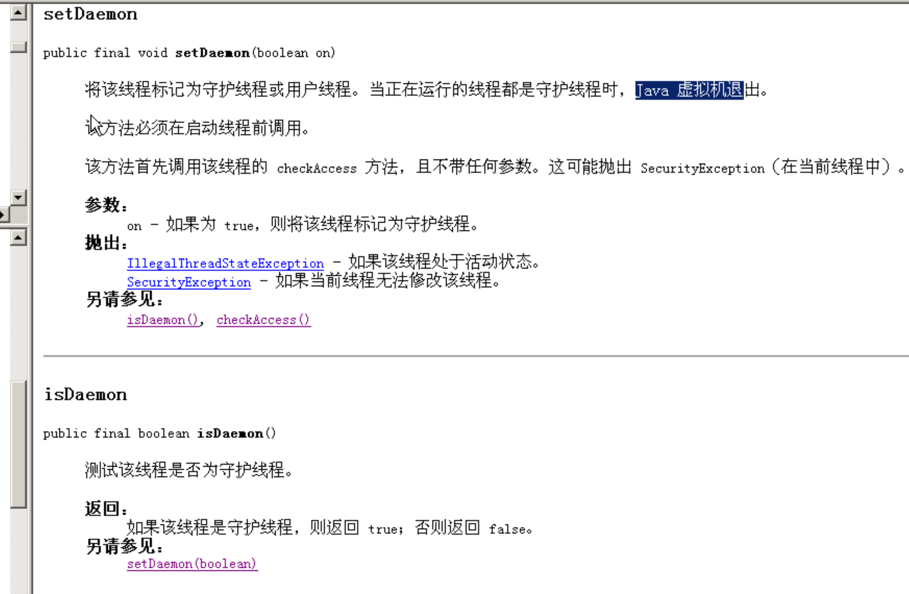
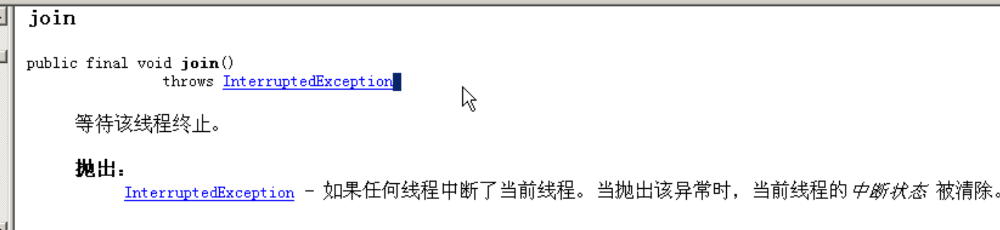
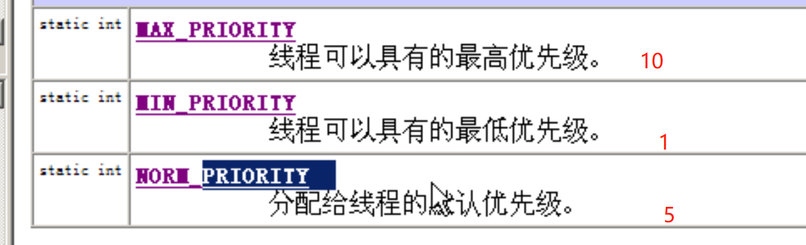
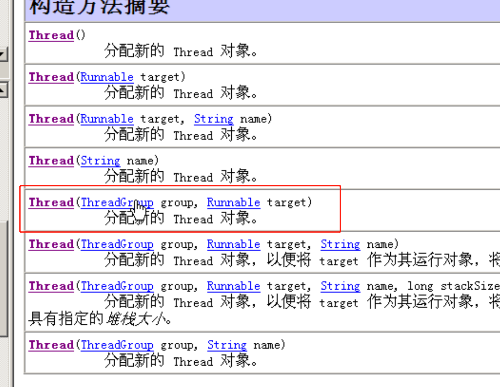

- # 一、守护线程setDaemon
	- ## 概念：
		- 相当于后台线程
	- ## 特点
		- 普通线程相当于前台线程，守护线程相当于后台线程
		- 二者的开启，执行并没有什么不同，
		- 守护线程是所有前台线程结束时，无论守护线程处于什么状态都会结束
	- ## API
		- 
	- ## 前台线程和后台线程区别
		- 前台线程只能手动操作结束
		- 后台线程依赖前台线程的存在，前台线程都结束，无论守护线程处于什么状态都会结束
- # 二、[[join]]
  collapsed:: true
	- # api
	  collapsed:: true
		-  ·
	- ## 示例
	  collapsed:: true
		- ```java
		  class Demo implements Runnable
		  {
		  	public void run()
		  	{
		  		for(int x=0; x<50; x++)
		  		{
		  			System.out.println(Thread.currentThread().toString()+"....."+x);
		  			Thread.yield();
		  		}
		  	}
		  }
		  
		  class  JoinDemo
		  {
		  	public static void main(String[] args) throws Exception
		  	{
		  		Demo d = new Demo();
		  
		  		Thread t1 = new Thread(d);
		  		Thread t2 = new Thread(d);
		  
		  		t1.start();
		  
		  
		  		t2.start();
		  //		t2.setPriority(Thread.MAX_PRIORITY);
		  
		  //		t1.join();//t1线程要申请加入进来，运行。临时加入一个线程运算时可以使用join方法。
		  
		  		for(int x=0; x<50; x++)
		  		{
		  //			System.out.println(Thread.currentThread()+"....."+x);
		  		}
		  	}
		  }
		  
		  ```
- # 三、toString
  collapsed:: true
	- 
- # 四、线程优先级（setPriority）
  collapsed:: true
	- 概念：得到CPU执行权的概率
	- 取值范围：1-10
	- 官方已经给出了三个优先级：
		- 
	-
- # 五、线程组（threadGroup）
  collapsed:: true
	- 创建方式：
		- 
	- 概念：把线程进行组的划分
	- 优点：整个组线程wait时，打断不用一个一个去打断，可以整个组打断，等等类似的方法
	- APi:
		- -00_14_46-2023_06_27_16_53_45_1687856041276_0.jpg)
- # 六、暂停（yield（））
	- 
- #