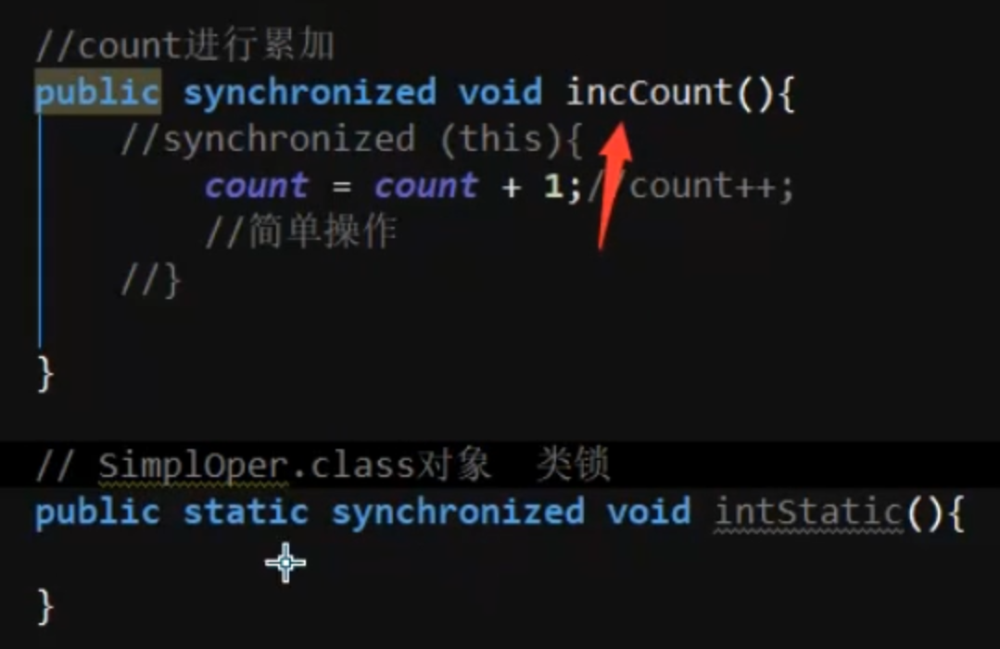
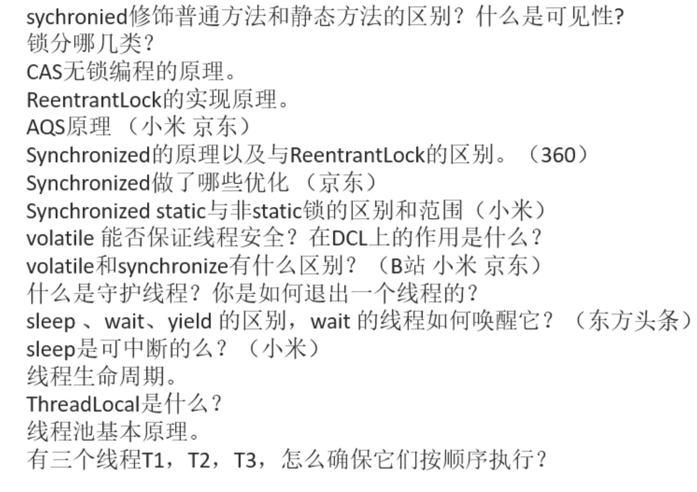

- # 概念题
  collapsed:: true
	- ## 1、进程与线程的区别
	  collapsed:: true
		- 进程：运行的程序
		- 线程：就是进程中一个负责程序执行的控制单元(执行路径)
		  一个进程中可以多执行路径，称之为多线程。
	- ## 2、 [[CPU时间轮转机制-过多应用开启导致卡顿]]
	- ## 3、[[并发和并行的区别？]]
	- ## 4、什么时候使用多线程，多线程的好处是什么？创建线程的目的？
		- 当需要多部分代码同时执行的时候，可以使用。
	- ## 5、java中能不能指定CPU去执行某个线程？
		- 不能，java做不到，通过C语言调用内核api去指定才行
- # Thread的面试题
  collapsed:: true
	- ## 6、实际开发中会考虑线程优先级吗
	  collapsed:: true
		- 
	- ## 1、wait和sleep区别
	  collapsed:: true
		- 1，wait可以指定时间也可以不指定。
		   sleep必须指定时间。
		- 2，在同步中时，对cpu的执行权和锁的处理不同。
		  	wait：释放执行权，释放锁。
		  	sleep:释放执行权，不释放锁。
		- 面试题
		  collapsed:: true
			- ```java
			  class Demo
			  {
			  
			  	void show()
			  	{
			  		synchronized(this)// 
			  		{
			  		 
			  			wait();//t0 t1 t2  // 3个都停在这里
			  		
			  		}
			  	}
			  	void method()
			  	{
			  		synchronized(this)//t4
			  		{
			  		
			  			//wait();
			  
			  			notifyAll(); //
			  		
			  		
			  		}//t4
			  	}
			  }
			  
			  
			  ```
			- show()中
				- 1、t0拿到执行权进去，wait()释放执行权释放锁，t1 t2也一样，所以3个都停那了
			- method中调用了notifyAll全唤醒。
				- 是都有执行权了，t4出来释放锁，t0t1t2抢锁，谁抢到谁执行，执行完了释放锁，后边的抢
				- 这么来说同步中进去了3个线程，wait后边的代码变的不同步了（有安全问题）
	- ## 2、Thread.run 和Thread.start区别？
	  collapsed:: true
		- run是函数调用，和线程没有关系，在哪里调用的run，就执行在哪个线程，并不不是开启线程
		- start是开启线程，走底层最终调用到run函数，这才是开启线程
	- ## 3、[[创建线程的几种方式]]
	- ## 4、[[停止线程的几种方式]]
	- ## 5、sleep wait 到底哪个函数才会清除中断标记，interrupt？
		- sleep 在睡眠期，调用了interrupt，会在抛出异常的时候，捕获异常之前，就已经清除了
	- ## 5、[[线程的状态]]或者说生命周期[[六种状态的线程生命周期]]
	- ## 6、[[怎么控制线程执行顺序]]
	- ## 7、在java中能不能强制中断线程的执行？
	  collapsed:: true
		- 
	- ## 8、如何让出当前线程的执行权？
	  collapsed:: true
		- yield 方法 只在jdk某些实现才能看到，是让出执行权
- # 线程间通信
	- ## 1、[[等待/唤醒机制（wait()，notify()）]]
	- ## 2、[[synchnized和lock区别]]
- # 线程安全问题+锁+并发编程
	- ## 线程安全问题都包括什么？`
		- CPU`缓存导致的可见性问题;
		- 线程切换导致的原子性问题;
		- 指令重排序导致的有序性问题。
	- ## 1、[[线程安全问题产生的原因]]
	- ## 2、[[线程安全问题解决思路]]->同步
	- ## 3、[[同步的前提]]
	- ## 4、[[同步的优缺点]]
	- ## 5、同步的几种方式：[[解决线程安全问题]]
	  collapsed:: true
		- 1、同步代码块，任意对象锁,如果静态函数里的同步代码块还是类锁
		- 2、同步函数，this锁
		- 3、静态同步函数：class 对象锁
	- ## 6、解决方式中锁的分别是什么
	  collapsed:: true
		- 1、同步代码块，任意对象锁
		- 2、同步函数，this锁
		- 3、静态同步函数：class 对象锁
	- ## 7、常见的锁机制
		- 对象锁，普通函数，synchnized修饰下
		- 静态函数中的类锁
		- lock锁：显示锁（手动上锁解锁）
	- ## 10、[[CAS机制面试题]]
	  collapsed:: true
	- ## 12、[[ThreadLocal和Synchronized区别]]
	- ## 11、[[可见性]]和[[原子性]]
	- ## 14、[[volatile面试题]]
	- ## 15、[[synchronized的实现原理+优化]]
	- ## 16、java实现多线程同步几种方式
	  collapsed:: true
		- 使用[[#red]]==**synchronized关键字**==: 使用synchronized关键字可以在方法或代码块上加锁，确保同一时刻只有一个线程可以访问该方法或代码块。
		- 使用[[#red]]==**volatile关键字**==:使用volatile关键字可以确保变量在多线程之间的可见性，即当一个线程修改了该变量的值，其他线程立即可以看到修改后的值。
		- 使用[[#red]]==**Atomic类**==: Java中提供了一系列的原子类，比如Atomicinteger、AtomicLong等，这些类提供了[[#red]]==**基于CAS操作的原子性操**==作，能够保证操作的原子性和可见性。
		- 使用wait0和notifv0方法: wait0方法可以使线程等待，直到其他线程调用notifv0或notifvAl0方法唤醒它。这种方式需要在svnchronized块内使用，以确保线程之间的同步。
		- [[#red]]==**使用Lock接口:**== Java中提供了Lock接口，可以使用它的实现类ReentrantLock来实现同步。Lock接口提供了比synchronized更丰富的方法，比如支持公平锁、可重入锁等。
		- [[#red]]==**使用CountDownLatch类**==: CountDownLatch类是一个同步工具类，可以让一个或多个线程等待其他线程完成操作后再继续执行。可以使用它来控制线程的顺序和同步
		- [[#red]]==**使用CyclicBarrier类**==: CyclicBarrier类也是一个同步工具类，可以让一组线程互相等待，直到所有线程都到达一个屏障点后再继续执行。可以使用它来实现分阶段任务的同步。
- # [[各种锁]]
	- ## [[锁分哪几类]]
	- ## 隐式锁synchronized 和 显示锁Lock怎么选？
	  collapsed:: true
		- 无特殊要求，多生产多消费场景，比如多个监视器什么的分别等待唤醒下使用lock
		- 其他使用sync 有优化
	- ## 1、什么是[[可重入锁]]？
	- ## 2、[[悲观锁，乐观锁]]
	- ## [[死锁和活锁]]
		- ## 线程饥饿：优先级太低一直拿不到锁
- # [[AQS面试题]]
-
- # 真题
	- ## 1、Synchronied修饰普通方法和静态方法的区别？什么是可见性？
	  collapsed:: true
		- 修饰普通方法，锁的是对象实例
		- 修饰静态方法，锁的是class对象
		- [[可见性]]
		- ## Synchronied static 和 非static锁的区别和范围？（小米）
	- ## 引申1：两个线程分别执行 下边两个方法是可以的，因为锁不同
	  collapsed:: true
		- 
	- ## 2、[[锁分哪几类]]
	- ## 3、CAS无锁编程的原理？
	  collapsed:: true
		- [[CAS机制原理]]
	- ## 4、ReentrantLock的实现原理。
	  id:: 64be2c8b-c622-4b4e-905b-793e4933943d
	  collapsed:: true
		- ReentrantLock为可重入锁
		- 线程每进入锁一次，有个计数器加1，每释放锁1次，计数器减1.直到为0，所有锁都释放，底层用的是AQS并发基础框架来实现的
	- ## 5、AQS的原理（小米京东）
	  collapsed:: true
		- 承上：假如从4问进来的
			- 虽然说可重入锁是基于AQS实现的，AQS不只实现了这一个锁，它是并发编程包的一个基础构建
			- 除了可重入锁，还有读写锁，[[CountDownLatch]]还有信号量都是基于AQS实现的
		- 启下
			- 实现上，AQS里边有个 volatile 修饰的int 型 state 表示同步的状态，内部至少还有一个队列，来完成线程获取资源的排队工作，是CLH队列锁的变体实现。不仅实现独占锁，共享锁也是能实现的读写锁的读锁也是AQS实现的
			- AQS内部使用了魔板方法的设计模式，实现同步工具类主要是继承 AQS，实现AQS的抽象方法，管理同步状态，我们重新tryAcquire 和 tryRelease 等方法
		- 再问内部怎么排队的，讲CLH原理
	- ## 6、Synchronied的原理以及与ReentrantLock区别（360）
	  collapsed:: true
		- [[synchronized的实现原理+优化]]
		- 区别？
			- 1、一个显示锁，一个隐式锁
			- 2、lock是对象，sync是关键字
			  id:: 64be3511-833c-4aa4-b138-9e6e96bad306
			- 3、ReentrantLock 还提供了尝试拿锁的方法，，
			  id:: 64be3521-0a8d-4b35-960a-c9f6af4efc7d
			- 4、Synchronied为非公平锁
				- ReentrantLock 除了非公平锁 还提供了公平锁的实现
			- 5、synchnized，锁上只能有一组wait notify
				- condition能有多组
	- ## 7、Synchronied做了哪些优化？
	  collapsed:: true
		- 引入了偏向锁，轻量级锁，自适应自旋锁
		- 深入项：
			- 锁粗化 （方法内部加了同步代码块，然后执行普通代码 下边又有同步代码块，jvm会把普通代码也包入同步代码块，减少上下文切换）
			- 锁消除（编译时，jvm发现加了锁的范围，不可能出现共享数据竞争，这时候会去掉锁）
			- 逃逸分析（发现加锁的这个对象，不会逃逸到方法外或者线程外，针对这个变量做优化，栈上分配对象）
		- [[synchronized的实现原理+优化]]
	- ## 8、[[volatile能否保证线程安全？在DCL（双重检查锁）上的作用是什么？]]
	- ## 9、[[volatile和Synchronized区别]]（B站小米京东）
	- ## 10、什么是守护线程？你是如何退出一个线程的？
	  collapsed:: true
		- ## 守护线程
			- 守护线程相当于后台线程
			- 是所有前台线程结束时，无论守护线程处于什么状态都会结束
		- ## 如何退出线程
			- [[停止线程的几种方式]]
	- ## 11、sleep wait  yield区别，wait线程如何唤醒它？（东方头条）
	  collapsed:: true
		- yield 让出cpu执行权，不释放锁
		- sleep  让当前线程休眠，释放执行权  不 释放锁，用于暂停线程的执行
		- wait  让当前线程等待，都释放，主要线程间通信
		- wait 怎么唤醒  notify notifyall
	- ## 12、sleep是可中断的吗？（小米）
	  collapsed:: true
		- 1、可以中断，会抛出异常
	- ## 13、线程的生命周期？
	  collapsed:: true
		- [[六种状态的线程生命周期]]
	- ## 14、ThreadLocal是什么？
	  collapsed:: true
		- 线程本地变量
		- ThreadLocal为每个线程都有一个ThreadLocalMap，存储本线程内的变量，线程隔离工具
		- 详细[[ThreadLocal]]
	- ## 15、线程池的基本原理、
	  collapsed:: true
		- ## 1、[[线程池优点？为什么用线程池]]
		- ## 2、[[线程池构造函数参数解析]]
		- ## 3、[[添加任务线程池执行流程]]
	- ## 16、有三个线程T1,T2.T3怎么确保他们按顺序执行？
	  collapsed:: true
		- join方法啊  [[怎么控制线程执行顺序]]
		- t3的run 调用t2.join   t2的run 调用t1的，join   执行顺序 t1,t2,t3
	- ## 图片
	  collapsed:: true
		- 