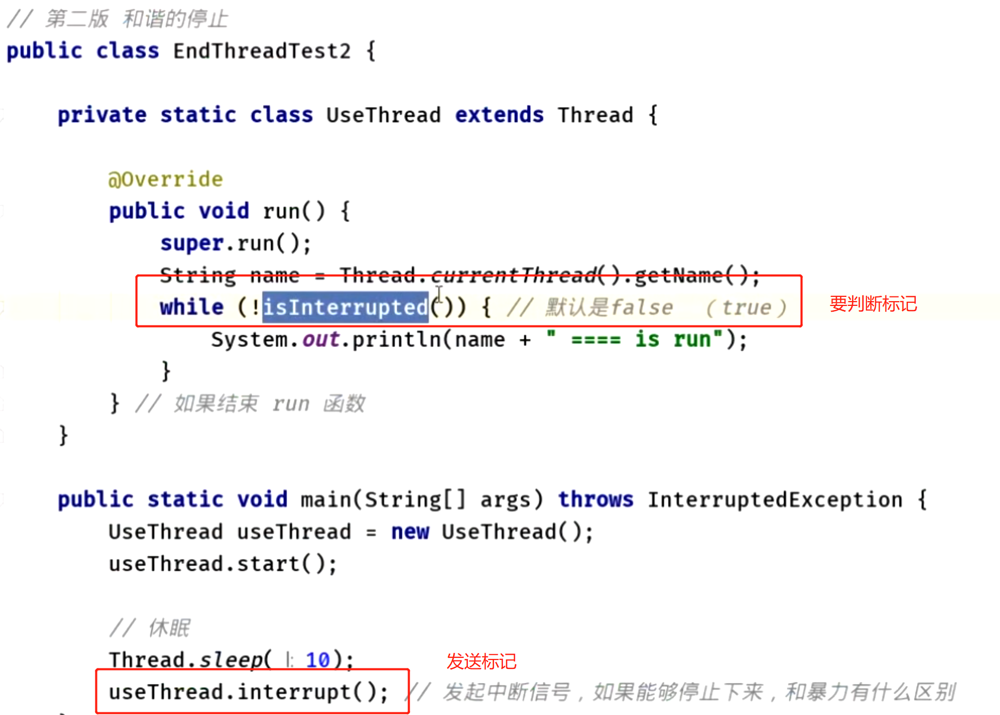

# 概念题
collapsed:: true
	- ## 1、进程与线程的区别
		- 进程：运行的程序
		- 线程：就是进程中一个负责程序执行的控制单元(执行路径)
		  一个进程中可以多执行路径，称之为多线程。
	- ## 2、 CPU时间轮转机制-过多应用开启导致卡顿
		- 1、一个应用进程至少对应一个线程 ，当 开启多个应用进程时，伴随着开启了很多个线程
		- 2、cpu有时间片的概念，每个cpu执行某个线程一段时间后，切换到其他（具有cpu执行权的）线程执行
		- 3、线程过多，导致cpu执行不过来，给人感觉很卡
		- 
	- ## 3、并发和并行的区别？
		- ## 并行
			- 4个车道 四辆车 并行走
		- ## 并发
			- 四个车道中，4秒钟多少车流量，  （和 多少吞吐量一样）
	- ## 4、什么时候使用多线程，多线程的好处是什么？创建线程的目的？
		- 当需要多部分代码同时执行的时候，可以使用。（多核cpu）
	- ## 5、java中能不能指定CPU去执行某个线程？
		- 不能，java做不到，通过C语言调用内核api去指定才行
- # Thread的面试题
  collapsed:: true
	- ## 6、实际开发中会考虑线程优先级吗
		- 不会考虑优先级
		- [[#red]]==**因为线程的优先级很依赖与系统的平台**==
		- [[#red]]==**Java线程优先级又十级，而此时操作系统优先级只有2~3级，那么就对应不上**==
		- 属于不稳定，有风险
	- ## 1、wait和sleep区别
		- 1，wait可以指定时间也可以不指定。
		   sleep必须指定时间。
		- 2，在同步中时，对cpu的执行权和锁的处理不同。
		  	wait：释放执行权，释放锁。
		  	sleep:释放执行权，不释放锁。
		- 3、wait是 object方法，sleep是thread的方法
		- 面试题
		  collapsed:: true
			- ```java
			  class Demo{
			  	
			    void show(){
			  		synchronized(this){
			  			wait();//t0 t1 t2  // 3个都停在这里
			  		}
			  	}
			    
			  	void method(){
			  		synchronized(this){
			  			//wait();
			  			notifyAll(); //
			  		}//t4
			  	}
			    
			  }
			  
			  
			  ```
			- show()中
				- 1、t0拿到执行权进去，wait()释放执行权释放锁，t1 t2也一样，所以3个都停那了
			- method中调用了notifyAll全唤醒。
				- 是都有执行权了，t4出来释放锁，t0t1t2抢锁，谁抢到谁执行，执行完了释放锁，后边的抢
				- 这么来说同步中进去了3个线程，wait后边的代码变的不同步了（有安全问题）
	- ## 2、Thread.run 和Thread.start区别？
		- run是函数调用，和线程没有关系，在哪里调用的run，就执行在哪个线程，并不不是开启线程
		- start是开启线程，走底层最终调用到run函数，这才是开启线程
	- ## 3、[[创建线程的几种方式]]
		- ### 1、继承thread
		- ### 二、实现Runnable接口，创建任务交给Thread
			- ### [[#red]]==**使用场景：**==
				- 创建线程的类，有父类时
			- ### 好处
				- 1，将线程的任务从线程的子类中分离出来，进行了单独的封装。
				  	按照面向对象的思想将任务的封装成对象。
				  2，避免了java单继承的局限性。
		- ### 三、Callable<T>接口，带返回值（获取返回值会阻塞当前线程）可算可不算，说到底还是runnable，交给thread
			- 1、自定义类 实现 Callable接口
			- 2、借助 FutureTask（Runnable子类） 才能交给Thread 执行
			- [[#red]]==**task.get()获取返回值时会阻塞当前线程，AsyncTask在用**==
			  collapsed:: true
				- ```java
				      public void test(){
				          WorkCall call = new WorkCall();
				          // FutureTask 实现了 runnable
				          FutureTask<String> task = new FutureTask<>(call);
				          // thread 里只能接受 runnable接口的子类
				          new Thread(task).start();
				          try {
				              Toast.makeText(MainActivity.this, task.get(), Toast.LENGTH_LONG).show();
				          } catch (Exception e) {
				  
				          }
				      }
				  
				      public class WorkCall implements Callable<String>{
				  
				          @Override
				          public String call() throws Exception {
				              Thread.sleep(5000);
				              // 执行任务返回结果
				              Log.e("Tag","執行了WorkCall");
				              return "执行成功";
				          }
				      }
				  ```
		- ### 四、ThreadFactory   线程工厂创建
		- ### 五、线程池
	- ## 4、[[停止线程的几种方式]]
		- ### 方式一循环标记终止：
			- 代码示例
			  collapsed:: true
				- ```java
				  class StopThread implements Runnable
				  {
				  	private boolean flag = true;
				  	public synchronized void run()
				  	{
				  		while(flag)
				  		{
				  			try
				  			{
				  				wait();//t0 t1
				  			}
				  			catch (InterruptedException e)
				  			{
				  				System.out.println(Thread.currentThread().getName()+"....."+e);
				  				flag = false;
				  			}
				  			
				  			System.out.println(Thread.currentThread().getName()+"......++++");
				  		}
				  	}
				  	public void setFlag()
				  	{
				  		flag = false;
				  	}
				  }
				  
				  
				  
				  class StopThreadDemo 
				  {
				  	public static void main(String[] args) 
				  	{
				  		StopThread st = new StopThread();
				  
				  		Thread t1 = new Thread(st);
				  		Thread t2 = new Thread(st);
				  
				  		t1.start();
				  		t2.setDaemon(true);
				  		t2.start();
				  
				  
				  		int num = 1;
				  		for(;;)
				  		{
				  			if(++num==50)
				  			{
				  //				st.setFlag();
				  				t1.interrupt();
				  //				t2.interrupt();
				  				break;
				  			}
				  			System.out.println("main...."+num);
				  		}
				  
				  		System.out.println("over");
				  	}
				  }
				  ```
			- 缺点：
				- 有停不下来的情况
				- 但是如果线程处于了冻结状态（wait），无法读取标记
		- ### 方式二：调用interrupt(中断)，同时被中断的线程需要判断中断标记
			- 使用：
				- 
			- 可以使用interrupt()方法将线程从冻结状态强制恢复到运行状态中来，[[#red]]==**让线程具备cpu的执行资格**==。
			- 如果[[#red]]==**线程sleep时，调用了interrupt，会发生异常 InterruptedException，这里会把中断标记清除**==，要想停止线程，需要捕获异常[[#red]]==**再次 发送interrupt才可以**==，记得要处理
			-
	- ## 5、sleep wait 到底哪个函数才会清除中断标记，interrupt？
		- sleep 在睡眠期，调用了interrupt，会在抛出异常的时候，捕获异常之前，就已经清除了
	- ## 5、[[线程的状态]]或者说生命周期[[六种状态的线程生命周期]]
		- {:height 435, :width 749}
		- 1、新建或者初始态（new thread）
		- 4、终止态：执行完成
		- 2、运行中
			- 系统调度
		- 3、就绪态：
			- 进入：调用yield()方法，
			- 新建调用start
			- sleep醒了
			- wait()被notify了
		- 5、等待 和 等待超时
			- wait() sleep()等
		- 6、阻塞态
			- 进入阻塞：等待进入synchronized
	- ## 6、[[怎么控制线程执行顺序]]
		- 使用Join，使得执行当前线程放弃执行权，返回调用线程，使得调用join的线程获取执行权直到执行结束
	- ## 7、在java中能不能强制中断线程的执行？
	  collapsed:: true
		- {:height 81, :width 718}
	- ## 8、如何让出当前线程的执行权？
		- yield 方法 只在jdk某些实现才能看到，是让出执行权
- # 线程间通信
  collapsed:: true
	- ## 1、[[等待/唤醒机制（wait()，notify()）]]
		- ### [[#red]]==**涉及的方法（由object锁调用）**==
			- 1，wait(): 让线程处于   等待/冻结状态，被wait的线程会被存储到线程池中。
				- 释放cpu的执行权和执行资格
				- 一个锁一个线程池，**==哪个锁调用的wait()会存在哪个锁的线程池中==**。
			- 2，notify():唤醒同一个锁的对应线程池中一个线程([[#red]]==**任意**==).
			- 3，notifyAll():唤醒同一个锁的对应线程池中的所有线程。
				- 适用于多生产多消费模式，同一个锁多个wait线程，需要用这个
		- ### 前提
			- 这些方法都必须定义在同步中。
			  因为这些方法是用于操作线程状态的方法。
			  必须要明确到底操作的是哪个锁上的线程。
		- ### 为什么操作线程的方法wait notify notifyAll定义在了Object类中？
			- 因为[[#red]]==**这些方法是监视器的方法。监视器其实就是锁**==。
			- 锁可以是任意的对象，任意的对象调用的方式一定定义在Object类中。
- # 线程安全问题+锁+并发编程
  collapsed:: true
	- ## 线程安全问题都包括什么？`
		- CPU`缓存导致的[[#red]]==**内存可见性问题**==;
		- cpu轮转，线程切换导致的[[#red]]==**原子性问题**==;
		- 指令重排序导致的[[#red]]==**有序性问题**==。
	- ## 1、[[线程安全问题产生的原因]]
		- 1，多个线程在操作共享的数据。
		- 2，操作共享数据的线程[[#red]]==**代码有多条**==。
		- 当一个线程在执行操作共享数据的多条代码过程中，其他线程参与了运算。
		  就会导致线程安全问题的产生。
	- ## 2、[[线程安全问题解决思路]]->同步
		- ### 解决线程安全思路：
			- 就是[[#red]]==**将多条操作共享数据的代码封装起来**==，当有线程在执行这些代码的时候，其他线程时不可以参与运算的。必须要当前线程把这些代码都执行完毕后，其他线程才可以参与运算。
		- ### 手段
			- 同步
	- ## 3、[[同步的前提]]
		- 同步中必须有多个线程并使用同一个锁。
	- ## 4、[[同步的优缺点]]
		- ### 优点：解决了线程的安全问题。
		- ### 缺点：相对降低了效率，因为同步外的线程的都会判断同步锁。
			- 即使同步外的线程拿到执行权也进不来，还得等到cpu切到 同步里边这个线程，才能往下执行
	- ## 5、同步的几种方式：[[解决线程安全问题]]
		- 1、同步代码块，任意对象锁,如果静态函数里的同步代码块还是类锁
		- 2、同步函数，this锁
		- 3、静态同步函数：class 对象锁
	- ## 7、常见的锁机制
		- 对象锁，普通函数，synchnized修饰下
		- 静态函数中的类锁
		- lock锁：显示锁（手动上锁解锁）
	- ## 10、[[CAS机制面试题]]
		- ### 1、原子操作
			- 不可在拆分的操作
		- ### 3、CAS问题
			- ABA问题
			- 最坏情况下一直循环指令，引起开销问题
			- 只能保证一个共享变量的原子操作
		- ### 4、[[怎么解决ABA问题？]]
			- 加版本戳，看有没被修改过，获取变量时，会带版本戳，比如JDK提供的实现
				- AtomicMarkableReference
					- 只关心变量有没有被人动过
				- AtomicStampedReference
					- 不仅关心变量有没有被人动过，还会记录动了多少次
	- ## 12、[[ThreadLocal和Synchronized区别]]
		- ThreadLocal和Synchonized都用于解决多线程并发訪问。可是ThreadLocal与synchronized有本质的差别。
		- ### synchronized是利用锁的机制，
			- 使变量或代码块在某一时该仅仅能被一个线程訪问。
		- ### ThreadLocal为每个线程都有一个ThreadLocalMap，存储本线程内的变量
			- 使得每个线程在某一时间訪问到的并非同一个对象，这样就隔离了多个线程对数据的数据共享。
	- ## 13、ThreadLocal  怎么保证 线程里变量的唯一性
		- 每个线程对应一个ThreadLocalMap。通过ThreadLocal 操作值，也是存在每个线程的这个map里的。所以线程1操作ThreadLocal，也是存在线程1的map里。当线程2拿到threadLocal时，获取值，内部也是去找的线程2内部的map的
	- ## 11、[[可见性]]和[[原子性]]
	- ## 14、[[volatile面试题]]
	- ## 15、[[synchronized的实现原理+优化]]
		- 1、synchronized在jvm里实现基于进入和退出Monitor对象来实现方法同步和代码块同步
		- 2、进入同步代码块之前，执行MonitorEnter指令，尝试拿Monitor对象的所有权，拿到就相当于拿到锁，拿不到就等待（上下文切换比较耗性能进行了[[synchronized 做的优化]]）
		- 3、在方法结束处和异常处，执行monitorExit执行，释放锁。
		- 4、同步方法在字节码上虽然没加这两个指令，加了ACC_SYNCHRONIZED访问标志，底层也是通过这两个指令的
	- ## synchronized优化
		- 进入了偏向锁和轻量级锁的机制详细见[[锁的状态]]
		- 
		- 1、当前线程没有竞争，并且总是同一个线程获取锁的时候，synchronized 会走这种[[#red]]==**偏向锁**==的机制
		- 2、一旦发生竞争，偏向锁被撤销，改为[[#red]]==**轻量级锁**==，内部使用适应性自旋锁，进行 CAS操作，比较耗费CPU资源，有个最大自旋阈值（线程一次上下文切换的时间）
		- 3、达到阈值，变成重量级锁，停止自旋释放cpu，进入阻塞
	- ## 16、java实现多线程同步几种方式
		- 使用[[#red]]==**synchronized关键字**==: 使用synchronized关键字可以在方法或代码块上加锁，确保同一时刻只有一个线程可以访问该方法或代码块。
		- 使用[[#red]]==**volatile关键字**==:使用volatile关键字可以确保变量在多线程之间的可见性，即当一个线程修改了该变量的值，其他线程立即可以看到修改后的值。
		- 使用[[#red]]==**Atomic类**==: Java中提供了一系列的原子类，比如Atomicinteger、AtomicLong等，这些类提供了[[#red]]==**基于CAS操作的原子性操**==作，能够保证操作的原子性和可见性。
		- 使用wait0和notifv0方法: wait0方法可以使线程等待，直到其他线程调用notifv0或notifvAl0方法唤醒它。这种方式需要在svnchronized块内使用，以确保线程之间的同步。
		- [[#red]]==**使用Lock接口:**== Java中提供了Lock接口，可以使用它的实现类ReentrantLock来实现同步。Lock接口提供了比synchronized更丰富的方法，比如支持公平锁、可重入锁等。
		- [[#red]]==**使用CountDownLatch类**==: CountDownLatch类是一个同步工具类，可以让一个或多个线程等待其他线程完成操作后再继续执行。可以使用它来控制线程的顺序和同步
		- [[#red]]==**使用CyclicBarrier类**==: CyclicBarrier类也是一个同步工具类，可以让一组线程互相等待，直到所有线程都到达一个屏障点后再继续执行。可以使用它来实现分阶段任务的同步。
- # [[各种锁]]
  collapsed:: true
	- ## [[锁分哪几类]]
	  collapsed:: true
		- 1、根据是否手动加锁分为：显示锁lock 和 隐式锁 synced
		- 2、线程要不要锁住同步资源：
			- 锁住：悲观锁 lock 和 sych
			- 不锁住：乐观锁，CAS
		- 3、锁住同步资源失败，线程要不要阻塞？
			- 阻塞
			- 非阻塞：自旋锁，适应性自旋锁
		- 4、多个线程竞争同步资源流程细节有没有区别？
			- 无锁，偏向锁，轻量级锁，重量级锁
		- 5、多个线程竞争锁时要不要排队？CLH机制排队拿锁
			- 排队：公平锁
			- 先尝试插队，插队失败再排队：非公平锁
		- 6、一个线程中的 多个流程能不能获取同一把锁？
			- 可以：可重入锁 lock 和 sych
			- 不可以：非可重入锁
		- 7、多个线程能不能共享一把锁
			- 能：共享锁：读写锁中的读锁，共享
			- 不能：排他锁（读写锁中的写锁，不允许其他线程读也不允许写）
	- ## [[死锁手写代码]]
	- ## 隐式锁synchronized 和 显示锁Lock怎么选？
		- 无特殊要求，多生产多消费场景，比如多个监视器什么的分别等待唤醒下使用lock
		- 其他使用sync 有优化
	- ## 1、什么是[[可重入锁]]？
		- 在递归的时候，可以反复拿锁，[[#red]]==**synchnized  和 lock 都是可重入锁**==
		- {:height 175, :width 719}
	- ## 2、[[悲观锁，乐观锁]]
		- [[#red]]==**悲观锁：**==总有刁民想害朕，在我操作期间，总觉得有人改自己的东西，那不如先去抢锁，抢到锁，安心自己把任务执行了就结束了
			- 悲观锁也叫互斥同步锁
			- synchronized关键字 和 Lock接口
			- 适用场景
				- 有`IO操作`。
				- 代码量大，逻辑比较多，相对来说`比较耗时`。
				- `并发大`，线程竞争激烈
		- [[#red]]==**乐观锁：**==在我进行操作期间，觉得没人改自己的东西，不管别人，把值取出来自己先算。算完了再去执行CAS指令
			- 乐观锁也叫非互斥同步锁
			- CAS机制：
			- 适用场景
				- 并发写入少，大部分是读取数据
		- [[#red]]==**乐观锁效率要大于悲观锁机制**==
	- ## [[死锁和活锁]]
		- ## 线程饥饿：优先级太低一直拿不到锁
- # [[AQS面试题]]
-
- # 真题
	- ## 1、Synchronied修饰普通方法和静态方法的区别？什么是可见性？
		- 修饰普通方法，锁的是对象实例
		- 修饰静态方法，锁的是class对象
		- [[可见性]]
		- ## Synchronied static 和 非static锁的区别和范围？（小米）
	- ## 引申1：两个线程分别执行 下边两个方法是可以的，因为锁不同
		- 
	- ## 2、[[锁分哪几类]]
	- ## 3、CAS无锁编程的原理？
		- [[CAS机制原理]]
	- ## 4、ReentrantLock的实现原理。
	  id:: 64be2c8b-c622-4b4e-905b-793e4933943d
		- ReentrantLock为可重入锁
		- 线程每进入锁一次，有个计数器加1，每释放锁1次，计数器减1.直到为0，所有锁都释放，底层用的是AQS并发基础框架来实现的
	- ## 5、AQS的原理（小米京东）
		- 承上：假如从4问进来的
			- 虽然说可重入锁是基于AQS实现的，AQS不只实现了这一个锁，它是并发编程包的一个基础构建
			- 除了可重入锁，还有读写锁，[[CountDownLatch]]还有信号量都是基于AQS实现的
		- 启下
			- 实现上，AQS里边有个 volatile 修饰的int 型 state 表示同步的状态，内部至少还有一个队列，来完成线程获取资源的排队工作，是CLH队列锁的变体实现。不仅实现独占锁，共享锁也是能实现的读写锁的读锁也是AQS实现的
			- AQS内部使用了魔板方法的设计模式，实现同步工具类主要是继承 AQS，实现AQS的抽象方法，管理同步状态，我们重新tryAcquire 和 tryRelease 等方法
		- 再问内部怎么排队的，讲CLH原理
	- ## 6、Synchronied的原理以及与ReentrantLock区别（360）
		- [[synchronized的实现原理+优化]]
		- 区别？
	- ## 7、Synchronied做了哪些优化？
		- 引入了偏向锁，轻量级锁，自适应自旋锁
		- 深入项：
			- 锁粗化 （方法内部加了同步代码块，然后执行普通代码 下边又有同步代码块，jvm会把普通代码也包入同步代码块，减少上下文切换）
			- 锁消除（编译时，jvm发现加了锁的范围，不可能出现共享数据竞争，这时候会去掉锁）
			- 逃逸分析（发现加锁的这个对象，不会逃逸到方法外或者线程外，针对这个变量做优化，栈上分配对象）
		- [[synchronized的实现原理+优化]]
	- ## 8、[[volatile能否保证线程安全？在DCL（双重检查锁）上的作用是什么？]]
		- 不可以，他只能保证可见性，不能保证原子性
		- DCL用在单例模式中，使用volatile关键字的作用，抑制指令重排序
	- ## 9、[[volatile和Synchronized区别]]（B站小米京东）
		- 1、volatile,只能保证内存可见性，不能保证原子性
			- Synchronized，既能保证内存可见性，又能保证原子性
		- 2、volatile标记的变量不会被编译器优化,而synchronized标记的变量可以被编译器优化（如编译器重排序的优化）
		- 3、volatile是变量修饰符，仅能用于变量，而synchronized是一个方法或块的修饰符。
	- ## 10、什么是守护线程？你是如何退出一个线程的？
		- ## 守护线程
			- 守护线程相当于后台线程
			- 是所有前台线程结束时，无论守护线程处于什么状态都会结束
		- ## 如何退出线程
			- [[停止线程的几种方式]]
	- ## 11、sleep wait  yield区别，wait线程如何唤醒它？（东方头条）
		- yield 让出cpu执行权，不释放锁
		- sleep  让当前线程休眠，释放执行权  不 释放锁，用于暂停线程的执行
		- wait  让当前线程等待，都释放，主要线程间通信
		- wait 怎么唤醒  notify notifyall
	- ## 12、sleep是可中断的吗？（小米）
		- 1、可以中断，会抛出异常
	- ## 13、线程的生命周期？
		- [[六种状态的线程生命周期]]
	- ## 14、ThreadLocal是什么？
		- 线程本地变量
		- ThreadLocal为每个线程都有一个ThreadLocalMap，存储本线程内的变量，线程隔离工具
		- 详细[[ThreadLocal]]
	- ## 15、线程池的基本原理、
		- ## 1、[[线程池优点？为什么用线程池]]
		- ## 2、[[线程池构造函数参数解析]]
		- ## 3、[[添加任务线程池执行流程]]
	- ## 16、有三个线程T1,T2.T3怎么确保他们按顺序执行？
		- join方法啊  [[怎么控制线程执行顺序]]
		- t3的run 调用t2.join   t2的run 调用t1的，join   执行顺序 t1,t2,t3
	- ## 图片
	  collapsed:: true
		- 