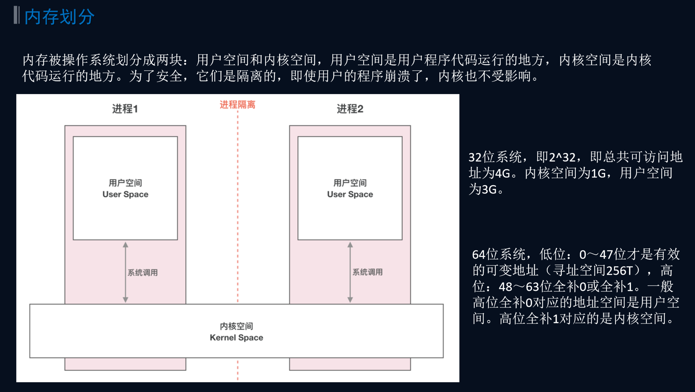
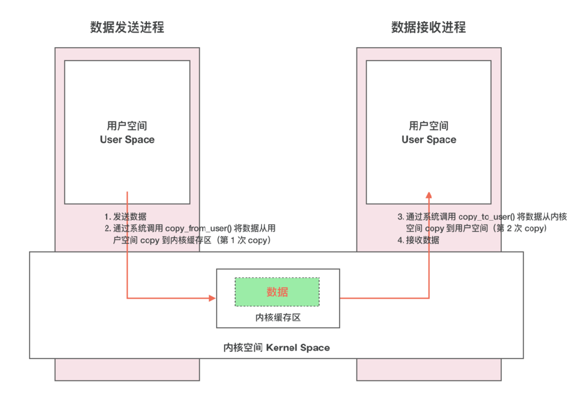

- # 一、什么时候用到多进程？
  collapsed:: true
	- ## 自己创建的进程场景
		- webView 视频播放 音乐 大图浏览 推送
	- ## 系统服务场景
		- 打电话 闹钟 AMS
# 二、多进程优点？
	- 1、开辟更多内存，为一个app，一个进程分配的内存是有限的，多开一个进程，开辟的内存就会翻倍
	- 2、风险隔离：危险动作放在单独进程里，崩溃也不会影响主进程
# 三、进程间通信为了什么？目的
	- A进程 和 B进程之间通信是为了
		- A进程 调用 B进程的方法
		- A进程拿到B进程的数据
		- A进程传递数据给B进程
	- **==传递数据就需要拷贝==**
# 四、进程间怎么通信的？
	- 进程间，用户空间内存是隔离的，内核空间是共享的。  不能直接拿到类 去new对象
	- 
	- ## 传统IPC2次拷贝形象比喻
	  collapsed:: true
		- 
		- 
	- ## Bander的一次拷贝：[[Binder怎么做到一次拷贝的？腾讯面试]]
# 五、虚拟内存和物理内存的理解
	- 虚拟内存是虚拟的
	- 物理内存是实际存在的
		- 内存条 磁盘
	-
	- 买房场景
		- 虚拟内存类似买房子的沙盘，是个假的不是真实的房子，看房选房时操作这个
		- 物理内存相当于真正的楼房
	- 或者说地球和地球仪的关系
		- 虚拟内存是地球仪，可以实际操作的
		- 物理内存是地球：放东西还是放在地球上
		-
-
- # [[Binder机制-Android的进程间通信]]
- # [[AIDL]]