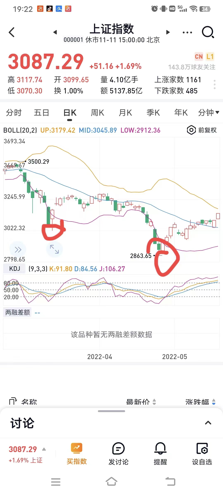

- ## 1、什么时候是大盘见顶，大盘见顶的指标是什么？大盘见顶的指标有哪些？
  collapsed:: true
	- 见顶信号
		- 政策上
			- 我们现在的货币政策是什么？
				- 宏观经济学  货币收紧政
		- 人性上
			- 当街上的卖菜老大爷都在给你讲股票的时候，你觉得这时候是应该买进还是卖出？
			- 卖出
- ## 2、股票的总市值/GDP
	- 股票的总市值/GDP
		- 参数：
			- 股票的总市值代表虚拟经济：取值 雪球看上证指数+深证指数=总市值
			- GDP代表实体经济：百度：xxx年全国GDP
		- 数值参考：
			- 70%为低估的分界线
			- 正常情况下这个比值应该在70%-100%之间波动
	- ### 情况一：当股票的总市值与GDP的比值＞100%的时候 即虚拟经济总量超过实体经济总量这叫做资产证券化的比例
	  collapsed:: true
		- 比例大于100%的时候说明了实体经济中存在泡沫
		- 有泡沫不一定马上会破，这只是提示告诉大家选择有风险，不是我们盲目进场或加仓的好时机。
		- 中国股市一共有3次证券化的比值超过了100%
			- 第一次出现在2000年这个比值达到了125%，随后一路下跌
			- 第二次发生在2007年6124点这个比值最高达到了127%，随后同样一路下跌
			- 最后一次发生在2015年6月10日，这个比值为104.75随后2015年6月15日股市开始暴跌。
	- ### 2022年举例
		- 截止2022年9月23日沪深总市值为77.24万亿
		- 2021年GDP为114.37万亿。   这里GDP选择前一年的数据
		- 以2022年9月23日为例 中国股票总市值占比国民生产总值（GDP）的比例为  计算得出67.54%
		- 这个数值低于70%为低估,正常情况下这个比值应该在70%-100%之间波动
		- 当这个比值低于70%的时候低估是我们进场的时机  但是不一定是最好的时机 所以当出现好时机 (我们也一定要选择好行业中的好公司）
		- 底部区域的判断这里先不讲    需要结合政策   大家这一次应该也看出了   政策救市的那一天  那就是政策底了
		- 政策低底 后面还有市场底  这些大家都学习过了  自己做好进场判断   估值相结合  做到心中更有谱
		- 两次政策救市
		  collapsed:: true
			- 
		- 那么股票总市值如何查找我选择雪球查看的
		- 那我们就在这个区域买入，他也不会高对吧，因为我们所说的估值也是一个区域，它也不是具体的一个数字
		- ## 如何计算:
		  上证指数点位与股市总市值/GDP的比值有何转换关系呢？
		-