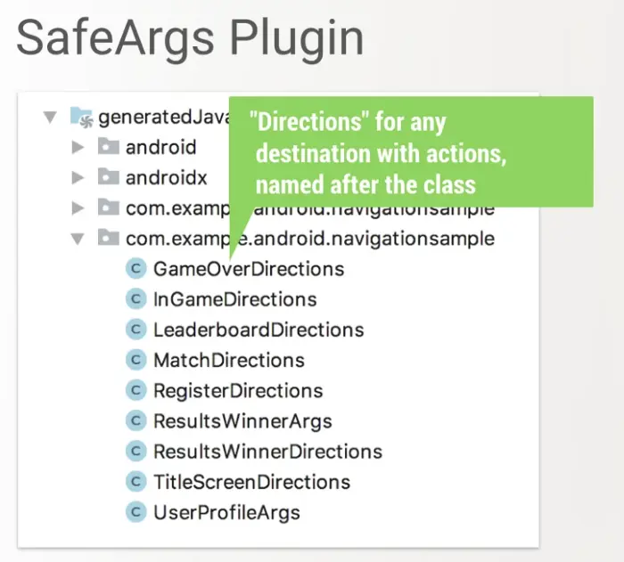
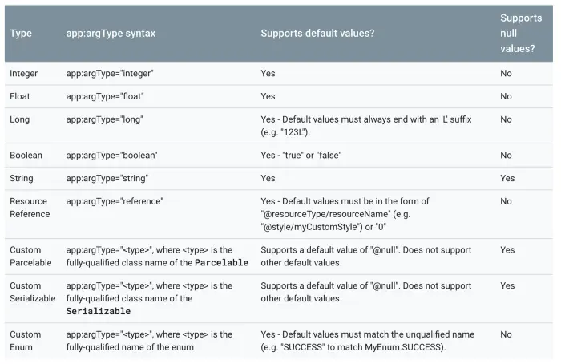

- 在 Fragment 之间共享数据的需求很常见。最简单的方法之一是使用共享的 ViewModel。当我们使用 Navigation 组件时，让我们看看如何使用 safe args 插件在两个 Fragment 之间共享数据。
- ##  Safe Args
  collapsed:: true
	- Safe Args 插件生成的代码允许我们进行类型安全的导航和参数传递。
	- 首先，要将 Safe Args 添加到项目中，在项目顶层的 build.gradle 文件中添加如下依赖：
		- ```
		  buildscript {
		      repositories {
		          google()
		      }
		      dependencies {
		          def nav_version = "2.3.0-alpha01"
		          classpath "androidx.navigation:navigation-safe-args-gradle-plugin:$nav_version"
		      }
		  }
		  ```
	- 要生成适用于 Java 或 Java 和 Kotlin 混编模块的代码，需要在 module 的 build.gradle 文件中添加：
		- ```
		  apply plugin: "androidx.navigation.safeargs"
		  ```
	- 如果要添加纯 Kotlin 模块的代码，需要添加：
		- ```
		  apply plugin: "androidx.navigation.safeargs.kotlin"
		  ```
	- 添加后的完整 build.gradle 文件如下：
		- ```
		  apply plugin: 'com.android.application'
		  apply plugin: 'kotlin-android'
		  apply plugin: 'kotlin-android-extensions'
		  apply plugin: "androidx.navigation.safeargs.kotlin" // add this
		  ```
	- 启用 Safe Args 后，插件会生成包含我们定义的每个操作的类和方法的代码。对于每个动作，Safe Args 还为每个目的地生成一个类，生成的类名是源目标类名和 Directions 的拼接。例如，如果目标名为 FragmentOne，则生成的类名为 FragmentOneDirections。
	- 生成的类包含用于在起始目的地中定义的每个操作的静态方法。此方法将定义的 action 参数作为参数并返回一个 NavDirections 对象，可以将其传递给 navigate()。 我们可以在生成的文件夹中找到生成的代码。
		- 
	- 举个例子，假设我们有一个导航图，它有一个单一的动作，将 FragmentOne 导航到 FragmentTwo。
	- Safe Args 自动生成 FragmentOneDirections 类，包含单个方法 actionFragmentOneToFragmentTwo()。 这个方法返回的 NavDirections 对象然后可以直接传递给 navigate()，示例如下：
	- safeargs_nav_graph.xml：
		- ```
		  <?xml version="1.0" encoding="utf-8"?>
		  <navigation xmlns:android="http://schemas.android.com/apk/res/android"
		      xmlns:app="http://schemas.android.com/apk/res-auto"
		      xmlns:tools="http://schemas.android.com/tools"
		      android:id="@+id/nav_graph"
		      app:startDestination="@id/fragmentOne">
		  
		      <fragment
		          android:id="@+id/fragmentOne"
		          android:name="com.example.navcomponent.FragmentOne"
		          android:label="Fragment1"
		          tools:layout="@layout/fragment_one" >
		          <action
		              android:id="@+id/action_fragment1_to_fragment2"
		              app:destination="@id/fragmentTwo"
		              app:popUpTo="@id/fragmentOne"
		              app:popUpToInclusive="true"
		              />
		      </fragment>
		  
		      <fragment
		          android:id="@+id/fragmentTwo"
		          android:name="com.example.navcomponent.FragmentTwo"
		          android:label="Fragment2"
		          tools:layout="@layout/fragment_two">
		          <argument
		              android:name="name"
		              android:defaultValue="Hello"
		              app:argType="string" />
		      </fragment>
		  </navigation>
		  ```
	- 在 FragmentOne 中调用方法：
		- ```
		  btn_next.setOnClickListener {
		      val action = FragmentOneDirections.actionFragment1ToFragment2("Android")
		      view.findNavController().navigate(action)
		  }
		  ```
	- 在 FragmentTwo 中可以接收到参数：
		- ```
		  override fun onActivityCreated(savedInstanceState: Bundle?) {
		      super.onActivityCreated(savedInstanceState)
		      val args: FragmentTwoArgs by navArgs()
		      args.let {
		          Toast.makeText(activity!!, it.name, Toast.LENGTH_SHORT).show()
		      }
		  }
		  ```
	- 我们可以在 build 文件夹中找到生成的代码
		- 
- ## 支持的参数类型
  collapsed:: true
	- {:height 462, :width 700}