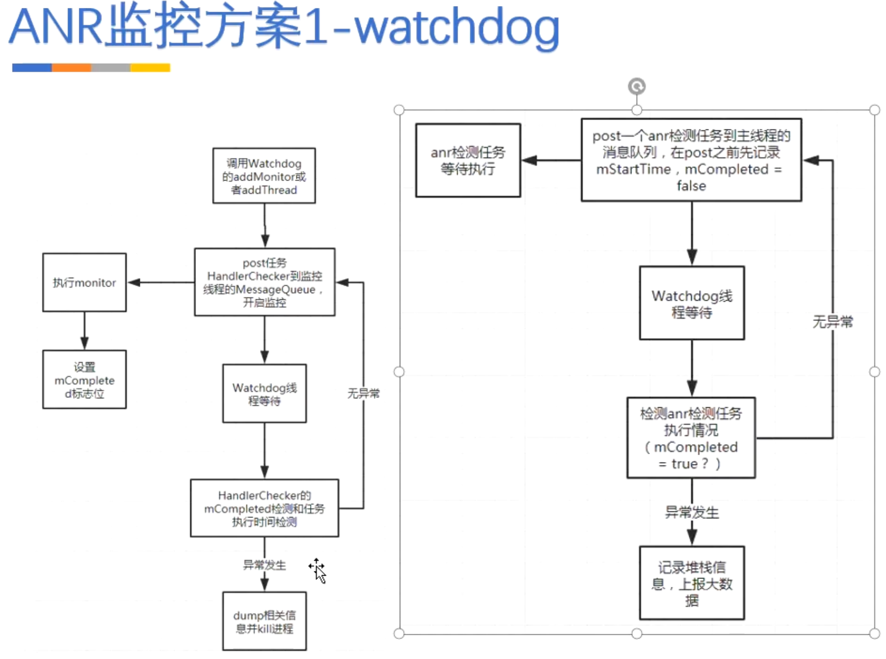
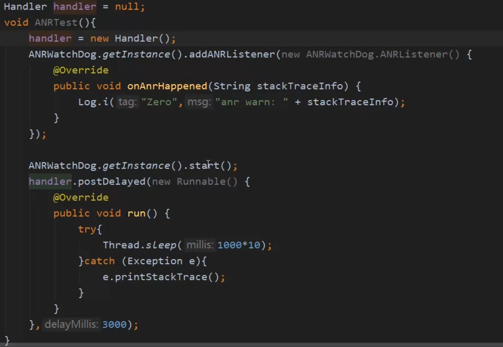

# 方案一、原生的ANRFileObserver，5.0以后可能被selinux挡住
collapsed:: true
	- 源码有个FileObserver
	- 作用：监控某个目录/文件 状态发生改变 创建 删除文件
	- 原理：自定义ANRFileObserver [[#red]]==**监控//data/anr/ 目录。捞到所有的ANR信息**==，有可能是别的应用的
	- ANRFileObserver
	  collapsed:: true
		- ```java
		  package com.xiangxue.arch_demo.anr;
		  
		  import android.os.FileObserver;
		  import android.util.Log;
		  
		  import androidx.annotation.Nullable;
		  
		  public class ANRFileObserver extends FileObserver {
		  
		  
		      public ANRFileObserver(String path) {//data/anr/  监控目录
		          super(path);
		      }
		  
		      public ANRFileObserver(String path, int mask) {
		          super(path, mask);
		      }
		  
		      @Override
		          public void onEvent(int event, @Nullable String path) {
		              switch (event)
		          {
		              case FileObserver.ACCESS://文件被访问
		                  Log.i("Zero", "ACCESS: " + path);
		                  break;
		              case FileObserver.ATTRIB://文件属性被修改，如 chmod、chown、touch 等
		                  Log.i("Zero", "ATTRIB: " + path);
		                  break;
		              case FileObserver.CLOSE_NOWRITE://不可写文件被 close
		                  Log.i("Zero", "CLOSE_NOWRITE: " + path);
		                  break;
		              case FileObserver.CLOSE_WRITE://可写文件被 close
		                  Log.i("Zero", "CLOSE_WRITE: " + path);
		                  break;
		              case FileObserver.CREATE://创建新文件
		                  Log.i("Zero", "CREATE: " + path);
		                  break;
		              case FileObserver.DELETE:// 文件被删除，如 rm
		                  Log.i("Zero", "DELETE: " + path);
		                  break;
		              case FileObserver.DELETE_SELF:// 自删除，即一个可执行文件在执行时删除自己
		                  Log.i("Zero", "DELETE_SELF: " + path);
		                  break;
		              case FileObserver.MODIFY://文件被修改
		                  Log.i("Zero", "MODIFY: " + path);
		                  break;
		              case FileObserver.MOVE_SELF://自移动，即一个可执行文件在执行时移动自己
		                  Log.i("Zero", "MOVE_SELF: " + path);
		                  break;
		              case FileObserver.MOVED_FROM://文件被移走，如 mv
		                  Log.i("Zero", "MOVED_FROM: " + path);
		                  break;
		              case FileObserver.MOVED_TO://文件被移来，如 mv、cp
		                  Log.i("Zero", "MOVED_TO: " + path);
		                  break;
		              case FileObserver.OPEN://文件被 open
		                  Log.i("Zero", "OPEN: " + path);
		                  break;
		              default:
		                  //CLOSE ： 文件被关闭，等同于(IN_CLOSE_WRITE | IN_CLOSE_NOWRITE)
		                  //ALL_EVENTS ： 包括上面的所有事件
		                  Log.i("Zero", "DEFAULT(" + event + "): " + path);
		                  break;
		          }
		      }
		  }
		  
		  ```
- # 方案二、Watchdog
	- 系统有个Watchdog，监控系统有没有被死锁，挂掉情况
	- ## 原理、
	  collapsed:: true
		- 
	- ANRWatchDog
	  collapsed:: true
		- ```java
		  package com.xiangxue.arch_demo.anr;
		  
		  import android.annotation.TargetApi;
		  import android.os.Build;
		  import android.os.Debug;
		  import android.os.Handler;
		  import android.os.Looper;
		  import android.os.Process;
		  import android.os.SystemClock;
		  import android.util.Log;
		  
		  
		  public class ANRWatchDog extends Thread {
		  
		      private static final String TAG = "ANR";
		      private int timeout = 5000;
		      private boolean ignoreDebugger = true;
		  
		      static ANRWatchDog sWatchdog;
		  
		      private Handler mainHandler = new Handler(Looper.getMainLooper());
		  
		  
		      private class ANRChecker implements Runnable {
		  
		          private boolean mCompleted;
		          private long mStartTime;
		          private long executeTime = SystemClock.uptimeMillis();
		  
		          @Override
		          public void run() {
		              synchronized (ANRWatchDog.this) {
		                  mCompleted = true;
		                  executeTime = SystemClock.uptimeMillis();
		              }
		          }
		  
		          void schedule() {
		              mCompleted = false;
		              mStartTime = SystemClock.uptimeMillis();
		              mainHandler.postAtFrontOfQueue(this);
		          }
		  
		          boolean isBlocked() {
		              return !mCompleted || executeTime - mStartTime >= 5000;
		          }
		      }
		  
		      public interface ANRListener {
		          void onAnrHappened(String stackTraceInfo);
		      }
		  
		      private ANRChecker anrChecker = new ANRChecker();
		  
		      private ANRListener anrListener;
		  
		      public void addANRListener(ANRListener listener){
		          this.anrListener = listener;
		      }
		  
		      public static ANRWatchDog getInstance(){
		          if(sWatchdog == null){
		              sWatchdog = new ANRWatchDog();
		          }
		          return sWatchdog;
		      }
		  
		      private ANRWatchDog(){
		          super("ANR-WatchDog-Thread");
		      }
		  
		      @TargetApi(Build.VERSION_CODES.JELLY_BEAN)
		      @Override
		      public void run() {
		          Process.setThreadPriority(Process.THREAD_PRIORITY_BACKGROUND); // 设置为后台线程
		          while(true){
		              while (!isInterrupted()) {
		                  synchronized (this) {
		                      anrChecker.schedule();
		                      long waitTime = timeout;
		                      long start = SystemClock.uptimeMillis();
		                      while (waitTime > 0) {
		                          try {
		                              wait(waitTime);
		                          } catch (InterruptedException e) {
		                              Log.w(TAG, e.toString());
		                          }
		                          waitTime = timeout - (SystemClock.uptimeMillis() - start);
		                      }
		                      if (!anrChecker.isBlocked()) {
		                          continue;
		                      }
		                  }
		                  if (!ignoreDebugger && Debug.isDebuggerConnected()) {
		                      continue;
		                  }
		                  String stackTraceInfo = getStackTraceInfo();
		                  if (anrListener != null) {
		                      anrListener.onAnrHappened(stackTraceInfo);
		                  }
		              }
		              anrListener = null;
		          }
		      }
		  
		      private String getStackTraceInfo() {
		          StringBuilder stringBuilder = new StringBuilder();
		          for (StackTraceElement stackTraceElement : Looper.getMainLooper().getThread().getStackTrace()) {
		              stringBuilder
		                      .append(stackTraceElement.toString())
		                      .append("\r\n");
		          }
		          return stringBuilder.toString();
		      }
		  }
		  
		  ```
	- ## 使用
	  collapsed:: true
		- 