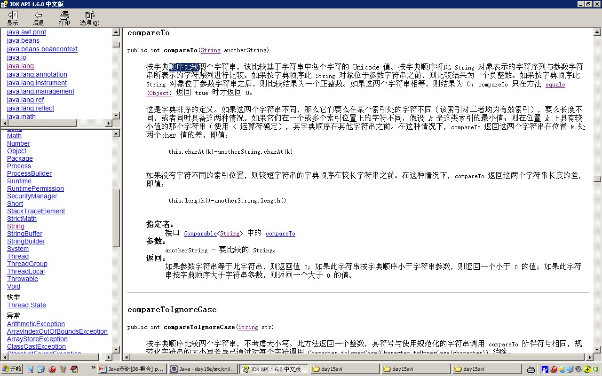
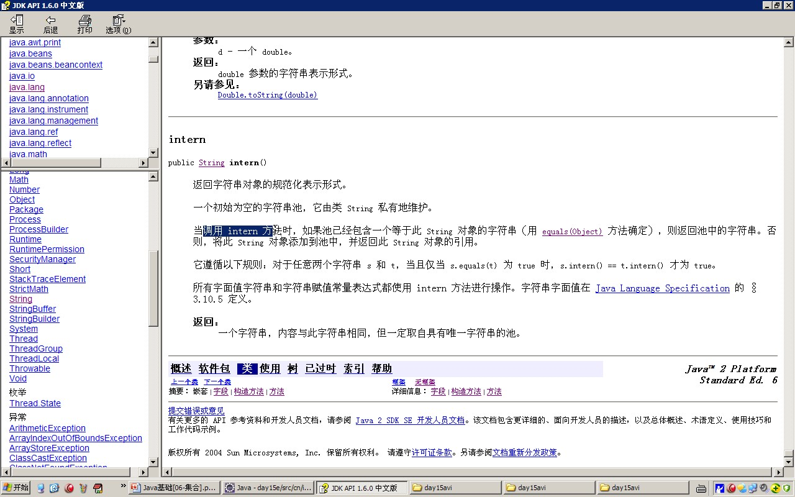

# 一、字符串的特点
	- 字符串对象一旦被初始化就不会被改变。
- # 二、字符串的创建方式与区别
	- ## 1、字面量创建:存储在字符串常量池中
	  collapsed:: true
		- ```java
		  	/**
		  	 * 演示字符串定义的第一种方式，并明确字符串常量池的特点.
		  	 * 池中没有就建立，池中有，直接用。
		  	 */
		  	private static void stringDemo1() {
		  		String s = "abc";//"abc"存储在字符串常量池中。
		  //		s = "nba";
		  		String s1 = "abc";		
		  		System.out.println(s==s1);//true?
		  //		System.out.println("s="+s);
		  	}
		  ```
		- ## 字符串常量池特点：池中没有就建立，池中有，直接用
	- ## 2、new创建：（会创建2个对象）
		- ```java
		  new String("abc")
		  ```
		- 1、传入的“abc”对象。注意这个不在常量池中
		- 2、new 会在堆中，根据传入的字面量对象，创建一个新对象，并返回
		- 传入的“abc”不会存在常量池中，而是在new 的这个新对象内维护的
- # 三、String重写了object equals
  collapsed:: true
	- 比较内容
- # 四、常用方法
  collapsed:: true
	- ```java
	  
	  		 * 按照面向对象的思想对字符串进行功能分类。
	  		 * "abcd"
	  		 * 
	  		 * 1,获取：
	  		 * 1.1 获取字符串中字符的个数(长度).
	  		 * 		int length();
	  		 * 1.2 根据位置获取字符。
	  		 * 		char charAt(int index);
	  		 * 1.3 根据字符获取在字符串中的第一次出现的位置.
	  		 * 		int indexOf(int ch)
	  		 * 		int indexOf(int ch,int fromIndex):从指定位置进行ch的查找第一次出现位置 
	  		 * 		int indexOf(String str);
	  		 * 		int indexOf(String str,int fromIndex);
	  		 * 		 根据字符串获取在字符串中的第一次出现的位置.
	  		 * 		int lastIndexOf(int ch)
	  		 * 		int lastIndexOf(int ch,int fromIndex):从指定位置进行ch的查找第一次出现位置 
	  		 * 		int lastIndexOf(String str);
	  		 * 		int lastIndexOf(String str,int fromIndex);
	  		 * 1.4 获取字符串中一部分字符串。也叫子串.
	  		 * 		String substring(int beginIndex, int endIndex)//包含begin 不包含end 。
	  		 * 		String substring(int beginIndex);
	  		 * 		
	  		 * 
	  		 * 
	  		 * 2，转换。
	  		 * 		2.1 将字符串变成字符串数组(字符串的切割)
	  		 * 			String[]  split(String regex):涉及到正则表达式.
	  		 * 		2.2 将字符串变成字符数组。
	  		 * 			char[] toCharArray();
	  		 * 		2.3 将字符串变成字节数组。
	  		 * 			byte[] getBytes();
	  		 * 		2.4 将字符串中的字母转成大小写。
	  		 * 			String toUpperCase():大写
	  		 * 			String toLowerCase():小写
	  		 *		2.5  将字符串中的内容进行替换
	  		 *			String replace(char oldch,char newch);
	  		 * 			String replace(String s1,String s2);
	  		 * 		2.6 将字符串两端的空格去除。
	  		 * 			String trim();
	  		 * 		2.7 将字符串进行连接 。
	  		 * 			String concat(string);
	  		 * 
	  		 * 3，判断
	  		 * 		3.1 两个字符串内容是否相同啊？
	  		 * 			boolean equals(Object obj);
	  		 * 			boolean equalsIgnoreCase(string str);忽略大写比较字符串内容。
	  		 * 		3.2 字符串中是否包含指定字符串？
	  		 * 			boolean contains(string str);
	  		 * 		3.3 字符串是否以指定字符串开头。是否以指定字符串结尾。
	  		 * 			boolean startsWith(string);
	  		 * 			boolean endsWith(string);
	  		 * 		
	  		 * 4，比较。compareTo
	  ```
	- 
	- 
- # 五、intern()
	- Api
		- 
	- ## 作用
		- 对字符串池进行操作的
	- ## 示例
		- ```java
		  package cn.itcast.p1.string.demo;
		  
		  public class StringObjectDemo {
		  
		  
		  	/**
		  	 * @param args
		  	 */
		  	public static void main(String[] args) {
		  
		  //		String s1 = "abc";
		  //		String s2 = "abc";
		  		
		  		//intern():对字符串池进行操作的 
		  		
		  		String s1 = new String("abc"); // 堆中创建新对象
		  		String s2 = s1.intern();// 调用这个会判断 常量池中有“abc”就会返回常量池中的引用，没有就会创建存在常量池中
		  		
		  		System.out.println(s1==s2);
		  		
		  		
		  		
		  	}
		  
		  }
		  
		  ```
- # 六、
- # [[StringBuffer]]
- # [[StringBuilder]]
- # 七、StringBuffer和StringBuilder区别
	- StringBuffer是线程同步的。通常用于多线程。
	- StringBuilder是线程不同步的。通常用于单线程。 它的出现提高效率。
-
- # 面试题
	- [[字符串内存上的面试题]]
- # 字符串算法
	- ## [[String算法-翻转字符串]]
	- ## [[242.有效的字母异位词]]
	- ## [[剑指 Offer 05. 替换空格-简单]]