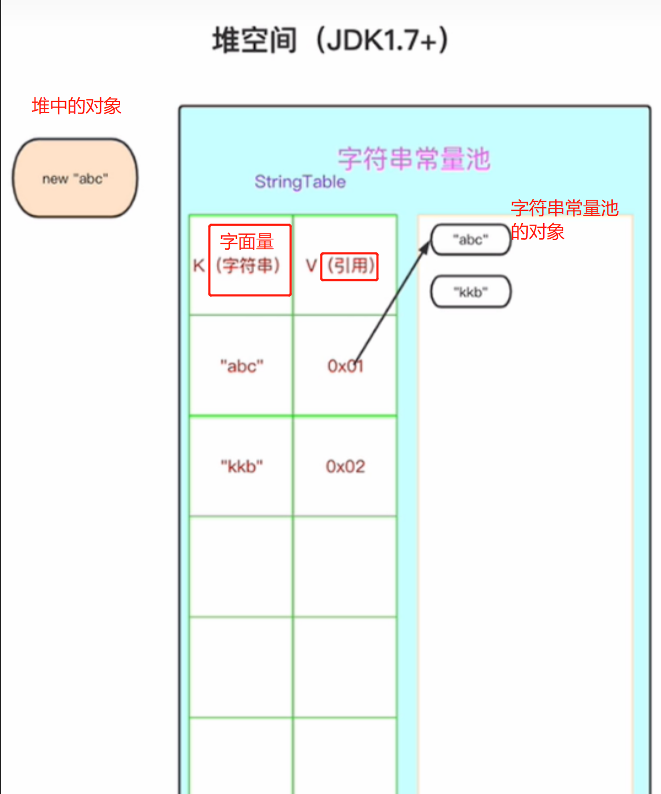
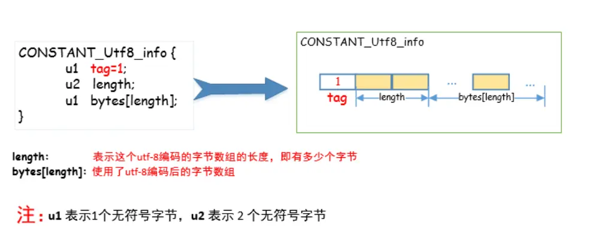
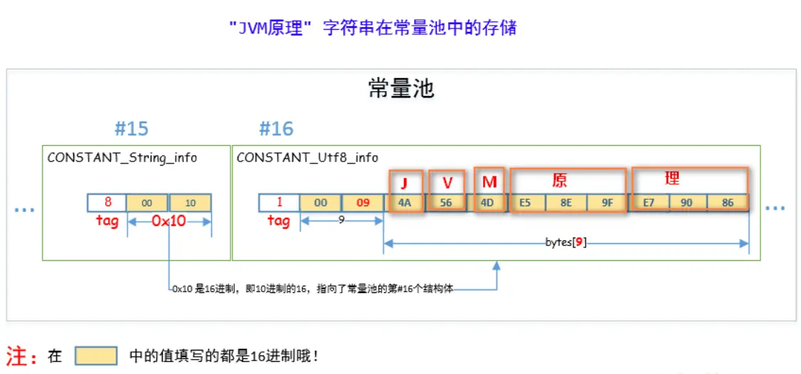

- 
- # [[#red]]==前提==
  collapsed:: true
	- 字符串常量池中存的是对象和引用
	- 
	- 对象实例存储在**堆的实例区**，字符串[字面量]对应的对象存储在**堆的字符串常量池**。串池同时存引用和对象，其中**引用存在StringTable**中，如图2。
- # 一、简介
  collapsed:: true
	- 运行时常量池中的常量对应的内容只是字面量，比如一个"hello"，它还不是String对象；
	- 当Java程序在运行时执行到这个[[#red]]==“hello"字面量时，会去**字符串常量池**里找该字面量的对象引用是否存在，存在则直接返回该引用==，不存在则在==**字符串常量池**==中[[#red]]==**创建该字面量对应的String对象，并将其引用置于字符串常量池中**==，然后返回该引用。
	- [[#red]]==**字符串常量池存储的是字符串对象的引用+对象**==
	- 多个相同内容的字符串字面量在字符串常量池中会共享同一个字符串对象
- # 二、字符串常量池本质及 存储结构
  collapsed:: true
	- 字符串常量池，是JVM用来维护字符串实例的一个引用表。
	- [[#red]]==在HotSpot虚拟机中==，它被实现为一个[[#red]]==全局的StringTable==，底层是一个c++的hashtable。它将[[#red]]==字符串的字面量作为key，==[[#red]]==实际串池中创建的String对象的引用作为value。==
	- [[#red]]==字符串常量池==在逻辑上属于方法区，但JDK1.7开始，就被挪到了[[#red]]==堆区==。
	- String的字面量被导入JVM的运行时常量池时，并不会马上试图在字符串常量池加入对应String的引用，而是等到程序实际运行时，要用到这个字面量对应的String对象时，才会去字符串常量池试图获取或者加入String对象的引用。因此它是[[#red]]==懒加载的==。
- # 三、String.intern()用法
  collapsed:: true
	- ## 方法含义
		- 1、去拿String的内容去Stringtable里查表，如果存在，则返回引用，
		- 2、不存在
			- jdk1.8+是直接将堆中String对象**移除**，并添加到串池中。
			- jdk1.6 是**拷贝**了一份堆中的对象到串池，堆中原有对象并未移除。（对象拷贝过去，地址也不相等）
	- ## 例子1：
		- ```java
		  public class RuntimeConstantPoolOOM{
		      public static void main(String[] args) {
		           // 堆中 创建出“计算机软件”对象 
		           String str1 = new StringBuilder("计算机").append("软件").toString();
		           System.out.println(str1.intern() == str1);
		  
		           String str2 = new StringBuilder("ja").append("va").toString();
		           System.out.println(str2.intern() == str2);
		  
		      }
		  }
		  ```
		- 以上代码，在 JDK6 下执行结果为 false、false，会判断常量池不存在则创建新对象
		- 在 JDK7 以上执行结果为 true、false。
		- 分析：
			- 首先我们调用StringBuilder创建了一个"计算机软件"String对象，因为调用了new关键字，因此是在运行时创建，之前JVM中是没有这个字符串的。
			- 在 [[#red]]==JDK6 下==，intern()会把首次遇到的字符串实例[[#red]]==复制到永久代中==，返回的也是这个永久代中字符串实例的引用；
			- 而[[#red]]==在JDK1.7==开始，intern()方法不在复制字符串实例，string 的 intern 方法首先将尝试在常量池中查找该对象的引用，如果找到则直接返回该对象在常量池中的引用地址,找不到就添加到常量池。
			-
			- 第一个例子：
				- 因此在1.7中，“计算机软件”这个字符串实例只存在一份，存在于java堆中！
					- 分析：已经在堆中创建了一个字符串对象，并且在全局字符串常量池中保留了这个字符串的引用，
					  collapsed:: true
						- 首先，`new StringBuilder("计算机")` 创建了一个 `StringBuilder` 对象，并将 `"计算机"` 字符串作为初始内容存储在堆内存中。
						- 接下来，通过 `append("软件")` 方法将 `"软件"` 字符串添加到了 `StringBuilder` 对象的末尾。
						- 最后，通过调用 `toString()` 方法将 `StringBuilder` 对象转换为一个字符串对象。
						- 由于 `StringBuilder` 生成的字符串对象不是字符串字面量，而是通过动态拼接生成的，因此它会存在于堆内存中。也就是说，生成的字符串对象 `"计算机软件"` 存储在堆内存中。
						- 需要注意的是，由于 `"计算机软件"` 是一个字符串字面量，它在首次出现时会被添加到字符串常量池中。所以，在整个代码执行过程中，字符串常量池中会有一个 `"计算机软件"` 的引用存在，但实际的字符串对象是存在于堆内存中的。
				- 那么str1.intern()直接返回这个引用，这当然满足`str1.intern() == str1`——都是他自己嘛；
			- 第二个例子：
				- 对于引用str2，因为JVM中已经有“java”这个字符串了，因此`new StringBuilder("ja").append("va").toString()`会重新创建一个新的“java”字符串对象，而intern()会返回首次遇到的常量的实例引用，因此他返回的是系统中的那个"java"字符串对象引用(首次)，因此会返回false
				- 在 JDK6 下 str1、str2 指向的是新创建的对象，该对象将在 Java Heap 中创建，所以 str1、str2 指向的是 Java Heap 中的内存地址；调用 intern 方法后将尝试在常量池中查找该对象，没找到后将其放入常量池并返回，所以此时 str1/str2.intern() 指向的是常量池中的地址，**JDK6常量池在永久代，与堆隔离**，所以 s1.intern()和s1 的地址当然不同了。
	- 例子2：
		- 例子：
		  collapsed:: true
			- ```java
			  public class Test2 {
			      public static void main(String[] args) {
			          /**
			           * 首先设置 持久代最大和最小内存占用(限定为10M)
			           * VM args: -XX:PermSize=10M -XX:MaxPremSize=10M
			           */
			  
			          List<String> list  = new ArrayList<String>();
			  
			          // 无限循环 使用 list 对其引用保证 不被GC  intern 方法保证其加入到常量池中
			          int i = 0;
			          while (true) {
			              // 此处永久执行，最多就是将整个 int 范围转化成字符串并放入常量池
			              list.add(String.valueOf(i++).intern());
			          }
			      }
			  }
			  ```
		- 以上代码在 JDK6 下会出现 Perm 内存溢出，JDK7 or high 则没问题。
		- **JDK6 常量池存在持久代(不经心CG)，设置了持久代大小后，不断while循环必将撑满 Perm 导致内存溢出；JDK7 常量池被移动到 Native Heap(Java Heap,HotSpot VM中不区分native堆和Java堆)，所以即使设置了持久代大小，也不会对常量池产生影响；不断while循环在当前的代码中，所有int的字符串相加还不至于撑满 Heap 区，所以不会出现异常。**
- # 三、[[String的创建方式和分配内存地址]]
- # 四、字符串常量池是否会被GC？
	- 字符串常量池本身不会被GC，但其中保存的引用所指向的String对象们是可以被回收的。否则字符串常量池总是"只进不出"，那么很可能会导致内存泄露。
	- 在HotSpot的字符串常量池实现StringTable中，提供了相应的接口用于支持GC，不同的GC策略会在适当的时候调用它们。一般实在Full GC的时候，额外调用StringTable的对应接口做可达性分析，将不可达的String对象的引用从StringTable中移除掉并销毁其指向的String对象。
- # 五、String"字面量" 是何时进入字符串常量池的?
	- 先说结论：**在执行ldc指令时，该指令表示int、float或String型常量从常量池推送至栈顶**
	- JVM规范里Class文件的常量池项的类型，有两种东西、
		- - CONSTANT_Utf8_info
		  collapsed:: true
			- 在HotSpot VM中，[[#red]]==运行时常量池里，CONSTANT_Utf8_info可以表示Class文件的方法、字段==等等，其结构如下：
				- 
				- 1、首先是1个字节的tag,表示这是一个CONSTANT_Utf8_info结构的常量，
				- 2、然后是两个字节的length，表示要储存字节的长度，
				- 3、之后是一个字节的byte数组，表示真正的储存的length个长度的字符串。
				- 这里需要注意的是，一个字节只是代表这里有一个byte类型的数组，而这个数组的长度当然可以远远大于一个字节。当然，由于CONSTANT_Utf8_info结构只能用u2即两个字节来表示长度，因此长度的最大值为2byte，也就是65535(注意这跟Android中dex字节码65535方法数限制没有什么关系，但是道理是一样的).
				-
		- - CONSTANT_String_info
		  collapsed:: true
			- CONSTANT_String_info是String常量的类型，但它并不直接持有String常量的内容，而是只持有一个index，这个index所指定的另一个常量池项必须是一个CONSTANT_Utf8类型的常量，这里才真正持有字符串的内容。
			- 
			- **CONSTANT_Utf8会在类加载的过程中就全部创建出来，而CONSTANT_String则是lazy resolve的，在第一次引用该项的ldc指令被第一次执行到的时候才会resolve。**在尚未resolve的时候，HotSpot VM把它的类型叫做JVM_CONSTANT_UnresolvedString，内容跟Class文件里一样只是一个index；等到resolve过后这个项的常量类型就会变成最终的JVM_CONSTANT_String，
			- 也就是说，就HotSpot VM的实现来说，**加载类的时候，那些字符串字面量会进入到当前类的运行时常量池，不会进入全局的字符串常量池（即在StringTable中并没有相应的引用，在堆中也没有对应的对象产生）**，在执行ldc指令时，触发lazy resolution这个动作：
			- **ldc字节码在这里的执行语义是：到当前类的运行时常量池（runtime constant pool，HotSpot VM里是ConstantPool + ConstantPoolCache）去查找该index对应的项，如果该项尚未resolve则resolve之，并返回resolve后的内容。**
			- **在遇到String类型常量时，resolve的过程如果发现StringTable已经有了内容匹配的java.lang.String的引用，则直接返回这个引用，反之，如果StringTable里尚未有内容匹配的String实例的引用，则会在Java堆里创建一个对应内容的String对象，然后在StringTable记录下这个引用，并返回这个引用出去。**
			- 可见，ldc指令是否需要创建新的String实例，全看在第一次执行这一条ldc指令时，StringTable是否已经记录了一个对应内容的String的引用。
- # 六、**字符串常量池在 Java 内存区域的哪个位置**
	- 由上图可知是堆
	- 在 [[#red]]==**JDK6.0 及之前版本**==，字符串常量池是放在 Perm Gen 区(也就是方法区)中，此时==**常量池中存储的是对象。**==
	- 在 **JDK7.0 版本**，字符串常量池被移到了堆中了。此时[[#red]]====常量池存储的就是引用====了。
	- 在 JDK8.0 中，永久代（方法区）被元空间取代了。
- # 参考
	- https://blog.csdn.net/m0_55913429/article/details/127867743
- # 面试题
	- [[字符串内存上的面试题]]
-
-