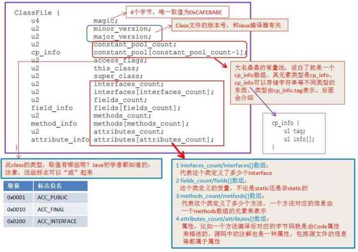
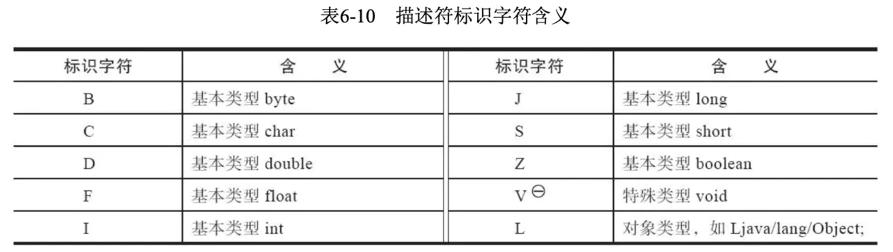

- ## 一、介绍
-
- ## 二、字节码结构
	- ByteCode数据并不是杂乱无章的，而是遵循一定的数据结构，这些结构定义在 [Java Virtual Machine Specification](https://docs.oracle.com/javase/specs/jvms/se8/html/index.html)中的[The class File Format](https://docs.oracle.com/javase/specs/jvms/se8/html/jvms-4.html)，如下所示。
	- 图解：
	  collapsed:: true
		- 
	- ## 整体结构
	  collapsed:: true
		- ```kotlin
		  ClassFile {
		      u4             magic;  //魔数
		      u2             minor_version; //次版本号
		      u2             major_version; //主版本号
		      u2             constant_pool_count; //常量池容量：从1开始,0：不引用任何一个常量池数据
		      cp_info        constant_pool[constant_pool_count-1]; //常量数据，数据构成有17种，以首位u1表示tag类型
		      u2             access_flags; //访问标记，识别类或接口的访问信息如：ACC_PUBLIC;ACC_ABSTRACT,由于每个标记占用二进制位不同，使用｜表示交集；
		      u2             this_class; //当前类索引：常量池中偏移量指向一个类型为CONSTANT_Class_info的类描述符常量
		      u2             super_class; //当前类的父类索引：java单继承机制
		      u2             interfaces_count; //当前类实现的接口计数器
		      u2             interfaces[interfaces_count]; //接口索引表：常量池中偏移量
		      u2             fields_count;  //字段计数器
		      field_info     fields[fields_count]; //字段表：由类级变量static和实例变量(全局)，不包括局部变量
		      u2             methods_count; //方法数
		      method_info    methods[methods_count]; //方法表
		      u2             attributes_count; //属性数
		      attribute_info attributes[attributes_count]; //属性表
		  }
		  ```
		- u* : 表示占用字节数，有u1,u2,u4,u8等构成；
	- ## 字段表
	  collapsed:: true
		- field_info字段表格式如下：
		- ```java
		  field_info {
		      u2             access_flags; //字段的访问标记
		      u2             name_index;  //字段的名称
		      u2             descriptor_index; //字段的描述符
		      u2             attributes_count; //字段属性
		      attribute_info attributes[attributes_count];
		  }
		  ```
		- 1. 全限定名：
			- 类的全限定名是将类全名的.全部替换为/，如java.lang.String ,全限定名java/lang/String
		- 2. 简单名称：
			- 方法main() 简单名称为main，全局变量num为名称num
		- collapsed:: true
		  3. 描述符：
			- 基本数据类型及void的由大写字母表示，对象类型有L+全限定名=> Ljava/lang/String;表示String字段描述符；
			- 对于数组类型根据维度在前面加上“[”，如int[] => [I ;        String[] => [Ljava/lang/String;
			- 
		- 4. attribute_info:字段的属性表，存储一些额外信息；
	- ## 方法表
	  collapsed:: true
		- 方法表格式如下,方法的描述与字段的描述采用了几乎完全一致的方式
		- ```java
		  method_info {
		      u2             access_flags;  //访问标记
		      u2             name_index;  //方法简单名称常量池索引
		      u2             descriptor_index; //方法描述符索引
		      u2             attributes_count; //方法属性表
		      attribute_info attributes[attributes_count];
		  }
		  ```
		- 注意class文件中编译器添加的实例构造器<init> 和类构造器<clint> 两个方法
	- ## 属性表
		- Class文件、字段表、方法表都可以携带自己的属性表集合，以描述某些场景专有的信息，参考如下事例表示：
		  collapsed:: true
			- ```kotlin
			  public class HelloWorld {
			  
			      public void foo() {
			          int i = 0;
			          int j = 0;
			          if (i > 0) {
			              int k = 0;
			          }
			          int l = 0;
			      }
			  }
			  
			  //使用javap -v 获取foo字节码code数据如下：
			  public void foo();
			      descriptor: ()V //方法描述符
			      flags: (0x0001) ACC_PUBLIC //方法访问标记
			      Code:  033C033D 1B9E0005 033E033E B1
			        stack=1, locals=4, args_size=1  //stack：操作数栈深度，locals：局部变量表，args_size：方法参数的个数，包括方法参数、this
			           0: iconst_0
			           1: istore_1
			           2: iconst_0
			           3: istore_2
			           4: iload_1    // 1B
			            /**
			            * ifle 字节码 9E -->后面u2类型字段为 0005 表示偏移量，当前5 + 偏移量 = 10
			            *  10由code字节码偏移量6，7位置，code属性中字节码长度由u4表示，
			            *   但是《Java虚拟机规范》中明确限制了一个方法不允许超过65535条字节码指令，即实际只使用了u2的长度，如果超过这个限制，Javac编译器就会拒绝编译，因此这里使用u2表示跳转字节码偏移量
			            */
			           5: ifle          10       //9E 0005
			           8: iconst_0     //03
			           9: istore_3
			          10: iconst_0
			          11: istore_3
			          12: return
			        LineNumberTable: //源码行数与code中偏移量对应关系，常用于log中输出日志
			          line 11: 0
			          line 12: 2
			          line 13: 4
			          line 14: 8
			          line 18: 10
			          line 20: 12
			        LocalVariableTable:  //描述栈帧中局部变量表的变量与Java源码中定义的变量之间的关系
			          //start:局部变量的生命周期开始的字节码偏移量
			          //Length:其作用范围覆盖的长度,两者结合起来就是这个局部变量在字节码之中的作用域范围
			          //Slot: 局部变量表位置：对应上方最大locals=4，根据字节码可以验证stack最大为1
			          Start  Length  Slot  Name   Signature  
			              0      13     0  this   Lsample/HelloWorld;
			              2      11     1     i   I
			              4       9     2     j   I
			             12       1     3     l   I
			        StackMapTable: number_of_entries = 1  //栈映射帧Stack Map Frame个数：1
			        
			        //虚拟机类加载的字节码验证阶段被新类型检查验证器使用，目的代替以前比较消耗性能的基于数据流分析的类型推导验证器；其中记录的是一个方法中操作数栈与局部变量区的类型在一些特定位置的状态。
			  	//chop减少，same_frame_extended：251相等，append增加
			          frame_type = 253 /* append */  //基本块开头处的状态：frame_type = 251，表示多了2个局部变量，append 增加变量，chop 减少变量
			          offset_delta = 10  //栈映射帧的code偏移量为10,记录的是if跳转语句
			          locals = [ int, int ]  //增量设置，进入时有默认Frame局部变量区:[this],在10位置变量k已经过了作用域局部变量区：[ this, int, int],增量为 locals = [ int, int ]
			  ```
		- 这里我们主要关注StackMapTable中包含的栈映射桢：它有什么用呢？
		  在使用ASM的classWriter修改字节码时构造函数如下，flags属性一般使用COMPUTE_FRAMES，其于COMPUTE_MAXS，默认0有何区别呢？
- ## 查看字节码
-