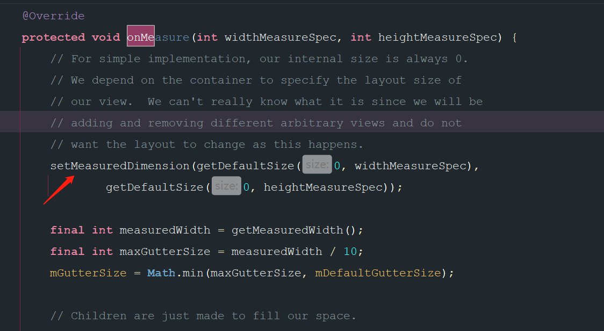

- 因为它一开始先设置了一个大小
  collapsed:: true
	- 
- # 学习了ViewGroup的测量，那么viewPager wrapContent无效怎么解决？#card
	- ## 面试-答这个
		- 1、继承viewPager，重新onMeasure
		- 2、遍历所有子view  通过getChildMeasureSpec 测量每个子view的高度，得到高度最大值
		- 3、super.onMeasure 设置给ViewPager
	- 解决
		- 继承viewPager，重新onMeasure。计算孩子的高度 再调用super
		- [[网上错误的方案：没有结合孩子的getChildMeasureSpec测量]]
		- ```java
		  public class WrapContentHeightViewPager extends ViewPager {
		     
		     public WrapContentHeightViewPager(@NonNull Context context) {
		         super(context);
		     }
		  
		     public WrapContentHeightViewPager(@NonNull Context context, @Nullable AttributeSet attrs) {
		         super(context, attrs);
		     }
		  
		     @Override
		     protected void onMeasure(int widthMeasureSpec, int heightMeasureSpec) {
		         int height = 0;
		         for (int i = 0; i < getChildCount(); i++) {
		             View child = getChildAt(i);
		             ViewGroup.LayoutParams params = child.getLayoutParams()
		           
		             child.measure(widthMeasureSpec, getChildMeasureSpec(heightMeasureSpec,0,params.height));
		             int h = child.getMeasuredHeight();
		             if (h > height) height = h;
		         }
		  
		         heightMeasureSpec = MeasureSpec.makeMeasureSpec(height, MeasureSpec.EXACTLY);
		         super.onMeasure(widthMeasureSpec, heightMeasureSpec);
		     }
		  }
		  ```