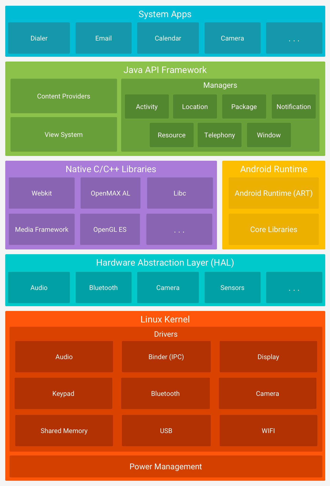
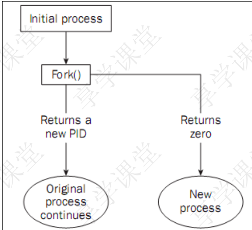
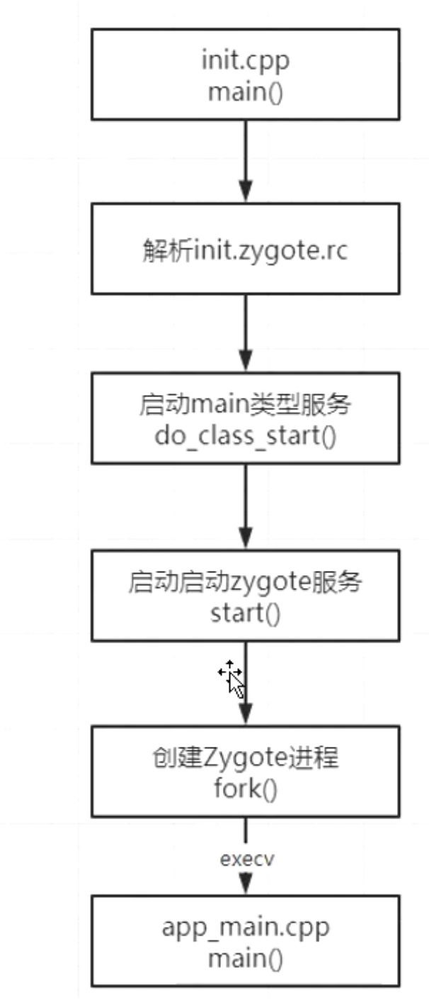

# 1、Android系统架构都包括哪几部分
collapsed:: true
	- 从下到上
		- Linux 内核，
		- 硬件抽象层
		- native library原生库，runtime运行时库
		- java api Framework层
		- 系统应用层
	- 图解
	  collapsed:: true
		- {:height 1107, :width 746}
- ### 2、什么情况下Zygote进程会重启呢？
  collapsed:: true
	- [[#red]]==**ServiceManager**==进程被杀;
	- (onResart)[[#red]]==**surfaceflinger**==进程被杀;
	- (onResart)[[#red]]==**Zygote**==进程自己被杀;
	- (oneshot=false)[[#red]]==**system_server进程被**==杀; (waitpid)
- # 3、子进程与父进程的区别
	- 1. 除了文件锁以外,其他的锁都会被继承
	- 2. 各自的进程ID不同
	- 3. 子进程的**未决告警**被清除；
	- 4. 子进程的**==未决信号集==**设置为空集。
- # 4、写时拷贝(copy- on-write)
	- Linux 的 fork() 使用是通过写时拷贝 (copy- on-write) 实现。
		- 写时拷贝是一种可以==推迟甚至避免拷贝数据==的技术。内核此时并不复制整个进程的地址空间，而是让父子进程共享同一个地址空间。只用在要写入的时候才会复制地址空间，从而使各个进程拥有各自的地址空间。
	- 也就是说，资源的复制是==**在需要写入的时候才会进行**==，在此之前，只有以只读方式共享
- # 5、面试官：你了解 Android 系统启动流程吗？
	- 当按电源键触发开机，首先会从 ROM 中预定义的地方[[#red]]==**加载引导程序 BootLoade**==r 到 RAM 中，并[[#red]]==**执行 BootLoader 引导程序**==启动 Linux Kernel， 然后启动用户级别的第一个进程： init 进程。
	- init 进程会==**解析init.rc 脚本做一些初始化工作**==，包括挂载文件系统、创建工作目录以及启动系统服务进程等，其中系统服务进程包括 Zygote、service manager(SM，Binder机制大管家)、media 等。
	- 在 Zygote 中会进一步去[[#red]]==**启动 system_server 进程**==，然后在 system_server 进程中会启动 AMS、WMS、PKMS 等服务，等这些服务启动之后，
	- AMS 中就会打开[[#red]]==**Launcher 应用的 home Activity**==，最终就看到了手机的 "桌面"。
- # 6、system_server 为什么要在 Zygote 中启动，而不是由 init 直接启动呢？
	- A：Zygote 作为一个孵化器，可以提前加载一些资源，这样 fork() 时基于 Copy-On-Write 机制创建的其他进程就能直接使用这些资源，而不用重新加载。
	- 比如 system_server 就可以直接使用 Zygote 中的 JNI函数、共享库、常用的类、以及主题资源。
- # 7、面试官：为什么要专门使用 Zygote 进程去孵化应用进程，而不是让 system_server 去孵化呢？
	- 首先 system_server 相比 Zygote 多运行了 AMS、WMS 等服务，这些对一个应用程序来说是不需要的。
	- 另外进程的 fork() 对多线程不友好，仅会[[#red]]==**将发起调用的线程拷贝**==到子进程，这可能会导致死锁，而system_server 中肯定是有很多线程的。
- # 8、面试官：能说说具体是怎么导致死锁的吗？
	- 1、fork通过写时拷贝，[[#red]]==**仅复制当前线程到子进程**==父进程中的其他线程，到子进程中都是突然蒸发掉的
	- 2、从系统来看，每个锁有一个所有者，即最后一次 lock 它的线程。
	- 3、加入 fork之前，[[#red]]==**有一个子线程 lock 了某个锁，获得了对锁的所有权**== fork后这个获得锁的线程随着其他线程都蒸发了。而锁却被正常复制了，在子进程看来，这个锁没有主人，所以没有任何人可以对它解锁。
	- 4、当子进程想 lock 这个锁时，没办法解开。程序发生死锁
- # 9、面试官：Zygote 为什么不采用 Binder 机制进行 IPC 通信,而是采用socket？
	- [[#red]]==**Binder 机制中存在 Binder 线程池，是多线程的，如果 Zygote 采用 Binder 的话就存在上面说的fork() 与 多线程的问题了**==。
	- 其实严格来说，Binder 机制不一定要多线程，所谓的 Binder 线程只不过是在循环读取 Binder 驱动的消息而已，只注册一个 Binder 线程也是可以工作的，比如 service manager就是这样的。
	- 实际上 Zygote 尽管没有采取 Binder 机制，它也不是单线程的，但它在 fork() 前主动停止了其他线程，fork() 后重新启动了。
	- [[#red]]==**而且Zygote进程启动的时候，binder还没起来**==
- #### 10、fork函数
  collapsed:: true
	- ```java
	  pid_t fork(void)
	  ```
	- 1. 参数：不需要参数
	- 2. 需要的头文件 <sys/types.h> 和 <unistd.h>
	- 3. 返回值分两种情况：
		- 返回0表示成功创建子进程，并且接下来进入子进程执行流程
		- 返回PID（>0），成功创建子进程，并且继续执行父进程流程代码
		- 返回非正数（<0），创建子进程失败，失败原因主要有：
			- 进程数超过系统所能创建的上限，errno会被设置为EAGAIN系统内存不足，errno会被设置为ENOMEM
		- 
	- 使用 fork() 函数得到的子进程是父进程的一个复制品，它从父进程处继承了整个进程的地址空间：包括进程上下文（进程执行活动全过程的静态描述）、进程堆栈、打开的文件描述符、信号控制设定、进程优先级、进程组号等。子进程所独有的只有它的进程号，计时器等（只有小量信息）。因此，使用 fork() 函数的代价是很大的
- #### 11、Zygote进程启动流程
  collapsed:: true
	- 
-
-
- # [Android面试题——高级开发面试题一](https://blog.csdn.net/Calvin_zhou/article/details/128123302)