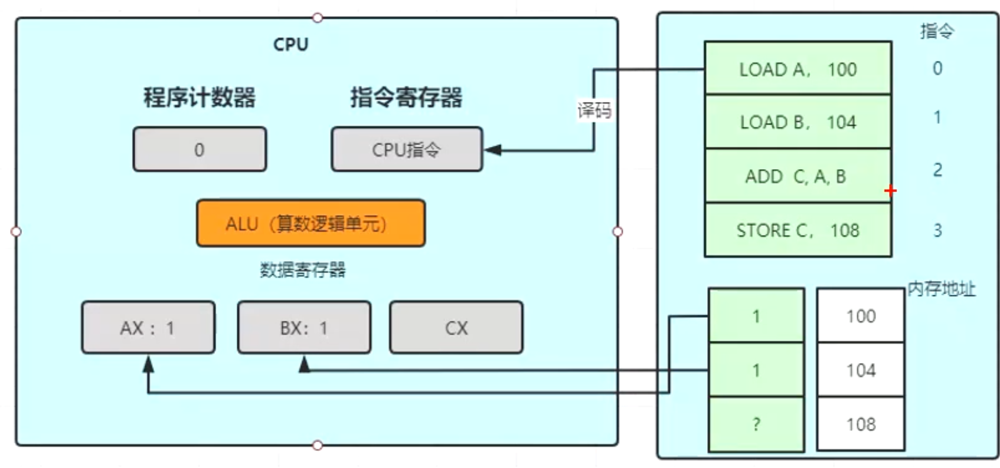

- # 一、概念
	- [[#red]]==**寄存器是CPU的组成部分**==，寄存器是有限存储容量的高速存储部件，[[#red]]==**他们可用来暂存指令、数据和位址。**====**是物理的**==，类似晶体管
	- 
	- ## 指令交互，大致运行过程
		- 1、CPU里的程序计算器，指向0号指令 LOAD A，100，则把该指令交给 [[#red]]==**指令寄存器**==去执行。
		- 2、该指令含义，LOAD 内存地址为100的数，加载到 数据寄存器 对应为A的地方
		- > LOAD B一样
		- 3、LOAD完毕后 执行ADD  c AB  就是用 CPU中的 ALU(算数逻辑单元)去计算。计算完后 存入数据寄存器的C中
- # 二、Android虚拟机，基于的寄存器，只是虚拟寄存器，指令交互上模拟真实寄存器而已。虚拟寄存器就是相当于一块内存。